# Implementing Makemore: Bigram Language Model

Hi everyone. Today we are continuing our implementation of Makemore. In the last lecture, we implemented the bigram language model using both counts and a super simple neural network with a single linear layer.

## Bigram Language Model

This is the Jupyter Notebook that we built out last lecture. We approached this by looking at only the single previous character and predicting the distribution for the character that would go next in the sequence. We did this by taking counts and normalizing them into probabilities so that each row sums to one.


This method works if you only have one character of previous context, and it's approachable. However, the problem with this model is that the predictions are not very good because it only takes one character of context. As a result, the model didn't produce very name-like outputs.

## Visualizing the Bigram Model

Here is a visualization of the bigram model's output. Each cell represents the probability of transitioning from one character to another.


## Code Implementation

Below is a snippet of the code we used to generate names using the bigram model. We used a simple loop to sample characters based on the probabilities computed from the counts.

```python
g = torch.Generator().manual_seed(2147483647)

for i in range(5):
    out = []
    ix = 0
    while True:
        p = P[ix]
        ix = torch.multinomial(p, num_samples=1, replacement=True, generator=g).item()
        out.append(itos[ix])
        if ix == 0:
            break
    print(''.join(out))
```

This code generates names by starting with an initial character and sampling subsequent characters based on the bigram probabilities until it reaches the end of the sequence.

While the bigram model is a good starting point, its limitation is evident in the quality of the generated names. In the next steps, we will explore more complex models that take into account more context to improve the quality of the generated names. Stay tuned!

This concludes our discussion on the bigram language model for Makemore. In the next lecture, we will delve into more advanced models to enhance our name generation capabilities. ## Context Explosion in Sequence Prediction

When predicting the next character in a sequence, taking more context into account can lead to exponential growth in the size of the context table. This phenomenon is illustrated in the following discussion.

### Single Character Context

If we only consider a single character at a time, there are 27 possible contexts (assuming a 27-character alphabet).

### Two-Character Context

When we extend the context to two characters, the number of possible contexts increases dramatically. Specifically, the number of rows in the context matrix becomes:

\[ 27 \times 27 = 729 \]


### Three-Character Context

If we further extend the context to three characters, the number of possible contexts explodes to:

\[ 27 \times 27 \times 27 = 19,683 \]

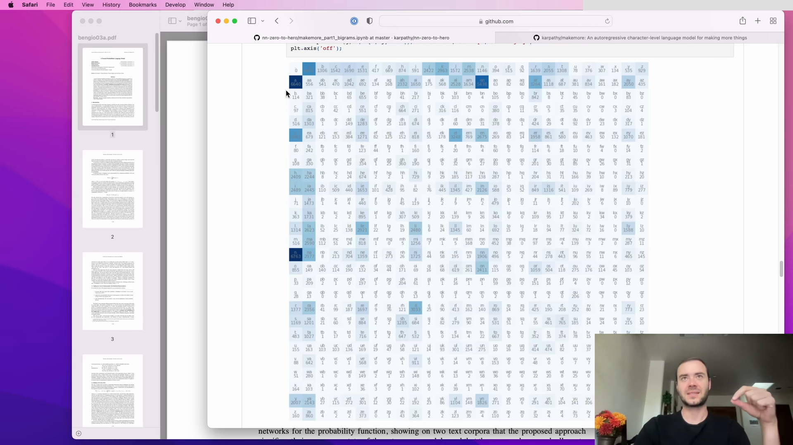

### Exponential Growth

This exponential growth continues as we increase the length of the context. For example, with four characters, the number of possible contexts would be:

\[ 27^4 = 531,441 \]

This rapid increase in the number of possible contexts makes it impractical to use longer contexts for sequence prediction, as the context table becomes too large to manage effectively. The number of counts for each possibility becomes too sparse, leading to unreliable predictions.

In summary, while considering more context can theoretically improve sequence prediction, the exponential growth in the size of the context table poses significant challenges. This issue highlights the need for more efficient methods to handle longer contexts in sequence prediction tasks. # Implementing a Multilayer Perceptron for Character Prediction

Today, we're going to implement a multilayer perceptron (MLP) model to predict the next character in a sequence. This modeling approach follows the paper by Bengio et al. (2003). Let's dive into the details of this influential paper and how we can adapt its ideas for our character-level language model.

## The Bengio et al. (2003) Paper

The paper by Bengio et al. is not the first to propose the use of multilayer perceptrons or neural networks for predicting the next character or token in a sequence, but it has been highly influential. It is often cited as a foundational work in this area.


The paper is 19 pages long, and while we won't cover every detail here, I encourage you to read it. It's very readable and contains many interesting ideas. The introduction describes the same problem we're tackling: predicting the next character in a sequence.

## Model Overview

In the paper, the authors propose a model to address the problem of predicting the next word in a sequence. Although they work at the word level with a vocabulary of 17,000 possible words, we will adapt their approach to work at the character level.

### Fighting the Curse of Dimensionality

One of the key challenges in language modeling is the curse of dimensionality. The authors propose fighting this by learning a distributed representation for words. This allows each training sentence to inform the model about an exponential number of semantically neighboring sentences.


### Key Steps in the Proposed Approach

1. **Associate each word with a distributed word feature vector**: This is a real-valued vector in an m-dimensional space.
2. **Express the joint probability function of word sequences**: This is done using the feature vectors of these words in the sequence.
3. **Learn the word feature vectors and the parameters of the probability function simultaneously**.


The feature vector represents different aspects of the word, and each word is associated with a point in a vector space. The number of features (e.g., m=30, 60, or 100) is much smaller than the size of the vocabulary (e.g., 17,000). The probability function is expressed as a product of the conditional probabilities of the next word given the previous ones.

By using a multilayer neural network to predict the next word given the previous ones, the model can maximize the log-likelihood of the training data or a regularized criterion.

### Why Does It Work?

The approach works because it allows the model to generalize from the training data. For example, if the model knows that "dog" and "cat" play similar roles in sentences, it can use this information to predict the next word more accurately.

In summary, the Bengio et al. (2003) paper provides a robust framework for building language models. By adapting their approach to work at the character level, we can create a powerful model for predicting the next character in a sequence. # Fighting the Curse of Dimensionality with Distributed Representations

## Overview

In a nutshell, the idea of the proposed approach can be summarized as follows:

1. **Associate with each word in the vocabulary a distributed word feature vector** (a real-valued vector in \( \mathbb{R}^m \)).
2. **Express the joint probability function of word sequences** in terms of the feature vectors of these words in the sequence.
3. **Learn simultaneously the word feature vectors and the parameters of that probability function**.


## Feature Vector Representation

The feature vector represents different aspects of the word: each word is associated with a point in a vector space. The number of features (e.g., \( m = 30, 60 \) or 100 in the experiments) is much smaller than the size of the vocabulary (e.g., 17,000). The probability function is expressed as a product of conditional probabilities of the next word given the previous ones (e.g., using a multi-layer neural network to predict the next word given the previous ones in the experiments). This function has parameters that can be iteratively tuned in order to maximize the log-likelihood of the training data or a regularized criterion, e.g., by adding a weight decay penalty. The feature vectors associated with each word are learned, but they could be initialized using prior knowledge of semantic features.

## Why Does It Work?

In the previous example, if we knew that "dog" and "cat" played similar roles (semantically and syntactically), and similarly for (the, a), (bedroom, room), (is, was), etc., we could use this information to initialize the word vectors. During training, these vectors would be fine-tuned to better capture the relationships between words.

### Example

Let's take every one of these 17,000 words and associate each word with a 30-dimensional feature vector. So, every word is now embedded into a 30-dimensional space. We have 17,000 points or vectors in a 30-dimensional space, which might seem very crowded. Initially, these words are randomly spread out, but during training, the embeddings are tuned using backpropagation. Over time, words with similar meanings or synonyms might end up in similar parts of the space, while words with different meanings will be farther apart.


### Training Process

During the course of training, these points or vectors move around in the space. For example, words that have very similar meanings or are synonyms might end up in very similar parts of the space. Conversely, words that mean very different things will be positioned far apart.


### Regularization

To prevent overfitting, regularization techniques such as weight decay are applied. This penalizes the squared norm of the parameters, ensuring that the model generalizes well to unseen data.

### Contextual Understanding

N-grams with \( n \) up to 5 (i.e., 4 words of context) have been reported, though due to data scarcity, most predictions are made with a much shorter context.

## Conclusion

By embedding words into a high-dimensional space and fine-tuning these embeddings through training, we can capture semantic and syntactic relationships between words. This approach helps in dealing with the curse of dimensionality and improves the performance of language models. # Fighting the Curse of Dimensionality with Distributed Representations

## Modeling Approach

The modeling approach discussed here is identical to the one used in the referenced paper. The method involves using a multi-layer neural network to predict the next word given the previous words. The training process maximizes the log likelihood of the training data.

## Example of Intuition

To illustrate why this approach works, consider the following example:

Suppose you are trying to predict the phrase "a dog was running in a blank." If the exact phrase "a dog was running in a" has never occurred in the training data, the model might struggle to predict the next word. This situation is referred to as being "out of distribution."

However, this approach allows the model to generalize. Even if the exact phrase hasn't been seen, the model might have encountered similar phrases like "the dog was running in a blank." The neural network can learn that "a" and "the" are frequently interchangeable. By placing their embeddings near each other in the vector space, the model can transfer knowledge and generalize.

Similarly, the network can understand that "cats" and "dogs" are animals that often appear in similar contexts. Even if the model hasn't seen the exact phrase or action (e.g., "walking" or "running"), it can generalize to novel scenarios through the embedding space.

## Neural Network Diagram

Let's examine the diagram of the neural network used in this approach. In this example, the network takes three previous words and tries to predict the fourth word in a sequence.

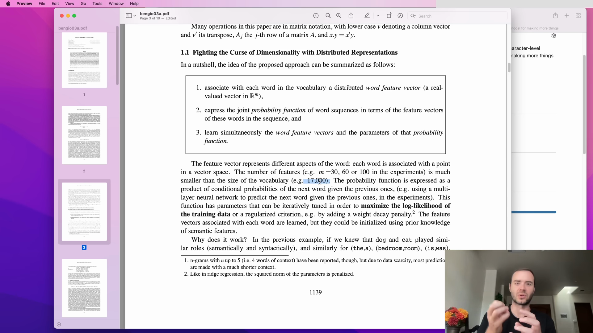

### Vocabulary and Lookup Table

The vocabulary consists of 17,000 possible words, so each word is represented by an integer between 0 and 16,999. The lookup table, referred to as matrix C, is a 17,000 by 30 matrix. This matrix acts as a lookup table where each index corresponds to a row in the embedding matrix, converting each word index into a 30-dimensional vector.

### Input Layer

The input layer consists of 30 neurons for each of the three words, making a total of 90 neurons. The matrix C is shared across all words, meaning that the same matrix is used for indexing every word.


### Embedding and Generalization

The embedding space allows the model to generalize by placing similar words and phrases near each other. This proximity in the vector space enables the transfer of knowledge and helps the model handle out-of-distribution scenarios effectively.

By leveraging distributed representations and embedding spaces, the neural network can predict words and phrases it hasn't explicitly seen during training, demonstrating the power of this approach in natural language processing tasks. ## Neural Network Architecture and Implementation

In this section, we will discuss the architecture of a neural network and its implementation. The size of the hidden neural layer in this neural network is a hyperparameter. We use the term "hyperparameter" to refer to design choices that are up to the designer of the neural network. This size can be as large or as small as desired. For example, the size could be set to 100 neurons. We will explore multiple choices for the size of this hidden layer and evaluate their performance.

### Neural Network Architecture

Consider a hidden layer with 100 neurons. All of these neurons are fully connected to the 90 numbers that represent three words. This forms a fully connected layer. Following this, there is a tanh non-linearity and an output layer. Given that there are 17,000 possible words that could follow, this output layer has 17,000 neurons, each fully connected to all neurons in the hidden layer. This results in a large number of parameters, making this layer computationally expensive.


There are 17,000 logits in this layer. On top of this, we have a softmax layer, which we have seen in previous discussions. Each of these logits is exponentiated, and then everything is normalized to sum to one, resulting in a probability distribution for the next word in the sequence.

During training, we have the label, which is the identity of the next word in the sequence. This word or its index is used to extract the probability of that word. We then maximize the probability of that word with respect to the parameters of the neural network. The parameters include the weights and biases of the output layer, the weights and biases of the hidden layer, and the embedding lookup table \( C \). All of these parameters are optimized using backpropagation.

The dashed arrows in the diagram represent a variation of the neural network that we will not explore in this discussion.

### Implementation

Let's implement this setup. We start by creating a new notebook for this lecture. We import PyTorch and matplotlib to create figures. Then, we read all the names into a list of words, as we did before.

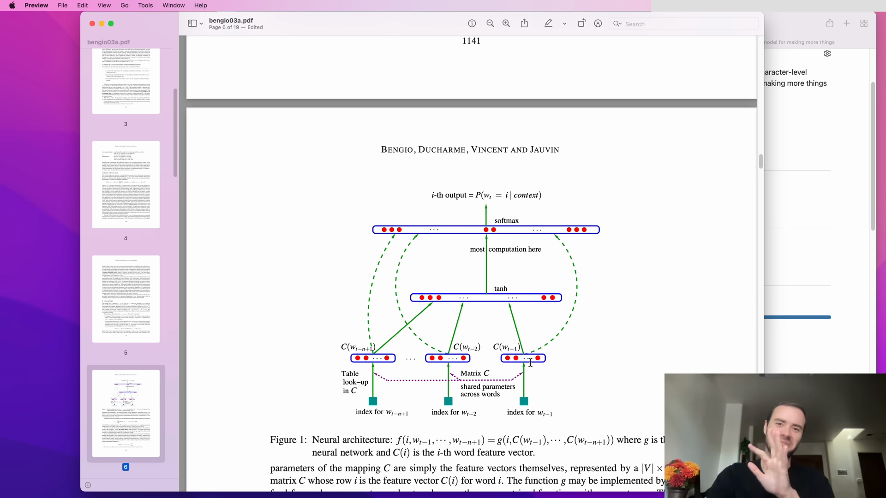

```python
import torch
import torch.nn.functional as F
import matplotlib.pyplot as plt  # for making figures
%matplotlib inline

# Read in all the words
words = open('names.txt', 'r').read().splitlines()
words[:8]

# Output
['emma', 'olivia', 'ava', 'isabella', 'sophia', 'charlotte', 'mia', 'amelia']

# Length of words
len(words)

# Output
32033

# Build the vocabulary of characters and mappings to/from integers
chars = sorted(list(set(''.join(words))))
stoi = {s:i for i, s in enumerate(chars)}
itos = {i:s for s, i in stoi.items()}
print(itos)

# Output
{0: ' ', 1: 'a', 2: 'b', 3: 'c', 4: 'd', 5: 'e', 6: 'f', 7: 'g', 8: 'h', 9: 'i', 10: 'j', 11: 'k', 12: 'l', 13: 'm', 14: 'n', 15: 'o', 16: 'p', 17: 'q', 18: 'r', 19: 's', 20: 't', 21: 'u', 22: 'v', 23: 'w', 24: 'x', 25: 'y', 26: 'z'}
```

In this code snippet, we import the necessary libraries and read the names from a text file into a list. We then build a vocabulary of characters and create mappings to and from integers. This setup is essential for processing the text data and feeding it into the neural network. ## Building a Dataset for a Neural Network

In this section, we will discuss how to build a dataset for a neural network. We will start by reading in the data, building the vocabulary, and then creating the dataset.

### Reading the Data and Building the Vocabulary

First, we read in all the words from a text file and build the vocabulary of characters. We also create mappings from characters to integers and vice versa.

```python
import torch
import torch.nn.functional as F
import matplotlib.pyplot as plt # for making figures
%matplotlib inline

# Read in all the words
words = open('names.txt', 'r').read().splitlines()
words[:8]
```

Output:
```python
['emma', 'olivia', 'ava', 'isabella', 'sophia', 'charlotte', 'mia', 'amelia']
```

```python
len(words)
```

Output:
```python
32033
```

```python
# Build the vocabulary of characters and mappings to/from integers
chars = sorted(list(set(''.join(words))))
stoi = {s: i + 1 for i, s in enumerate(chars)}
stoi['.'] = 0
itos = {i: s for s, i in stoi.items()}
print(itos)
```

Output:
```python
{1: 'a', 2: 'b', 3: 'c', 4: 'd', 5: 'e', 6: 'f', 7: 'g', 8: 'h', 9: 'i', 10: 'j', 11: 'k', 12: 'l', 13: 'm', 14: 'n', 15: 'o', 16: 'p', 17: 'q', 18: 'r', 19: 's', 20: 't', 21: 'u', 22: 'v', 23: 'w', 24: 'x', 25: 'y', 26: 'z', 0: '.'}
```

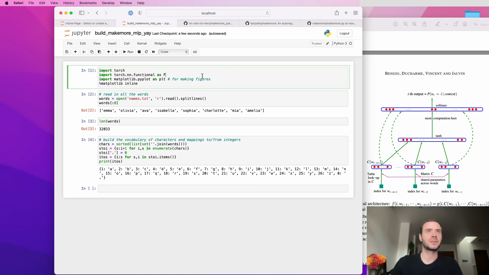

### Creating the Dataset

Next, we compile the dataset for the neural network. This involves defining a block size, which is the context length of how many characters we take to predict the next one. In this example, we take three characters to predict the fourth one.

```python
# Build the dataset
block_size = 3 # context length: how many characters do we take to predict the next one?
X, Y = [], []
for w in words[:5]:
    print(w)
    context = [0] * block_size
    for ch in w + '.':
        ix = stoi[ch]
        X.append(context)
        Y.append(ix)
        print(''.join(itos[i] for i in context), '--->', itos[ix])
        context = context[1:] + [ix] # crop and append

X = torch.tensor(X)
Y = torch.tensor(Y)
```

Output:
```python
emma
... ---> e
..e ---> m
.em ---> m
emm ---> a
mma ---> .
olivia
... ---> o
..o ---> l
.ol ---> i
oli ---> v
liv ---> i
ivi ---> a
via ---> .
ava
... ---> a
..a ---> v
.av ---> a
ava ---> .
isabella
... ---> i
..i ---> s
.is ---> a
isa ---> b
sab ---> e
abe ---> l
bel ---> l
ell ---> a
lla ---> .
```

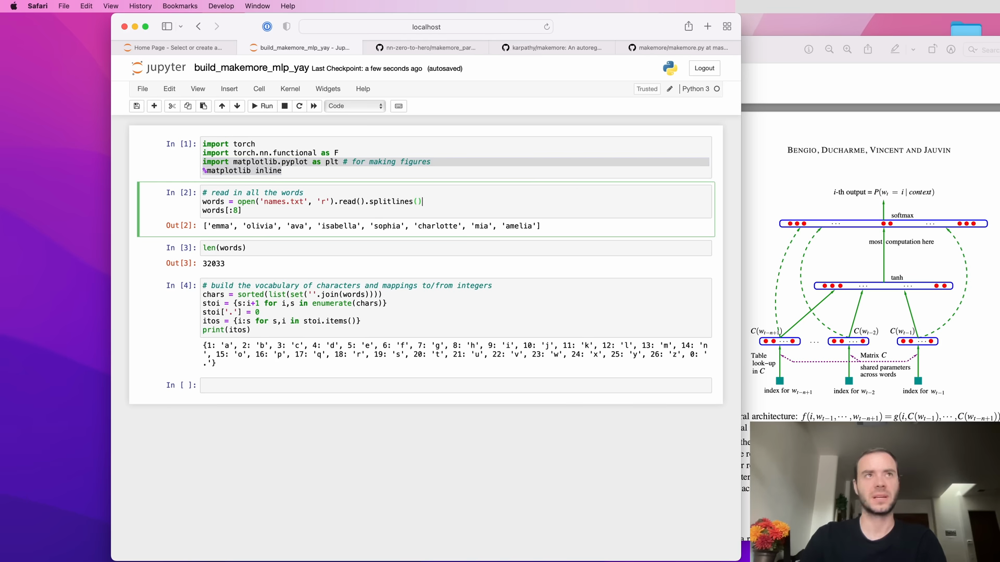

In the code above, we start with a padded context of zero tokens. We then iterate over all the characters in each word, building out the array `Y` for the current character and the array `X` which stores the current running context. This process is repeated for the first five words for efficiency during development. Later, we will use the entire training set.

By following these steps, we can effectively create a dataset that can be used to train a neural network to predict the next character in a sequence based on the given context. # Building a Character-Level Language Model with PyTorch

In this post, we will walk through the process of building a character-level language model using PyTorch. We will start by creating a dataset, then build an embedding lookup table, and finally, implement a neural network to predict the next character in a sequence.

## Creating the Dataset

We begin by creating a dataset from a list of words. The dataset consists of input sequences of characters and their corresponding target characters. The context length, or block size, determines how many characters we use to predict the next one.

```python
block_size = 3  # context length: how many characters do we take to predict the next one?
X, Y = [], []
for w in words[:5]:
    print(w)
    context = [0] * block_size
    for ch in w + '.':
        ix = stoi[ch]
        X.append(context)
        Y.append(ix)
        print(''.join(itos[i] for i in context), '--->', itos[ix])
        context = context[1:] + [ix]  # crop and append

X = torch.tensor(X)
Y = torch.tensor(Y)
```

Here, we use a context length of 3. For each word, we create input sequences of three characters and their corresponding target character. The dataset looks like this:


## Adjusting the Block Size

We can change the block size to predict the next character based on a different number of preceding characters. For example, setting the block size to 5:

```python
block_size = 5  # context length: how many characters do we take to predict the next one?
X, Y = [], []
for w in words[:5]:
    print(w)
    context = [0] * block_size
    for ch in w + '.':
        ix = stoi[ch]
        X.append(context)
        Y.append(ix)
        print(''.join(itos[i] for i in context), '--->', itos[ix])
        context = context[1:] + [ix]  # crop and append

X = torch.tensor(X)
Y = torch.tensor(Y)
```

With a block size of 5, the dataset is updated accordingly:


## Building the Embedding Lookup Table

Next, we build an embedding lookup table. We have 27 possible characters, and we will embed them in a lower-dimensional space. For simplicity, we start with a two-dimensional space.

```python
C = torch.randn((27, 2))
```

This creates a matrix `C` with 27 rows and 2 columns, where each row represents a character embedding.

## Embedding a Single Integer

To understand how embedding works, let's embed a single integer, say 5. We can index into the fifth row of `C` to get the embedding vector.

```python
C[5]
```

Alternatively, we can use one-hot encoding to achieve the same result. First, we create a one-hot encoded vector for the integer 5.

```python
F.one_hot(torch.tensor(5), num_classes=27)
```

This produces a 27-dimensional vector with a 1 at the fifth position. We can then multiply this one-hot vector by `C` to get the embedding.

```python
F.one_hot(torch.tensor(5), num_classes=27) @ C
```

This approach is equivalent to indexing into the embedding matrix.

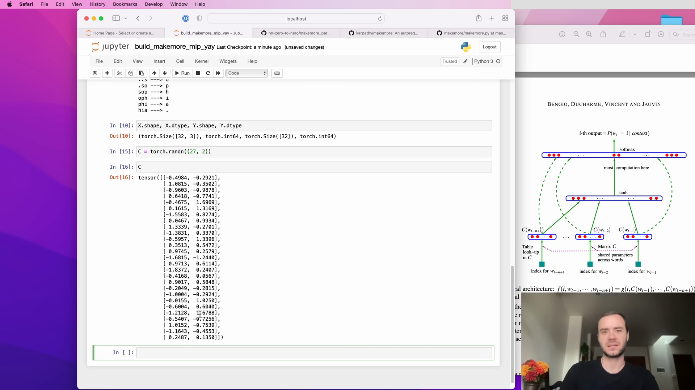

In this post, we have created a dataset for a character-level language model, built an embedding lookup table, and demonstrated how to embed individual characters using both direct indexing and one-hot encoding. This forms the foundation for building a neural network to predict the next character in a sequence. # Building an MLP with PyTorch

In this post, we will walk through the process of building a Multi-Layer Perceptron (MLP) using PyTorch. We will cover embedding integers, handling tensors, and constructing hidden layers. Let's dive in!

## Handling Data Types in PyTorch

When working with PyTorch, it's important to ensure that the data types of tensors are compatible for operations. For instance, PyTorch does not allow multiplication of an integer tensor with a float tensor directly. We need to explicitly cast the integer tensor to a float tensor.

```python
F.one_hot(torch.tensor(5), num_classes=27).float() @ C
```

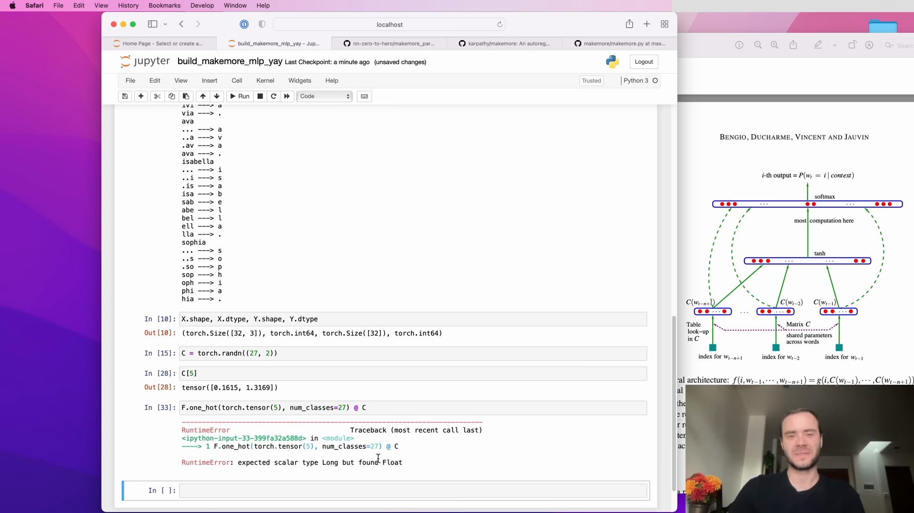

In the example above, we cast the one-hot encoded tensor to a float before performing matrix multiplication. This ensures compatibility and avoids runtime errors.

## Embedding Integers

Embedding integers is a common task in neural networks, especially when dealing with categorical data. In PyTorch, we can use indexing to retrieve embeddings from a lookup table.

```python
C = torch.randn(27, 2)
C[5]
```

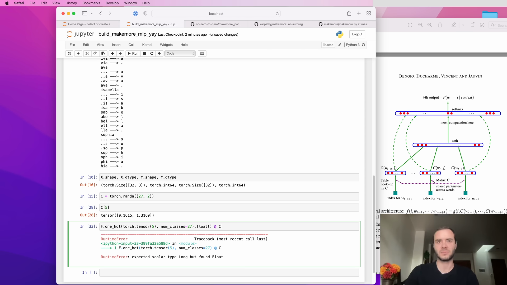

The code above retrieves the embedding for the integer `5` from the matrix `C`. This is equivalent to using a one-hot encoded vector to index into `C`.

## Indexing with Lists and Tensors

PyTorch's indexing capabilities are quite flexible. We can index using lists or tensors of integers to retrieve multiple rows simultaneously.

```python
C[torch.tensor([5, 6, 7])]
```


In the example above, we retrieve the embeddings for the integers `5`, `6`, and `7` using a tensor of integers. This can also be done with lists.

## Multi-Dimensional Indexing

We can also index with multi-dimensional tensors. This allows us to retrieve embeddings for a batch of data efficiently.

```python
X = torch.randint(0, 27, (32, 3))
C[X]
```

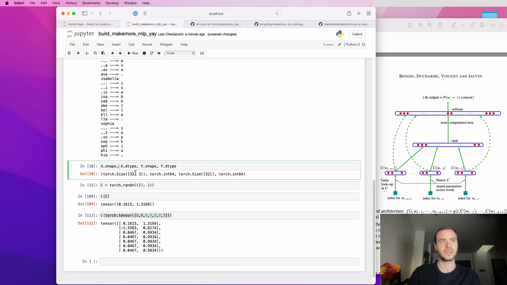

Here, `X` is a 32x3 tensor of integers, and `C[X]` retrieves the corresponding embeddings. The shape of the resulting tensor is `(32, 3, 2)`, where `2` is the embedding dimension.

## Constructing the Hidden Layer

Next, we construct the hidden layer of our MLP. We initialize the weights and biases randomly. The number of inputs to this layer is determined by the embedding dimensions and the number of embeddings.

```python
W1 = torch.randn((3 * 2, 100))  # 3 embeddings, each of dimension 2, and 100 neurons
b1 = torch.randn(100)
```


In this example, we have 3 embeddings, each of dimension 2, resulting in 6 inputs to the hidden layer. We choose to have 100 neurons in this layer.

By following these steps, we can build a robust MLP using PyTorch, capable of handling embeddings and efficiently processing batches of data. ## Working with Embeddings in PyTorch

In this section, we will discuss how to handle embeddings in PyTorch, particularly focusing on transforming tensor shapes to perform matrix multiplications.

### Problem Statement

We have embeddings stacked up in the dimensions of an input tensor. The current shape of the tensor is `32 x 3 x 2`, and we need to perform a matrix multiplication with a tensor of shape `6 x 100`. This operation will not work directly due to the shape mismatch. Therefore, we need to transform the tensor from `32 x 3 x 2` to `32 x 6` to perform the multiplication.

### Understanding the Tensor Shapes

The tensor `emb` has the shape `32 x 3 x 2`. Here is a snapshot of the tensor shape:


To perform the matrix multiplication, we need to concatenate the embeddings along the correct dimension.

### Using PyTorch Documentation

PyTorch is a comprehensive library with numerous functions to manipulate tensors. By exploring the documentation, we can find various ways to achieve our goal. One useful function is `torch.cat`, which concatenates a sequence of tensors along a specified dimension.

### Concatenating Tensors

To concatenate the tensors, we need to retrieve the three parts of the embeddings and concatenate them. Here’s how we can do it:

1. **Retrieve the Parts**: We need to grab the embeddings for each part separately.
2. **Concatenate the Parts**: Use `torch.cat` to concatenate these parts along the desired dimension.

Here’s the code to achieve this:

```python
# Retrieve the parts
part1 = emb[:, 0, :]
part2 = emb[:, 1, :]
part3 = emb[:, 2, :]

# Concatenate the parts
concatenated = torch.cat([part1, part2, part3], dim=1)
```

### Resulting Shape

By concatenating along dimension 1, we transform the shape from `32 x 3 x 2` to `32 x 6`, which allows us to perform the matrix multiplication.

```python
print(concatenated.shape)  # Output: torch.Size([32, 6])
```

### Performing Matrix Multiplication

Now that we have the tensor in the correct shape, we can perform the matrix multiplication:

```python
W1 = torch.randn(6, 100)
b1 = torch.randn(100)

result = concatenated @ W1 + b1
```

By using the `torch.cat` function, we can effectively concatenate the embeddings along the desired dimension, transforming the tensor shape to perform the required matrix multiplication. This demonstrates the flexibility and power of PyTorch in handling tensor operations.

 ## Handling Tensor Dimensions in PyTorch

In this section, we will discuss how to handle tensor dimensions in PyTorch, specifically focusing on concatenating tensors and using the `torch.unbind` function.

### Concatenating Tensors

We start with a tensor of shape `(32, 3, 2)` and aim to concatenate it into a shape of `(32, 6)`. Initially, this is done by directly indexing the tensor, which is not ideal for generalization. For example, if we change the block size or the number of inputs, the code would need to be manually adjusted.

```python
torch.cat([emb[:, 0, :], emb[:, 1, :], emb[:, 2, :]], 1).shape
```

This code concatenates the tensor along the specified dimensions, resulting in a shape of `(32, 6)`.

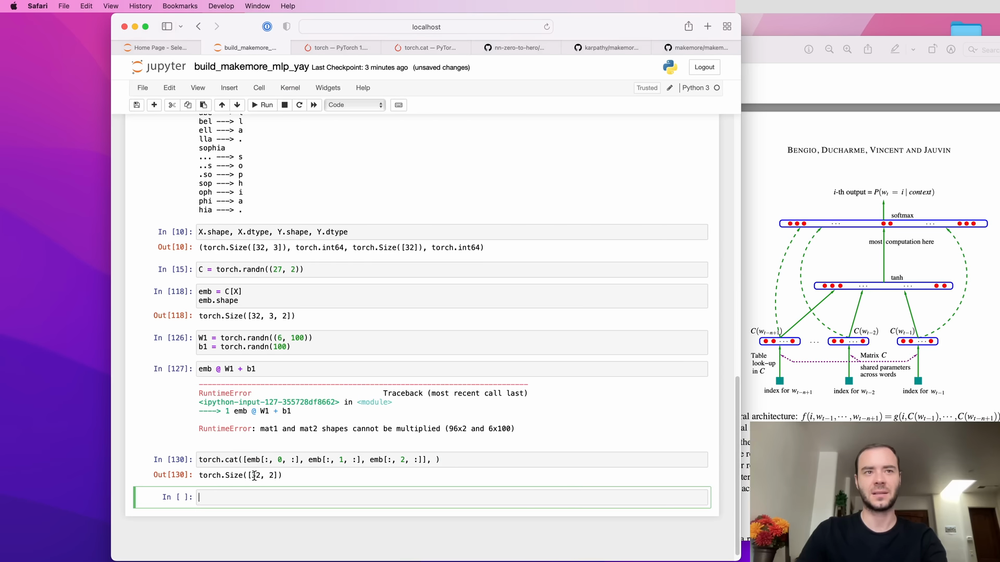

### Generalizing with `torch.unbind`

To make the code more flexible, we can use the `torch.unbind` function. This function removes a tensor dimension and returns a tuple of all slices along a given dimension without it. This is exactly what we need to avoid hardcoding the indices.

```python
torch.unbind(input, dim=1)
```

Here, `input` is the tensor we want to unbind, and `dim` is the dimension to remove. This function call returns a list of tensors equivalent to the manually indexed tensors.

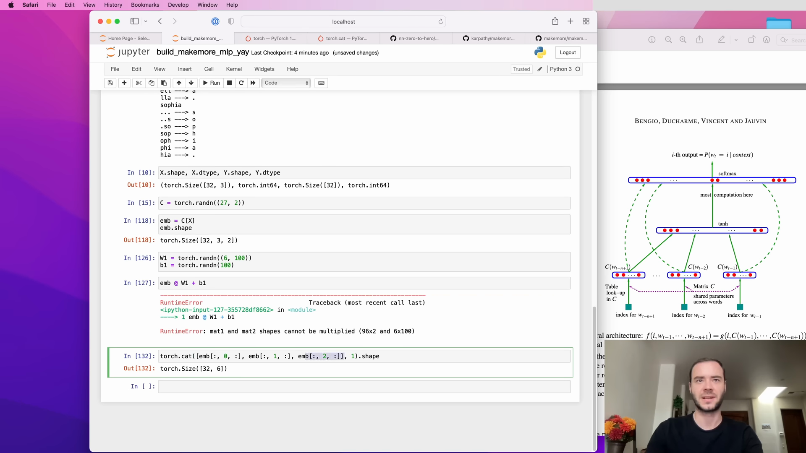

### Applying `torch.unbind`

By using `torch.unbind`, we can achieve the same result as before but in a more generalized manner. We call `torch.unbind` on the tensor `emb` along dimension 1, which gives us a list of tensors. We can then concatenate these tensors along the first dimension.

```python
torch.cat(torch.unbind(emb, 1), 1).shape
```

This approach ensures that the code will work regardless of the number of inputs or the block size, making it more robust and easier to maintain.

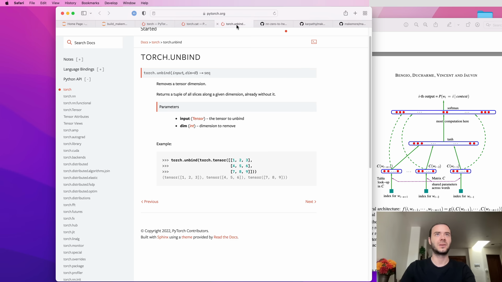

By leveraging `torch.unbind`, we can handle tensor dimensions more effectively and write code that is both flexible and scalable. # Efficient Tensor Manipulation in PyTorch

In this section, we will explore an efficient way to manipulate tensors in PyTorch. We will start by creating a tensor and then reshape it to different dimensions. This will give us an opportunity to delve into some of the internals of `torch.tensor`.

## Creating and Reshaping Tensors

Let's begin by creating a tensor with elements ranging from 0 to 17. The shape of this tensor is a single vector of 18 numbers.

```python
a = torch.arange(18)
a
```

The output of this code is:

```plaintext
tensor([ 0,  1,  2,  3,  4,  5,  6,  7,  8,  9, 10, 11, 12, 13, 14, 15, 16, 17])
```

To confirm the shape of the tensor, we can use the `.shape` attribute:

```python
a.shape
```

The output will be:

```plaintext
torch.Size([18])
```


## Efficient Tensor Operations

In PyTorch, we can efficiently represent and manipulate tensors of different sizes and dimensions. For instance, we can concatenate tensors along a specific dimension using `torch.cat` and `torch.unbind`.

Consider the following example where we concatenate tensors along the second dimension:

```python
torch.cat([emb[:, 0, :], emb[:, 1, :], emb[:, 2, :]], 1).shape
```

The output is:

```plaintext
torch.Size([32, 6])
```

Alternatively, we can achieve the same result using `torch.unbind`:

```python
torch.cat(torch.unbind(emb, 1), 1).shape
```

The output remains the same:

```plaintext
torch.Size([32, 6])
```

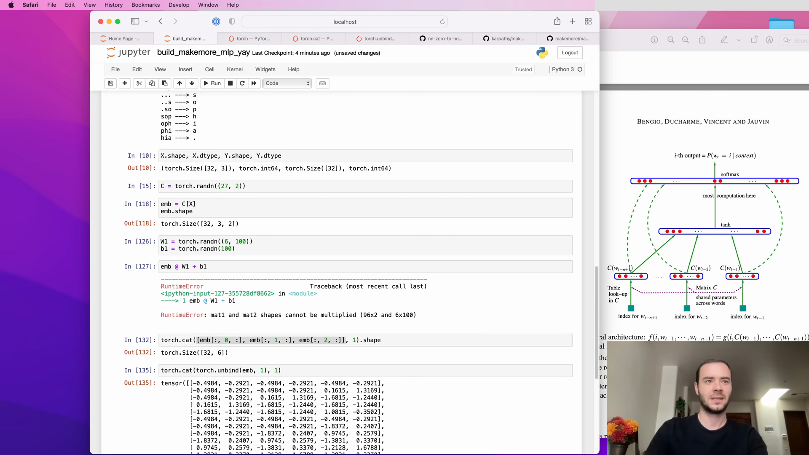

## Handling Shape Mismatches

When performing matrix multiplications, it is crucial to ensure that the shapes of the tensors are compatible. In the following example, we encounter a `RuntimeError` due to incompatible shapes:

```python
emb @ W1 + b1
```

The error message is:

```plaintext
RuntimeError: mat1 and mat2 shapes cannot be multiplied (96x2 and 6x100)
```

To resolve this, we need to ensure that the dimensions of the tensors align correctly for the matrix multiplication to succeed.

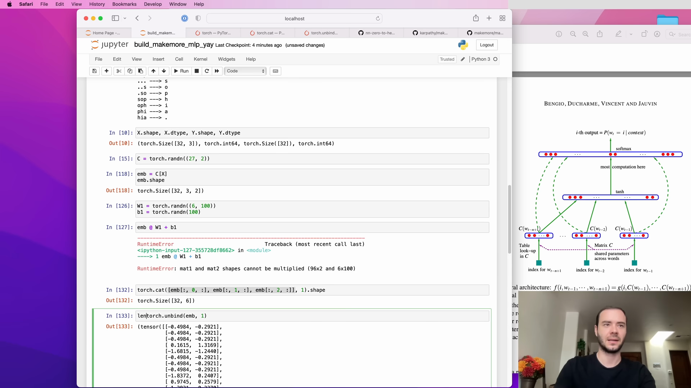

By understanding and utilizing these efficient tensor operations, we can significantly improve the performance and flexibility of our PyTorch code. ## Understanding PyTorch Tensor Views and Efficient Operations

In PyTorch, tensors can be reshaped efficiently using the `view` method. This method allows us to interpret the same data in different shapes without changing the underlying data. Let's explore how this works and why it's efficient.

### Tensor Views

A tensor can be reshaped in multiple ways as long as the total number of elements remains the same. For example, a tensor with 18 elements can be viewed as:

- A 9x2 tensor
- A 3x3x2 tensor

This is possible because the total number of elements (18) remains constant. In PyTorch, calling the `view` method is extremely efficient because it doesn't change the underlying data. Instead, it manipulates the tensor's metadata to interpret the data differently.

### Underlying Storage

Each tensor in PyTorch has an underlying storage, which is a one-dimensional vector containing all the elements. When we call `view`, we are not changing this storage. Instead, we are modifying attributes like `storage_offset`, `strides`, and `shapes` to interpret the one-dimensional sequence as an n-dimensional tensor.

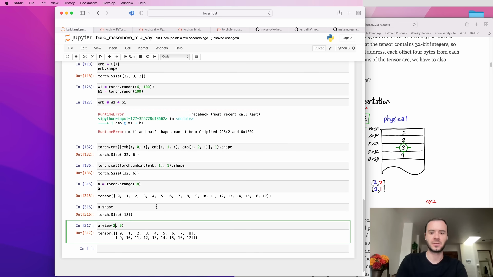

### Efficient Reshaping

Let's consider an example where we have a tensor `a` with 18 elements:

```python
a = torch.arange(18)
a.shape  # torch.Size([18])
```

We can view this tensor as a 3x3x2 tensor:

```python
a.view(3, 3, 2)
```

This operation is efficient because it doesn't create new memory; it only changes how we interpret the existing data.

### Practical Example

In our practical example, we have a tensor `emb` with a shape of 32x3x2. We want to reshape it to 32x6:

```python
emb.view(32, 6)
```

This reshaping operation stacks the elements in a single row, effectively flattening the tensor.

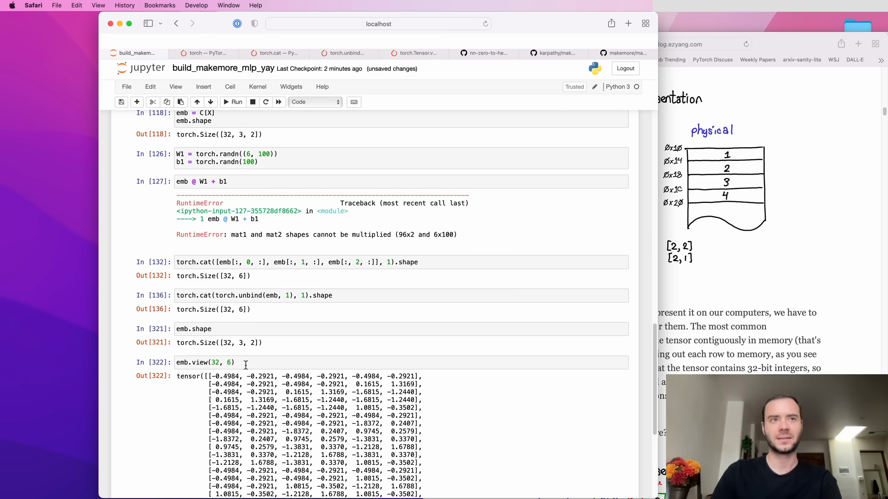

### Avoiding Inefficient Operations

Concatenation operations, unlike `view`, are less efficient because they create new tensors with new storage. This means new memory is allocated, which can be costly. For example:

```python
torch.cat([emb[:, 0, :], emb[:, 1, :], emb[:, 2, :]], 1)
```

This operation creates a new tensor, which is inefficient compared to using `view`.

### Using Dynamic Shapes

To make our code more flexible, we can avoid hardcoding dimensions. Instead, we can use dynamic shapes:

```python
emb.view(emb.shape[0], -1)
```

Here, `-1` tells PyTorch to infer the dimension size based on the total number of elements. This makes the code adaptable to tensors of different sizes.

### Applying Activation Functions

After reshaping, we can apply activation functions like `tanh` to our tensor:

```python
h = torch.tanh(emb.view(-1, 6) @ W1 + b1)
```

This results in a tensor `h` with values between -1 and 1, representing the hidden states.

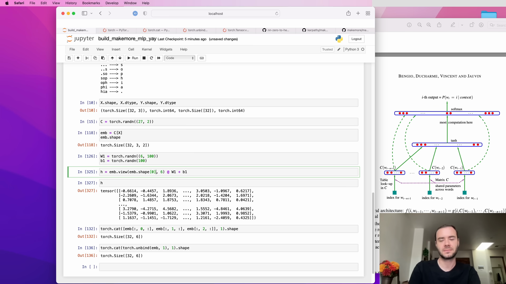

Using `view` in PyTorch allows for efficient reshaping of tensors without changing the underlying data. This is crucial for performance, especially when dealing with large tensors. Avoiding inefficient operations like concatenation and using dynamic shapes can further optimize our code. # Building a Character-Level Language Model with PyTorch

In this section, we will walk through the process of building a character-level language model using PyTorch. We will cover the creation of the dataset, the architecture of the neural network, and the computation of probabilities for the next character in a sequence.

## Dataset Creation

We start by creating the dataset. The dataset consists of sequences of characters, and for each sequence, we want to predict the next character.

```python
block_size = 3  # context length: how many characters do we take to predict the next one?
X, Y = [], []
for w in words[:5]:
    context = [0] * block_size
    for ch in w + '.':
        ix = stoi[ch]
        X.append(context)
        Y.append(ix)
        context = context[1:] + [ix]

X = torch.tensor(X)
Y = torch.tensor(Y)
```

Here, `block_size` is the context length, and `X` and `Y` are the input and output tensors, respectively. The context is a sliding window of characters used to predict the next character.

## Neural Network Architecture

Next, we define the architecture of our neural network. We start by creating the embedding matrix and the first layer's weights and biases.

```python
C = torch.randn((27, 2))
emb = C[X]
emb.shape  # torch.Size([32, 3, 2])

W1 = torch.randn((6, 100))
b1 = torch.randn(100)
```

The embedding matrix `C` maps each character to a 2-dimensional vector. The first layer's weights `W1` and biases `b1` are initialized randomly.

We then compute the hidden layer activations using the `tanh` activation function.

```python
h = torch.tanh(emb.view(-1, 6) @ W1 + b1)
h.shape  # torch.Size([32, 100])
```

The hidden layer `h` has a shape of `[32, 100]`, where 32 is the batch size and 100 is the number of neurons in the hidden layer.

## Final Layer and Logits

We create the final layer's weights and biases and compute the logits.

```python
W2 = torch.randn((100, 27))
b2 = torch.randn(27)

logits = h @ W2 + b2
logits.shape  # torch.Size([32, 27])
```

The logits have a shape of `[32, 27]`, where 27 is the number of possible characters.

## Computing Probabilities

We exponentiate the logits to get the fake counts and normalize them to get probabilities.

```python
counts = logits.exp()
prob = counts / counts.sum(1, keepdims=True)
prob.shape  # torch.Size([32, 27])
```

The `prob` tensor contains the probabilities for each character in the sequence, and each row sums to one.

## Indexing Probabilities

We now index into the rows of `prob` to get the probability assigned to the correct character.

```python
torch.arange(32)
Y

prob[torch.arange(32), Y]
```

Here, `torch.arange(32)` creates an iterator over numbers from 0 to 31, and we use it to index into `prob` to get the probabilities for the correct characters as given by `Y`.

In this section, we have built a simple character-level language model using PyTorch. We created the dataset, defined the neural network architecture, computed the logits, and normalized them to get probabilities. Finally, we indexed into the probabilities to get the values assigned to the correct characters. This model is not yet trained, so the probabilities are not accurate, but this will improve with training. ## Minimizing Loss in Neural Networks

In this section, we will discuss how to minimize the loss in a neural network to predict the correct character in a sequence. The loss value here is 17, and our goal is to reduce this value to improve the network's performance.

### Dataset and Parameters

First, let's look at the dataset and the parameters we have defined. We are using a generator to ensure reproducibility. All parameters are clustered into a single list, making it easy to count them. Currently, we have about 3,400 parameters.

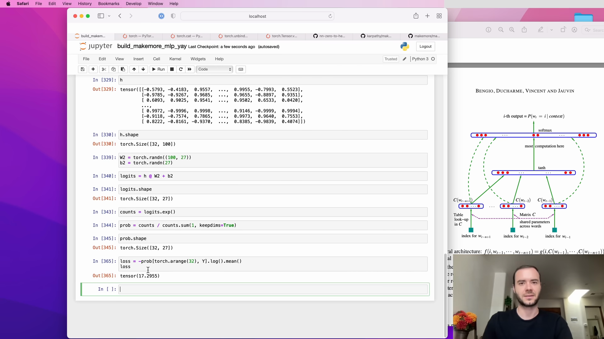

### Forward Pass and Loss Calculation

Here is the forward pass as we developed it. We arrive at a single number, the loss, which expresses how well the neural network works with the current setting of parameters.

```python
emb = C[X]  # (32, 3, 2)
h = torch.tanh(emb.view(-1, 6) @ W1 + b1)  # (32, 100)
logits = h @ W2 + b2  # (32, 27)
counts = logits.exp()
prob = counts / counts.sum(1, keepdims=True)
loss = -prob[torch.arange(32), Y].log().mean()
loss
```

### Using PyTorch's Cross-Entropy Function

To make the code more respectable and efficient, we can use PyTorch's built-in `functional.cross_entropy` function. This function is specifically designed for classification tasks and calculates the loss more efficiently.

```python
import torch.nn.functional as F

loss = F.cross_entropy(logits, Y)
loss
```

By replacing the manual calculation with `F.cross_entropy`, we simplify the code and improve its efficiency.

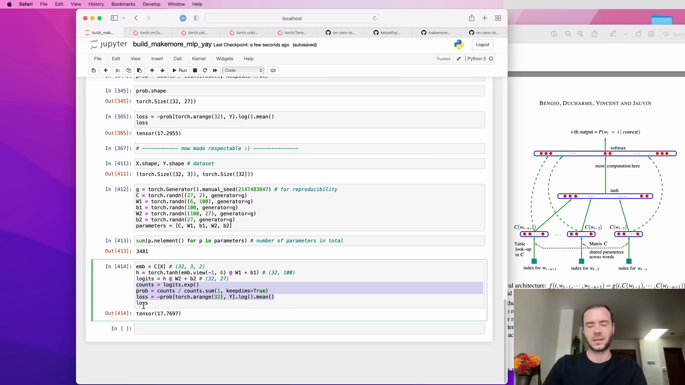

This approach not only makes the code cleaner but also leverages optimized functions provided by PyTorch, ensuring better performance and readability. ## Efficient Implementation of Cross Entropy in PyTorch

In this post, we'll discuss the importance of using PyTorch's built-in functions for operations like cross-entropy, and why you should avoid implementing these from scratch. We'll also delve into the numerical stability and efficiency benefits provided by PyTorch.

### Why Use PyTorch's Built-in Functions?

When you use `F.cross_entropy` in PyTorch, it avoids creating numerous intermediate tensors in memory, which can be inefficient. Instead, PyTorch clusters these operations and often uses fused kernels to evaluate expressions efficiently. This clustering leads to a more efficient backward pass, both in terms of computation and memory usage.

#### Example: Tanh Backward Pass

Consider the implementation of the `tanh` function. The forward pass involves a complex mathematical expression, but the backward pass can be simplified significantly. Instead of backpropagating through each operation individually, we can use the derivative of `tanh`, which is `1 - t^2`. This simplification is possible because we can reuse calculations and derive the derivative analytically.

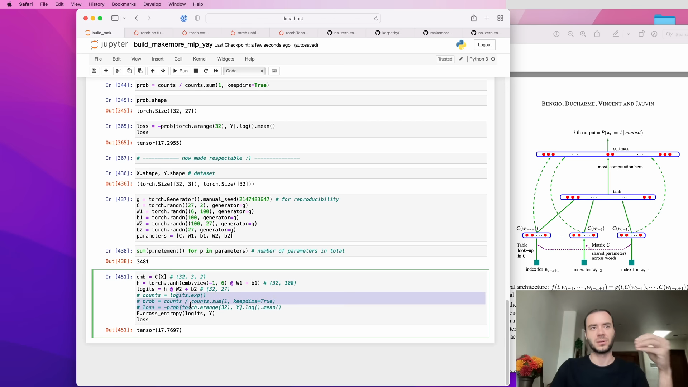

### Numerical Stability in Cross Entropy

Another significant advantage of using `F.cross_entropy` is its numerical stability. Let's explore this with an example.

#### Example: Logits and Exponentiation

Suppose we have logits with values `[-2, -3, 0, 5]`. When we exponentiate and normalize these values, we get a well-behaved probability distribution. However, if some logits take on extreme values, such as `-100`, the probabilities remain well-behaved. But if we have very positive logits, like `100`, we run into numerical issues, resulting in `NaN` values due to floating-point overflow.

```python
logits = torch.tensor([-100, -3, 0, 5])
counts = logits.exp()
probs = counts / counts.sum()
print(probs)  # tensor([0.0000e+00, 3.3311e-04, 6.6906e-03, 9.9293e-01])
```

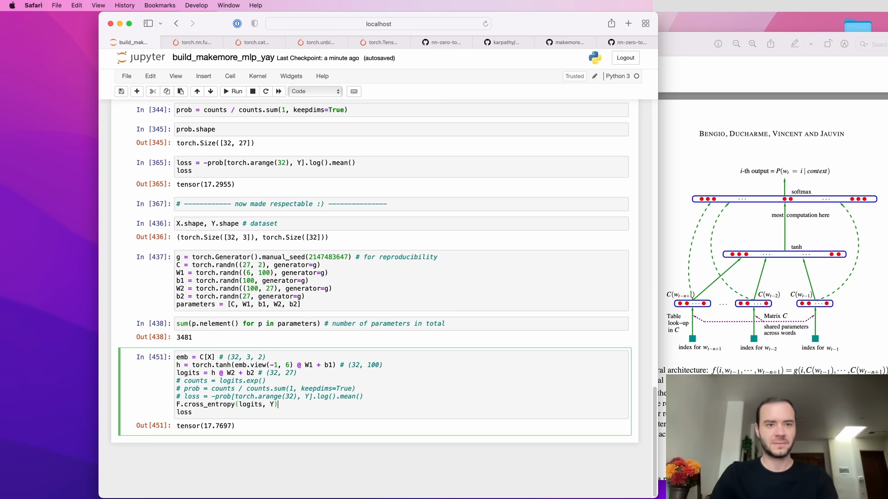

### PyTorch's Solution

PyTorch addresses this issue by normalizing the logits. It subtracts the maximum logit value from all logits, ensuring that the largest logit is zero and the others are negative. This normalization prevents overflow and ensures numerical stability.

```python
logits = torch.tensor([-5, -3, 0, 5]) - 5
counts = logits.exp()
probs = counts / counts.sum()
print(probs)  # tensor([4.5079e-05, 3.3309e-03, 6.6903e-03, 9.9293e-01])
```

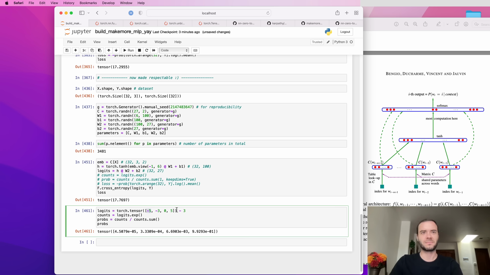

### Setting Up Neural Network Training

Let's set up the training loop for our neural network. We'll use the forward pass, backward pass, and parameter update steps.

#### Forward Pass

```python
emb = C[X]  # (32, 3, 2)
h = torch.tanh(emb.view(-1, 6) @ W1 + b1)  # (32, 100)
logits = h @ W2 + b2  # (32, 27)
loss = F.cross_entropy(logits, Y)
```

#### Backward Pass

First, we set the gradients to zero:

```python
for p in parameters:
    p.grad = None
loss.backward()
```

#### Parameter Update

We update the parameters using the gradients:

```python
for p in parameters:
    p.data += -0.1 * p.grad
```

#### Training Loop

We repeat the forward and backward passes for several iterations:

```python
for _ in range(10):
    # Forward pass
    emb = C[X]  # (32, 3, 2)
    h = torch.tanh(emb.view(-1, 6) @ W1 + b1)  # (32, 100)
    logits = h @ W2 + b2  # (32, 27)
    loss = F.cross_entropy(logits, Y)
    print(loss.item())
    
    # Backward pass
    for p in parameters:
        p.grad = None
    loss.backward()
    
    # Update
    for p in parameters:
        p.data += -0.1 * p.grad
```


By using PyTorch's built-in functions and following these steps, we ensure that our neural network training is both efficient and numerically stable. # Optimizing Neural Networks with Mini-Batches in PyTorch

In this session, we started with a loss of 17 and observed how it decreased significantly over time. Initially, we ran the optimization for a thousand iterations, which resulted in a very low loss, indicating that our model was making good predictions. However, this was achieved by overfitting a small dataset of only 32 examples.

## Overfitting on a Small Dataset

We began by overfitting a single batch of data, which consisted of 32 examples. Given that our model had 3,400 parameters, it was relatively easy to achieve a low loss on such a small dataset. This is a classic case of overfitting, where the model performs exceptionally well on the training data but may not generalize to new data.

```python
for _ in range(1000):
    # forward pass
    emb = C[X]  # (32, 3, 2)
    h = torch.tanh(emb.view(-1, 6) @ W1 + b1)  # (32, 100)
    logits = h @ W2 + b2  # (32, 27)
    loss = F.cross_entropy(logits, Y)
    print(loss.item())

    # backward pass
    for p in parameters:
        p.grad = None
    loss.backward()

    # update
    for p in parameters:
        p.data += -0.1 * p.grad
```

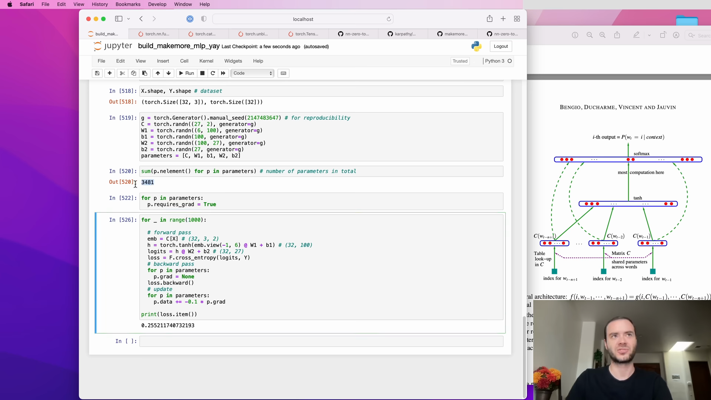

Despite the low loss, we couldn't achieve a loss of exactly zero. This is because some inputs can have multiple valid outputs, making it impossible to perfectly predict every example.

## Expanding to the Full Dataset

Next, we expanded our dataset to include all words, resulting in 228,000 examples instead of just 32. This required reinitializing the weights and ensuring that all parameters required gradients.

```python
X.shape, Y.shape  # dataset
# Output: (torch.Size([32, 3]), torch.Size([32]))

# Reinitialize weights
g = torch.Generator().manual_seed(2147483647)  # for reproducibility
C = torch.rand((27, 2), generator=g)
W1 = torch.rand((6, 100), generator=g)
b1 = torch.rand(100, generator=g)
W2 = torch.rand((100, 27), generator=g)
b2 = torch.rand(27, generator=g)
parameters = [C, W1, b1, W2, b2]

sum(p.nelement() for p in parameters)  # number of parameters in total
# Output: 3481

for p in parameters:
    p.requires_grad = True
```


## Implementing Mini-Batches

To optimize the neural network efficiently, we implemented mini-batches. Instead of processing all 228,000 examples in each iteration, we randomly selected a subset of the data (mini-batch) and performed forward and backward passes on this subset. This significantly reduced the computation time per iteration.

```python
for _ in range(10):
    # minibatch construct
    ix = torch.randint(0, X.shape[0], (32,))

    # forward pass
    emb = C[X[ix]]  # (32, 3, 2)
    h = torch.tanh(emb.view(-1, 6) @ W1 + b1)  # (32, 100)
    logits = h @ W2 + b2  # (32, 27)
    loss = F.cross_entropy(logits, Y[ix])
    print(loss.item())

    # backward pass
    for p in parameters:
        p.grad = None
    loss.backward()

    # update
    for p in parameters:
        p.data += -0.1 * p.grad
```

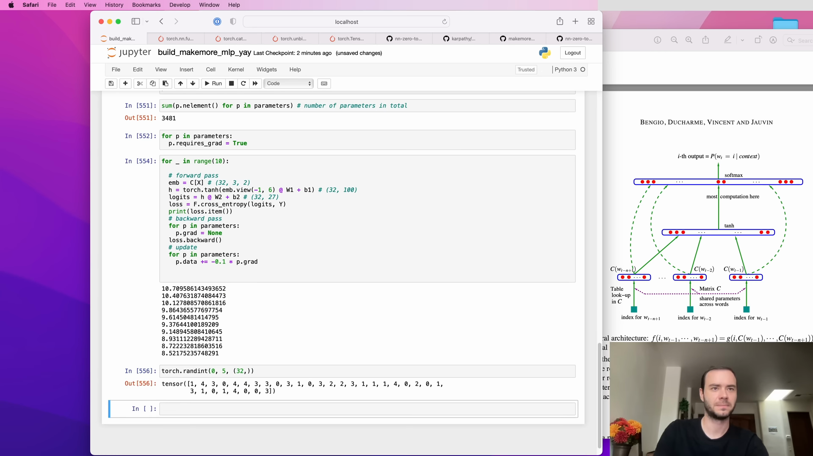

By using mini-batches, we were able to run many iterations almost instantly, making the optimization process much more efficient. This approach is commonly used in practice to handle large datasets and speed up the training of neural networks. ## Optimizing the Learning Rate for Faster Convergence

In this section, we will discuss how to optimize the learning rate to decrease the loss much faster. When dealing with mini-batches, the quality of our gradient is lower, so the direction is not as reliable. It's not the actual gradient direction, but the gradient direction is good enough even when estimating on only 32 examples. This makes it useful and much better to have an approximate gradient and make more steps than to evaluate the exact gradient and take fewer steps. This approach works quite well in practice.

### Evaluating the Loss

Let's continue the optimization by moving the `loss.item()` print statement to the end of the loop. Initially, we are hovering around a loss of 2.5, but this is only for the mini-batch. To get a full sense of how well the model is doing, we need to evaluate the loss for the entire training set.

```python
# Evaluate the loss for the entire training set
emb = C[X[ix]]  # (32, 3, 2)
h = torch.tanh(emb.view(-1, 6)) @ W1 + b1  # (32, 100)
logits = h @ W2 + b2  # (32, 27)
loss = F.cross_entropy(logits, Y[ix])
print(loss.item())
```

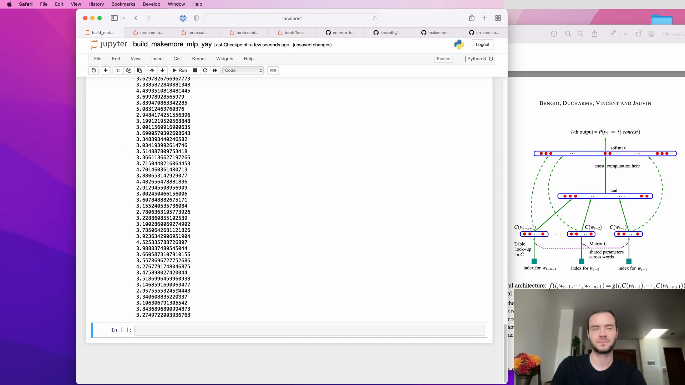

### Running the Optimization

After running the optimization for a while, we observe the following loss values:

- 2.7 on the entire training set
- 2.6
- 2.57
- 2.53

One issue is that we don't know if we're stepping too slow or too fast. The learning rate of 0.1 was just a guess. So, how do we determine this learning rate and gain confidence that we're stepping at the right speed?

### Determining a Reasonable Learning Rate

One way to determine a reasonable learning rate is as follows:

1. **Reset Parameters**: Reset the parameters to their initial settings.
2. **Print Loss at Each Step**: Print the loss at each step, but only do 10 or 100 steps to find a reasonable search range.

For example, if the learning rate is very low, the loss barely decreases, indicating that it's too low. Let's try this approach:

```python
# Reset parameters and try a low learning rate
for p in parameters:
    p.requires_grad = True

for _ in range(100):
    # Minibatch construct
    ix = torch.randint(0, X.shape[0], (32,))
    
    # Forward pass
    emb = C[ix]  # (32, 3, 2)
    h = torch.tanh(emb.view(-1, 6)) @ W1 + b1  # (32, 100)
    logits = h @ W2 + b2  # (32, 27)
    loss = F.cross_entropy(logits, Y[ix])
    print(loss.item())
    
    # Backward pass
    for p in parameters:
        p.grad = None
    loss.backward()
    
    # Update
    for p in parameters:
        p.data += -0.1 * p.grad
```

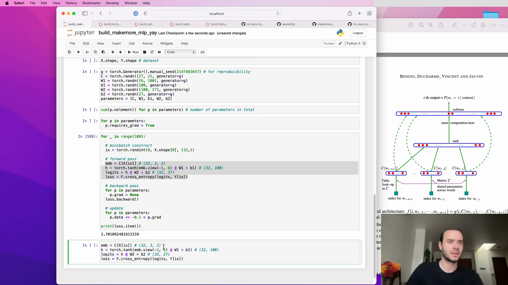

### Finding the Exploding Point

Next, let's find the point at which the loss explodes. We can try a learning rate of -1 and observe the behavior:

```python
# Try a higher learning rate
for p in parameters:
    p.requires_grad = True

for _ in range(100):
    # Minibatch construct
    ix = torch.randint(0, X.shape[0], (32,))
    
    # Forward pass
    emb = C[ix]  # (32, 3, 2)
    h = torch.tanh(emb.view(-1, 6)) @ W1 + b1  # (32, 100)
    logits = h @ W2 + b2  # (32, 27)
    loss = F.cross_entropy(logits, Y[ix])
    print(loss.item())
    
    # Backward pass
    for p in parameters:
        p.grad = None
    loss.backward()
    
    # Update
    for p in parameters:
        p.data += -1 * p.grad
```

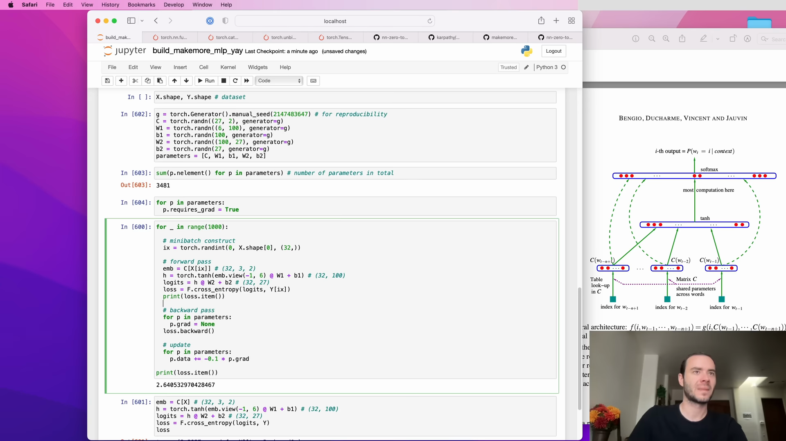

We see that with a learning rate of -1, the loss is minimized but is quite unstable, going up and down. This indicates that -1 is probably a fast learning rate. Let's try -10:

```python
# Try an even higher learning rate
for p in parameters:
    p.requires_grad = True

for _ in range(100):
    # Minibatch construct
    ix = torch.randint(0, X.shape[0], (32,))
    
    # Forward pass
    emb = C[ix]  # (32, 3, 2)
    h = torch.tanh(emb.view(-1, 6)) @ W1 + b1  # (32, 100)
    logits = h @ W2 + b2  # (32, 27)
    loss = F.cross_entropy(logits, Y[ix])
    print(loss.item())
    
    # Backward pass
    for p in parameters:
        p.grad = None
    loss.backward()
    
    # Update
    for p in parameters:
        p.data += -10 * p.grad
```

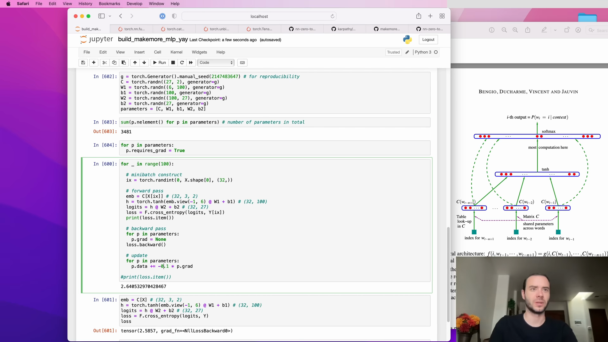

With a learning rate of -10, the optimization does not work well, indicating that -10 is way too big. Therefore, -1 was somewhat reasonable. By resetting and trying different learning rates, we can find a suitable range for our optimization process. ## Exploring Learning Rates in PyTorch

In this section, we will explore how to effectively search for optimal learning rates using PyTorch. We will use a range of learning rates, exponentially spaced, to find the best learning rate for our model.

### Generating Learning Rates

First, we generate a range of learning rates. Instead of stepping linearly, we will step through the exponents of these learning rates.

```python
lre = torch.linspace(-3, 0, 1000)
lrs = 10**lre
```

This creates 1,000 learning rates between \(10^{-3}\) and \(10^0\) (i.e., 0.001 and 1), spaced exponentially.

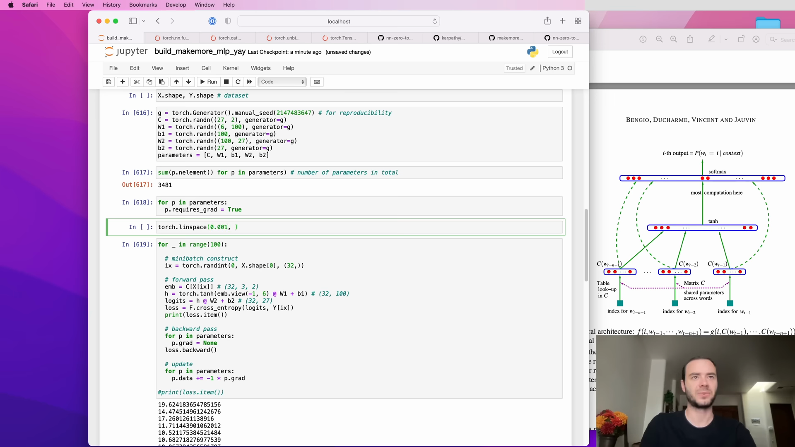

### Running the Optimization

Next, we will run the optimization process for 1,000 steps. Instead of using a fixed learning rate, we will use the learning rates generated above.

```python
lri = []
lossi = []

for i in range(1000):
    # Minibatch construct
    ix = torch.randint(0, X.shape[0], (32,))
    
    # Forward pass
    emb = C[ix]  # (32, 3, 2)
    h = torch.tanh(emb.view(-1, 6) @ W1 + b1)  # (32, 100)
    logits = h @ W2 + b2  # (32, 27)
    loss = F.cross_entropy(logits, Y[ix])
    
    # Backward pass
    for p in parameters:
        p.grad = None
    loss.backward()
    
    # Update
    lr = lrs[i]
    for p in parameters:
        p.data += -lr * p.grad
    
    # Track stats
    lri.append(lr)
    lossi.append(loss.item())
```

Here, we start with a very low learning rate (0.001) and increase it up to 1. We track the learning rates and the corresponding losses.

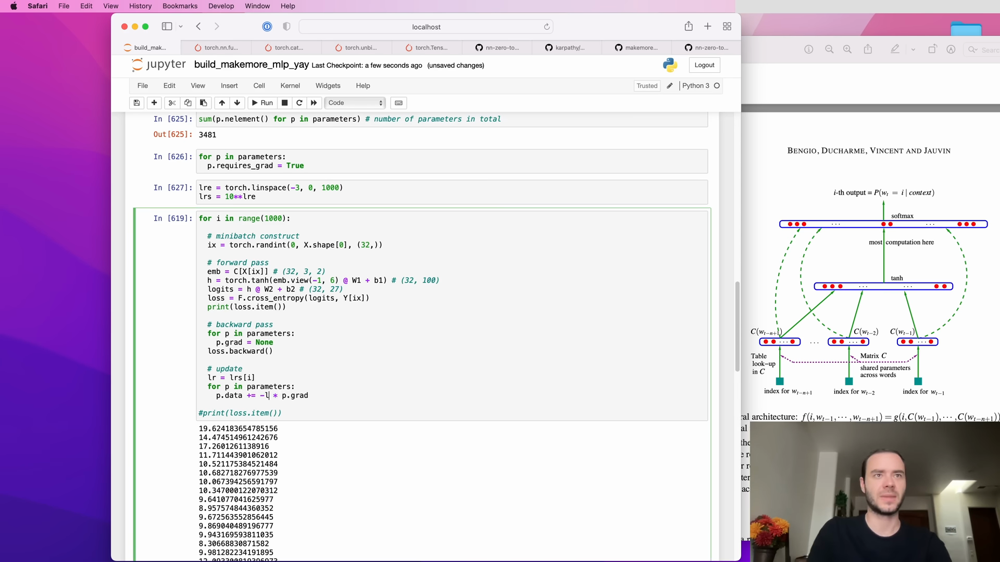

### Plotting the Results

Finally, we plot the learning rates against the losses to visualize the performance.

```python
plt.plot(lri, lossi)
```


In the plot, we observe that:

- At very low learning rates, the model barely learns anything.
- There is a sweet spot where the learning rate is optimal.
- As the learning rate increases further, the model becomes unstable.

To better understand the optimal learning rate, we can plot the exponents of the learning rates instead.

```python
plt.plot(lre, lossi)
```

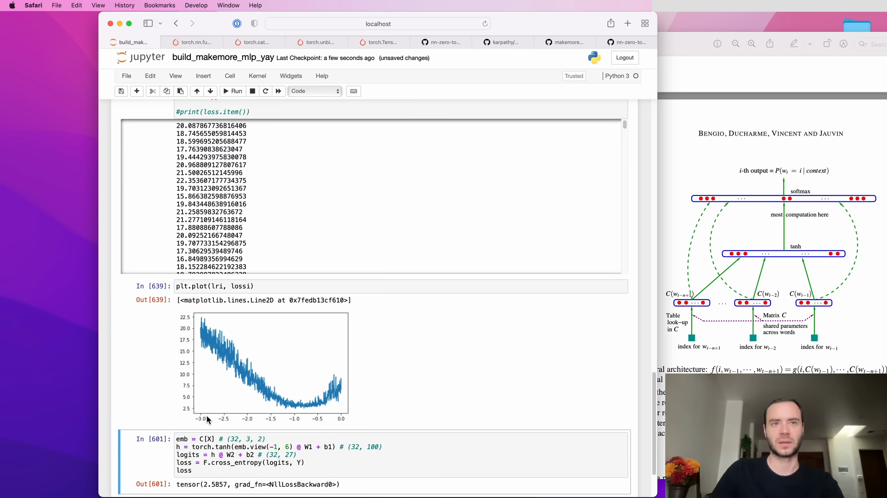

From this plot, we see that the optimal learning rate exponent is around -1, which corresponds to a learning rate of \(10^{-1}\) or 0.1. This is where the loss is minimized, indicating a good learning rate for our model. # Optimizing Learning Rate and Model Evaluation

In this session, we will discuss how to determine a good learning rate, the importance of learning rate decay, and the significance of splitting your dataset for training, validation, and testing.

## Determining a Good Learning Rate

Initially, we set our learning rate to 0.1, which proved to be quite effective. To confirm this, we can remove the tracking and set the learning rate (`lr`) to \(10^{-1}\) or 0.1. With this confidence, we can increase the number of iterations, reset our optimization, and run for an extended period using this learning rate.

```python
# Set learning rate
lr = 0.1

# Run optimization for 10,000 steps
for i in range(10000):
    # Optimization code here
    pass
```

## Learning Rate Decay

After running several iterations, we observe the loss. For instance, after 10,000 steps, the loss might be around 2.48. Running another 10,000 steps might reduce it to 2.46. At this point, we can apply learning rate decay by reducing the learning rate by a factor of 10.

```python
# Apply learning rate decay
lr *= 0.1
```

This approach helps in the later stages of training, allowing the model to converge more smoothly.

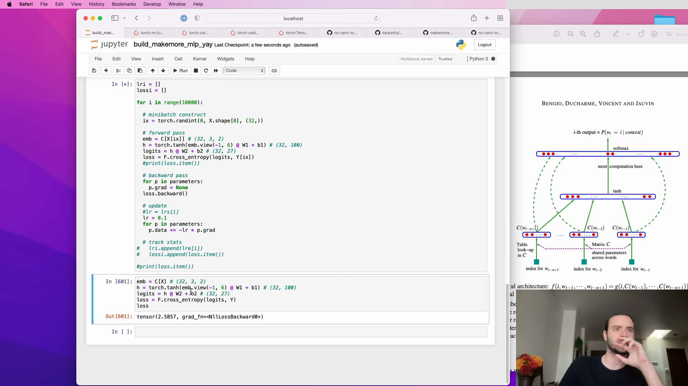

## Comparing Models

In our previous session, we achieved a bigram loss of 2.45. With our current model, we have surpassed this, achieving a loss of around 2.3. This indicates a significant improvement.

However, it's crucial to note that a lower loss on the training set does not necessarily mean a better model. As the model's capacity increases (i.e., more parameters), it becomes more prone to overfitting. Overfitting occurs when the model memorizes the training data instead of generalizing from it.

## Dataset Splits

To mitigate overfitting and ensure our model generalizes well, we split our dataset into three parts:

1. **Training Split**: Typically 80% of the dataset, used to optimize the model parameters.
2. **Validation Split (Dev Split)**: Around 10%, used to tune hyperparameters such as the size of hidden layers, embedding dimensions, and regularization strength.
3. **Test Split**: The remaining 10%, used sparingly to evaluate the final model performance.

```python
# Example of dataset split
train_data, val_data, test_data = split_dataset(data, train_ratio=0.8, val_ratio=0.1, test_ratio=0.1)
```

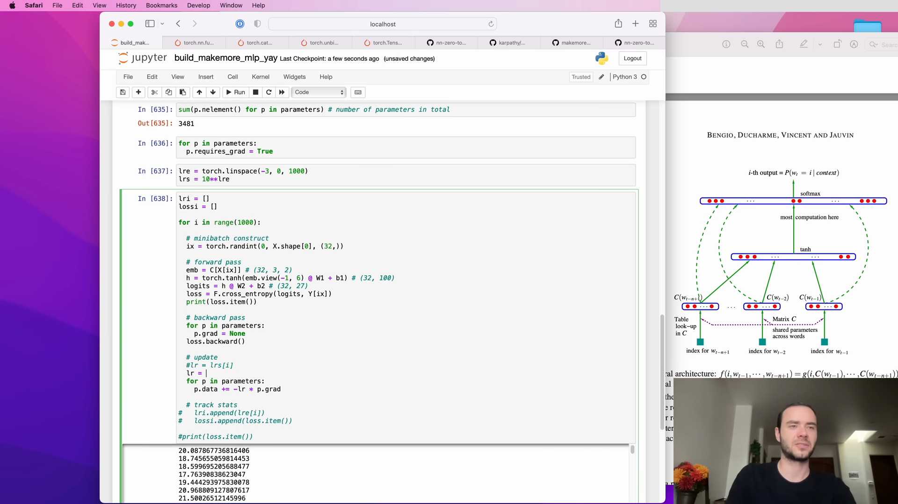

## Hyperparameter Tuning

Hyperparameters are crucial for defining the architecture and behavior of the neural network. Examples include the size of the hidden layer and the embedding dimensions. The validation split helps in experimenting with different hyperparameter settings to find the optimal configuration.

```python
# Example of hyperparameter tuning
hidden_layer_size = [50, 100, 200]
embedding_size = [2, 4, 8]

for h in hidden_layer_size:
    for e in embedding_size:
        # Train and validate model with hyperparameters h and e
        pass
```

By carefully selecting a learning rate, applying learning rate decay, and properly splitting the dataset, we can train a robust model that generalizes well to unseen data. This approach helps in achieving a balance between underfitting and overfitting, leading to better performance on real-world tasks.

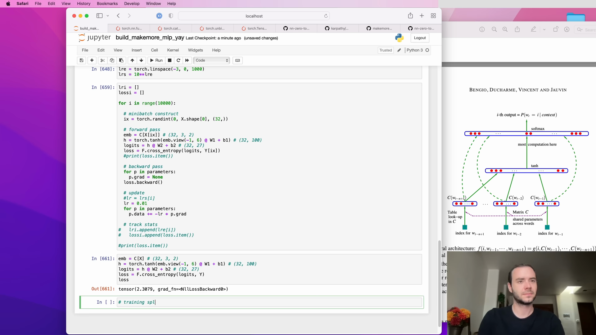 # Training, Validation, and Test Split

To avoid overfitting and ensure our model generalizes well, we split our data into training, validation (dev), and test sets. We train on the training set and evaluate on the test set sparingly.

## Building the Dataset

We start by reading all the words and converting them into tensors `X` and `Y`. Here's the code snippet for this process:

```python
# Read in all the words
words = open('names.txt', 'r').read().splitlines()
words[:8]

# Build the vocabulary of characters and mappings to/from integers
chars = sorted(list(set(''.join(words))))
stoi = {s: i + 1 for i, s in enumerate(chars)} 
stoi['.'] = 0
itos = {i: s for s, i in stoi.items()}
print(itos)

# Build the dataset
block_size = 3 # context length: how many characters do we take to predict the next one?
X, Y = [], []
for w in words:
    context = [0] * block_size
    for ch in w + '.':
        ix = stoi[ch]
        X.append(context)
        Y.append(ix)
        context = context[1:] + [ix]
X = torch.tensor(X)
Y = torch.tensor(Y)
```


## Shuffling and Splitting the Data

Next, we shuffle the words and split them into training, validation, and test sets. We use 80% of the data for training, 10% for validation, and 10% for testing.

```python
import random
random.seed(42)
random.shuffle(words)
n1 = int(0.8 * len(words))
n2 = int(0.9 * len(words))

Xtr, Ytr = build_dataset(words[:n1])
Xdev, Ydev = build_dataset(words[n1:n2])
Xte, Yte = build_dataset(words[n2:])
```

Here, `build_dataset` is a function that constructs the `X` and `Y` tensors for a given list of words.


## Training the Neural Network

We initialize our neural network and start training. Initially, we use a small network, but we later scale it up to improve performance.

```python
# Initialize parameters
g = torch.Generator().manual_seed(2147483647)
C = torch.randn((27, 2), generator=g)
W1 = torch.randn((6, 100), generator=g)
b1 = torch.randn(100, generator=g)
W2 = torch.randn((100, 27), generator=g)
b2 = torch.randn(27, generator=g)
parameters = [C, W1, b1, W2, b2]

# Training loop
for i in range(10000):
    # Minibatch construct
    ix = torch.randint(0, Xtr.shape[0], (32,))
    
    # Forward pass
    emb = C[Xtr[ix]]
    h = torch.tanh(emb.view(-1, 6) @ W1 + b1)
    logits = h @ W2 + b2
    loss = F.cross_entropy(logits, Ytr[ix])
    
    # Backward pass
    for p in parameters:
        p.grad = None
    loss.backward()
    
    # Update
    lr = 0.01
    for p in parameters:
        p.data += -lr * p.grad
```

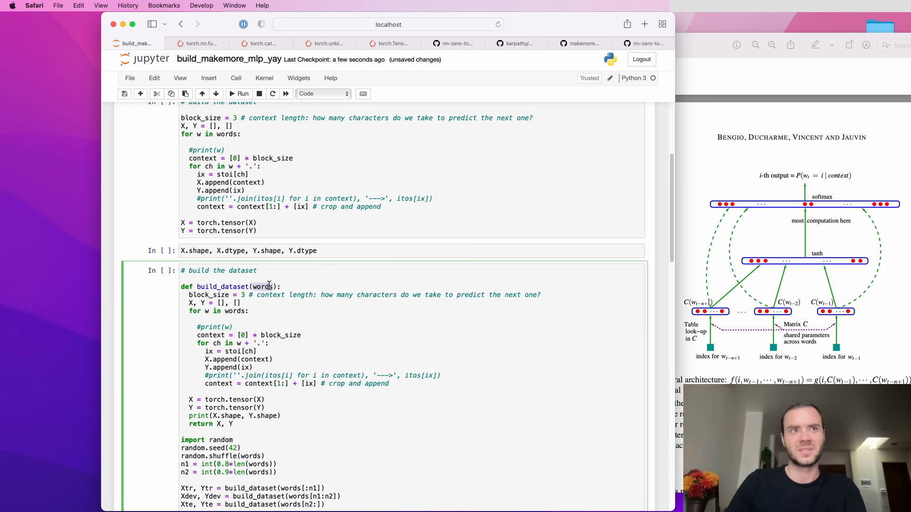

## Evaluating the Model

We evaluate the model on the validation set to ensure it generalizes well. The loss on the validation set is approximately 2.3, indicating that the model is not overfitting.

```python
# Evaluate on validation set
emb = C[Xdev]
h = torch.tanh(emb.view(-1, 6) @ W1 + b1)
logits = h @ W2 + b2
loss = F.cross_entropy(logits, Ydev)
print(loss.item())
```

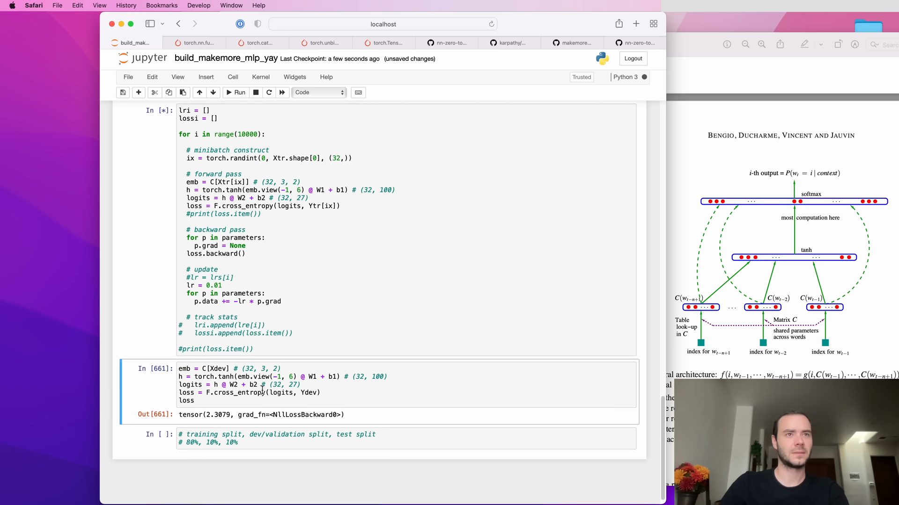

## Scaling Up the Neural Network

To improve performance, we increase the size of the neural network by increasing the number of neurons in the hidden layer from 100 to 300.

```python
# Increase the size of the neural network
W1 = torch.randn((6, 300), generator=g)
b1 = torch.randn(300, generator=g)
W2 = torch.randn((300, 27), generator=g)
b2 = torch.randn(27, generator=g)
parameters = [C, W1, b1, W2, b2]

# Reinitialize training loop with new parameters
for i in range(30000):
    # Minibatch construct
    ix = torch.randint(0, Xtr.shape[0], (32,))
    
    # Forward pass
    emb = C[Xtr[ix]]
    h = torch.tanh(emb.view(-1, 6) @ W1 + b1)
    logits = h @ W2 + b2
    loss = F.cross_entropy(logits, Ytr[ix])
    
    # Backward pass
    for p in parameters:
        p.grad = None
    loss.backward()
    
    # Update
    lr = 0.01
    for p in parameters:
        p.data += -lr * p.grad
```

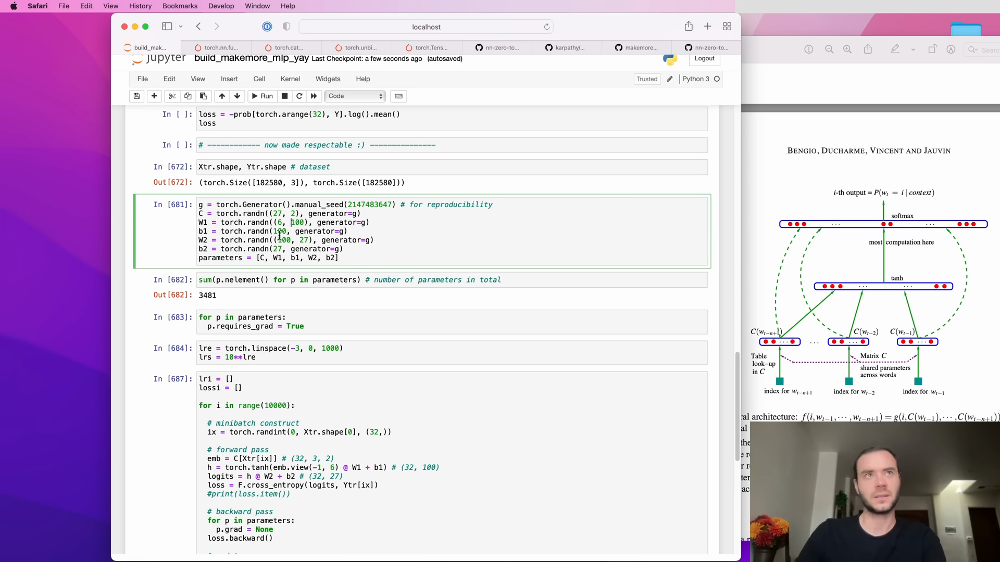

By scaling up the neural network, we expect to see performance improvements as the model becomes more capable of capturing the underlying patterns in the data. ## Optimizing Neural Networks with PyTorch

In this session, we are working on optimizing a neural network using PyTorch. We will track the steps and losses during the training process and make adjustments to improve the model's performance.

### Tracking Steps and Loss

First, we need to keep track of the steps and losses during the training process. We will train the model for 30,000 iterations with a learning rate of 0.1. The goal is to optimize the neural network and plot the steps against the loss to visualize the optimization process.

```python
lri = []
lossi = []
stepi = []

for i in range(30000):
    # minibatch construct
    ix = torch.randint(0, Xtr.shape[0], (32,))
    
    # forward pass
    emb = C[Xtr[ix]] # (32, 3, 2)
    h = torch.tanh(emb.view(-1, 6) @ W1 + b1) # (32, 100)
    logits = h @ W2 + b2 # (32, 27)
    loss = F.cross_entropy(logits, Ytr[ix])
    
    # backward pass
    for p in parameters:
        p.grad = None
    loss.backward()
    
    # update
    lr = 0.1
    for p in parameters:
        p.data += -lr * p.grad
    
    # track stats
    lri.append(lre[i])
    stepi.append(i)
    lossi.append(loss.item())
```

### Plotting the Loss

We will plot the steps against the loss to see how the loss function is being optimized. The thickness in the plot is due to the noise created by the mini-batches.

```python
plt.plot(stepi, lossi)
```


### Evaluating the Model

After training, we evaluate the model on the development set. The current loss is around 2.5, indicating that the neural network has not been optimized very well. This could be due to the model's size or the batch size being too low, causing too much noise in the training process.

```python
emb = C[Xtr] # (32, 3, 2)
h = torch.tanh(emb.view(-1, 6) @ W1 + b1) # (32, 100)
logits = h @ W2 + b2 # (32, 27)
loss = F.cross_entropy(logits, Ytr)
loss
```


### Adjusting the Learning Rate

To improve the model's performance, we decrease the learning rate by a factor of two and continue training. We expect to see a lower loss than before because we have a much bigger model now.

```python
lr = 0.05
for p in parameters:
    p.data += -lr * p.grad
```


### Addressing the Bottleneck

One concern is that the embeddings are two-dimensional, which might be cramming too many characters into a small space. This could be the bottleneck of the network's performance. Increasing the dimensionality of the embeddings might help the neural network utilize the space more effectively.

```python
emb = C[Xtr] # (32, 3, 2)
h = torch.tanh(emb.view(-1, 6) @ W1 + b1) # (32, 100)
logits = h @ W2 + b2 # (32, 27)
loss = F.cross_entropy(logits, Ytr)
loss
```

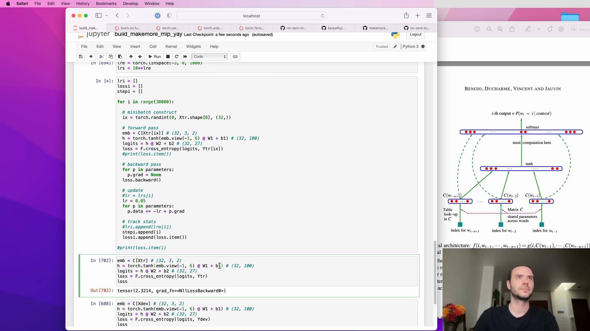

By making these adjustments and continuing to train the model, we aim to achieve better optimization and lower loss, ultimately improving the neural network's performance. # Visualizing Character Embeddings in Neural Networks

I was able to make quite a bit of progress. Let's run this one more time and then evaluate the training and the dev loss.

## Evaluating Training and Dev Loss

Now, one more thing after training that I'd like to do is visualize the embedding vectors for these characters before we scale up the embedding size from two. We want to make this bottleneck potentially go away. But once I make this greater than two, we won't be able to visualize them.

Here, we see the training and dev loss values:


We are at 2.23 and 2.24, so we're not improving much more. Maybe the bottleneck now is the character embedding size, which is two.

## Visualizing Embedding Vectors

I have a bunch of code that will create a figure, and then we're going to visualize the embeddings that were trained by the neural net on these characters. Right now, the embedding size is just two, so we can visualize all the characters with the x and y coordinates as the two embedding locations for each of these characters.

Here is the code snippet for visualizing the embeddings:

```python
plt.figure(figsize=(8,8))
plt.scatter(C[:,0].data, C[:,1].data, s=200)
for i in range(C.shape[0]):
    plt.text(C[i,0].item(), C[i,1].item(), itos[i], ha="center", va="center", color="white")
plt.grid('minor')
```

And here is the resulting plot:

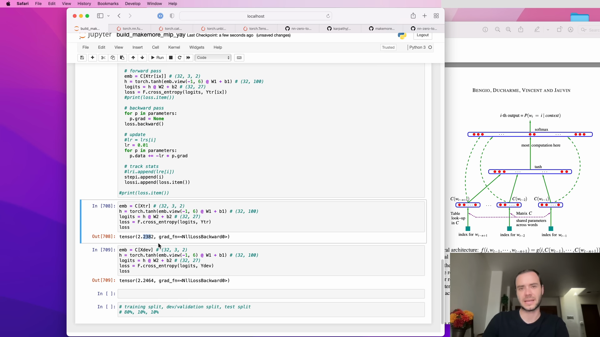

## Interpretation of the Embedding Plot

What we see is actually kind of interesting. The network has basically learned to separate out the characters and cluster them a little bit. For example, you see how the vowels, A, E, I, O, U, are clustered together. This tells us that the neural net treats these as very similar because when they feed into the neural net, the embedding for all these characters is very similar. The neural net thinks that they're very similar and kind of interchangeable, if that makes sense.

The points that are really far away are, for example, Q. Q is treated as an exception and has a very special embedding vector. Similarly, the dot character, which is a special character, is all the way out here. A lot of the other letters are clustered up here.

It's interesting that there's a little bit of structure here after the training, and it's definitely not random. These embeddings make sense.

## Scaling Up the Embedding Size

We are now going to scale up the embedding size, and we won't be able to visualize it directly anymore. This step is crucial to potentially remove the bottleneck and improve the model's performance further.

By understanding and visualizing these embeddings, we gain insights into how the neural network perceives and processes different characters, which can be invaluable for further tuning and improving the model. # Optimizing Neural Network Embeddings and Hyperparameters

In this session, we will explore how to optimize neural network embeddings and hyperparameters. We will start by increasing the dimensionality of our embeddings and adjusting the size of our hidden layer. Additionally, we will modify the learning rate and the number of iterations to observe their effects on the training and validation losses.

## Increasing Embedding Dimensions

First, let's increase the embedding dimensions from 2 to 10. This means each word will now have a 10-dimensional embedding. Consequently, the input to the hidden layer will be 30 (3 words * 10 dimensions).

```python
C = torch.randn((27, 10), generator=g)
W1 = torch.randn((30, 100), generator=g)
b1 = torch.randn(300, generator=g)
W2 = torch.randn((300, 27), generator=g)
b2 = torch.randn(27, generator=g)
parameters = [C, W1, b1, W2, b2]
```

## Adjusting the Hidden Layer Size

We will also reduce the size of the hidden layer from 300 to 200 neurons. This change will slightly increase the total number of parameters to around 11,000.

```python
W1 = torch.randn((30, 200), generator=g)
b1 = torch.randn(200, generator=g)
W2 = torch.randn((200, 27), generator=g)
b2 = torch.randn(27, generator=g)
parameters = [C, W1, b1, W2, b2]
```

## Modifying the Learning Rate and Iterations

We will set the learning rate to 0.1 and run the training for 50,000 iterations. Additionally, we will log the loss using a logarithmic scale to better visualize the training progress.

```python
lr = 0.1
for i in range(50000):
    # Minibatch construct
    ix = torch.randint(0, Xtr.shape[0], (32,))
    
    # Forward pass
    emb = C[Xtr[ix]]
    h = torch.tanh(emb.view(-1, 30) @ W1 + b1)
    logits = h @ W2 + b2
    loss = F.cross_entropy(logits, Ytr[ix])
    
    # Backward pass
    for p in parameters:
        p.grad = None
    loss.backward()
    
    # Update
    for p in parameters:
        p.data += -lr * p.grad
    
    # Track stats
    stepi.append(i)
    lossi.append(loss.log10().item())
```

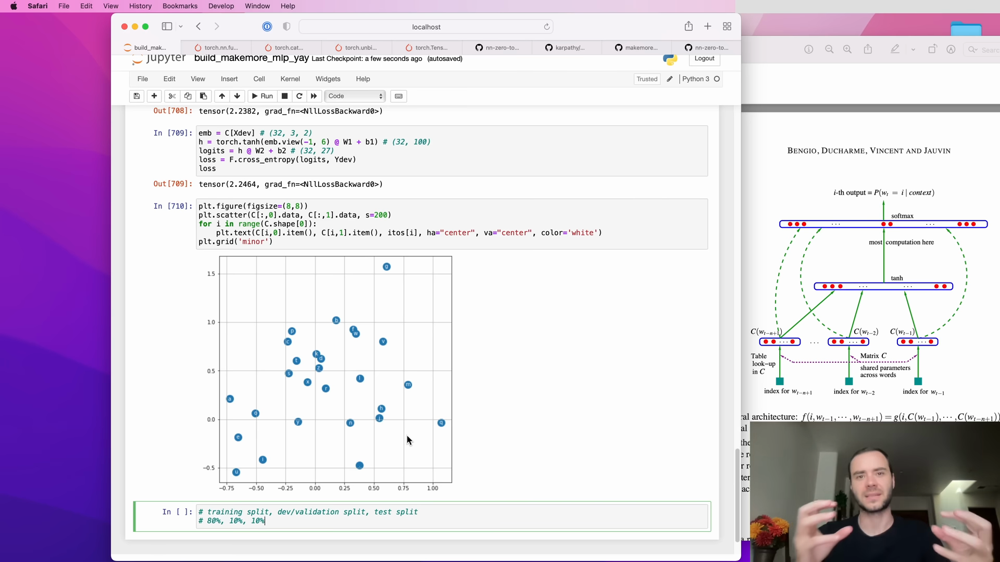

## Plotting the Log Loss

Plotting the log loss helps in visualizing the training progress more clearly, as it squashes the loss values and avoids the hockey stick appearance.

```python
plt.plot(stepi, lossi)
```

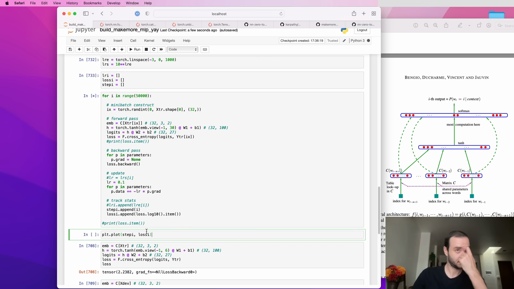

## Observing Training and Validation Losses

After running the training for 50,000 iterations, we observe the training and validation losses. The training loss is around 2.17, and the validation loss is around 2.2. This indicates that the model is starting to overfit slightly.

```python
emb = C[Xtr]
h = torch.tanh(emb.view(-1, 30) @ W1 + b1)
logits = h @ W2 + b2
loss = F.cross_entropy(logits, Ytr)
print(loss.item())  # Training loss

emb = C[Xdev]
h = torch.tanh(emb.view(-1, 30) @ W1 + b1)
logits = h @ W2 + b2
loss = F.cross_entropy(logits, Ydev)
print(loss.item())  # Validation loss
```

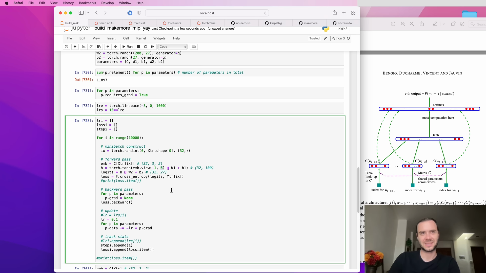

## Further Optimization

To further optimize the model, we can decrease the learning rate by a factor of 10 and train for another 50,000 iterations. This should help in reducing the loss further.

```python
lr = 0.01
for i in range(50000, 100000):
    # Minibatch construct
    ix = torch.randint(0, Xtr.shape[0], (32,))
    
    # Forward pass
    emb = C[Xtr[ix]]
    h = torch.tanh(emb.view(-1, 30) @ W1 + b1)
    logits = h @ W2 + b2
    loss = F.cross_entropy(logits, Ytr[ix])
    
    # Backward pass
    for p in parameters:
        p.grad = None
    loss.backward()
    
    # Update
    for p in parameters:
        p.data += -lr * p.grad
    
    # Track stats
    stepi.append(i)
    lossi.append(loss.log10().item())
```

## Final Results

After running the training for a total of 100,000 iterations, we achieve a training loss of 2.16 and a validation loss of 2.19. This indicates that the embedding size was likely holding us back initially.

```python
emb = C[Xtr]
h = torch.tanh(emb.view(-1, 30) @ W1 + b1)
logits = h @ W2 + b2
loss = F.cross_entropy(logits, Ytr)
print(loss.item())  # Training loss

emb = C[Xdev]
h = torch.tanh(emb.view(-1, 30) @ W1 + b1)
logits = h @ W2 + b2
loss = F.cross_entropy(logits, Ydev)
print(loss.item())  # Validation loss
```

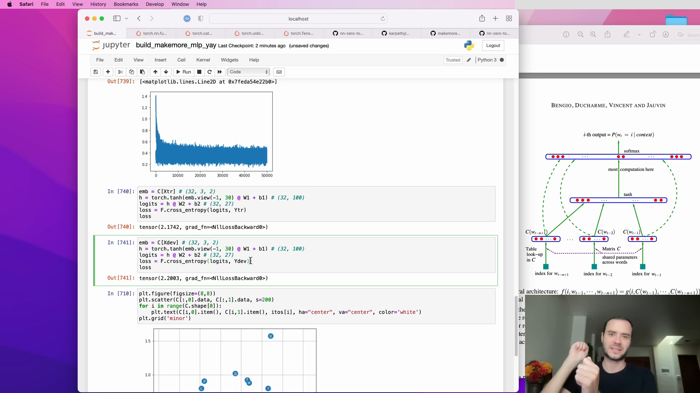

There are many ways to further optimize the model, such as tuning the optimization parameters, adjusting the size of the neural network, or increasing the number of input characters. By running multiple experiments and scrutinizing the results, we can find the best hyperparameters that yield the best validation performance. Once the optimal hyperparameters are found, we can evaluate the test set performance and report the results.

I invite you to beat the validation loss of 2.17. You have quite a few knobs available to you to surpass this number. Happy optimizing! # Exploring Model Hyperparameters and Optimization Techniques

In this section, we will discuss various aspects of tuning a neural network model, including changing the number of neurons, adjusting the dimensionality of the embedding lookup table, and modifying the context input size. Additionally, we will explore optimization details such as learning rate schedules, batch sizes, and their impact on convergence speed and model performance.

## Adjusting Model Hyperparameters

### Number of Neurons in the Hidden Layer

One of the primary hyperparameters you can adjust is the number of neurons in the hidden layer. This change can significantly impact the model's capacity to learn and generalize from the data.

### Dimensionality of the Embedding Lookup Table

Another crucial hyperparameter is the dimensionality of the embedding lookup table. This parameter determines the size of the vector space in which the input characters are embedded. Adjusting this dimensionality can affect the model's ability to capture and represent the input data effectively.

### Context Input Size

You can also change the number of characters fed into the model as context. This parameter influences how much historical information the model considers when making predictions.

## Optimization Techniques

### Learning Rate and Schedule

The learning rate is a critical factor in training neural networks. You can experiment with different learning rates and schedules to see how they affect the model's convergence. For instance, you might use a learning rate that decays over time to fine-tune the model's performance.

### Batch Size

The batch size determines the number of samples processed before the model's internal parameters are updated. Adjusting the batch size can lead to faster convergence and better model performance.

### Training Duration

The duration of the training process is another variable you can control. Running the training for a longer period can lead to better results, but it also requires more computational resources.

## Practical Example

Below is an example of a training loop with various hyperparameters and optimization techniques applied:

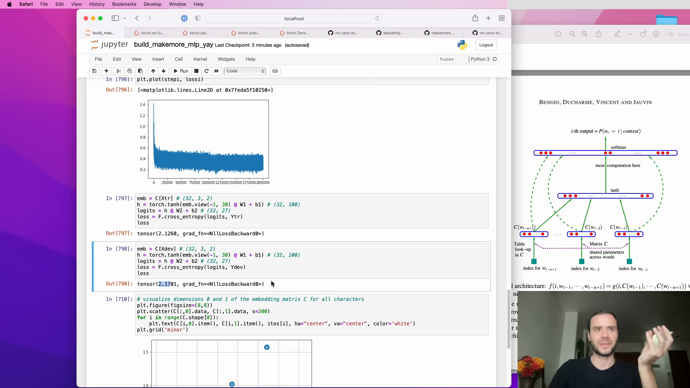

```python
for i in range(200000):
    # Minibatch construct
    ix = torch.randint(0, Xtr.shape[0], (32,))
    
    # Forward pass
    emb = C[Xtr[ix]]  # (32, 3, 2)
    h = torch.tanh(emb.view(-1, 30) @ W1 + b1)  # (32, 100)
    logits = h @ W2 + b2  # (32, 27)
    loss = F.cross_entropy(logits, Ytr[ix])
    
    # Backward pass
    for p in parameters:
        p.grad = None
    loss.backward()
    
    # Update
    lr = lrs[i]
    lr = 0.1 if i < 100000 else 0.01
    for p in parameters:
        p.data += -lr * p.grad
    
    # Track stats
    lri.append(lre[i])
    stepi.append(i)
    lossi.append(loss.log10().item())
```

## Visualizing Training Progress

The plot below shows the training loss over time, indicating how the model's performance improves with each iteration.

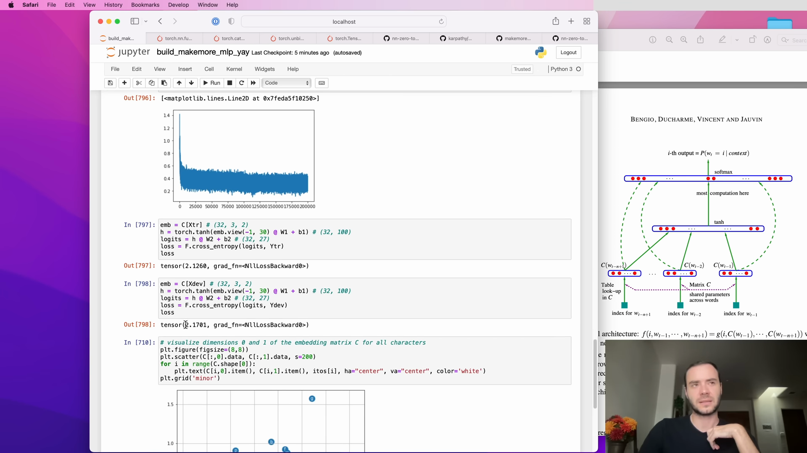

## Recommended Reading

For a deeper understanding of these concepts, I recommend reading the paper by Bengio, Ducharme, Vincent, and Jauvin. Although it is 19 pages long, you should now be able to comprehend a significant portion of it.


By experimenting with these hyperparameters and optimization techniques, you can achieve better convergence speeds and improved model performance. # Sampling from the Model

Before we wrap up, I wanted to show how you would sample from the model. We're going to generate 20 samples.

## Initial Context

At first, we begin with all dots, so that's the context. Until we generate the zero character again, we're going to embed the current context using the embedding table `C`.

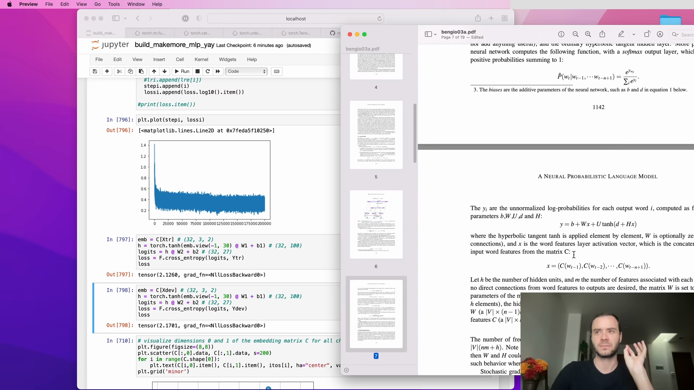

## Embedding and Hidden State

Usually, the first dimension is the size of the training set, but here we're only working with a single example that we're generating. So, this is just dimension one, for simplicity. This embedding then gets projected into the hidden state, and we get the logits.

## Calculating Probabilities

Next, we calculate the probabilities. For that, you can use the `F.softmax` of logits, which exponentiates the logits and makes them sum to one. Similar to cross-entropy, it ensures there are no overflows.

## Sampling and Context Shifting

Once we have the probabilities, we sample from them using `torch.multinomial` to get our next index. Then, we shift the context window to append the index and record it.


## Decoding and Output

Finally, we decode all the integers to strings and print them out. Here are some example samples, and you can see that the model now works much better.

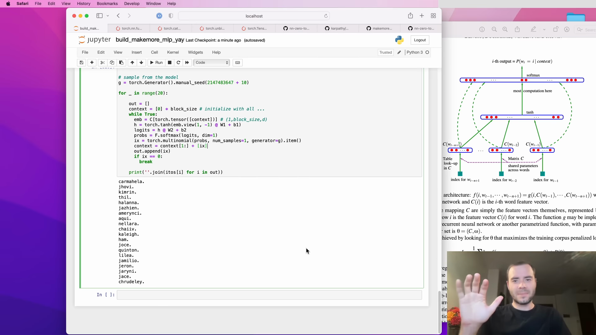 # Improving Name Generation with Neural Networks

The words generated by our model are starting to resemble actual names. For instance, we have outputs like "hem," "jose," and "lila." These are more name-like compared to earlier iterations, indicating that we are making progress. However, there is still room for improvement in our model.

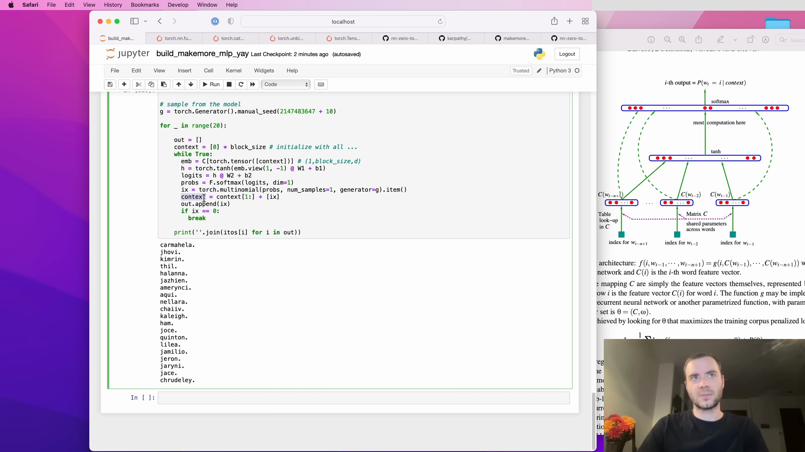

## Making Notebooks More Accessible

I want to make these notebooks more accessible. Instead of requiring you to install Jupyter notebooks, Torch, and other dependencies, I will be sharing a link to a Google Colab.

Google Colab allows you to run notebooks directly in your browser. You can execute all the code without any installation. This is the same code I used in this lecture, albeit slightly shortened. You will be able to train the exact same network, plot results, and sample from the model. Everything is set up for you to experiment with the parameters right in your browser.

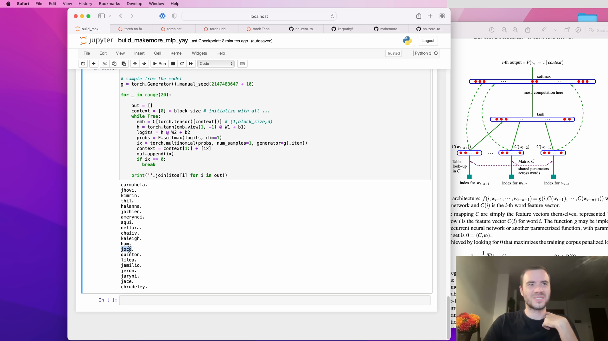

The link to the Google Colab will be provided in the video description. This should make it easier for you to follow along and experiment with the code.

## Example Code and Results

Here is an example of the code used to generate names:

```python
# sample from the model
g = torch.Generator().manual_seed(2147483647 + 10)

for _ in range(20):
    out = []
    context = [0] * block_size  # initialize with all ...
    while True:
        emb = C[torch.tensor([context])]  # (1, block_size, d)
        h = torch.tanh(emb.view(1, -1) @ W1 + b1)
        logits = h @ W2 + b2
        probs = F.softmax(logits, dim=1)
        ix = torch.multinomial(probs, num_samples=1, generator=g).item()
        context = context[1:] + [ix]
        out.append(ix)
        if ix == 0:
            break

    print(''.join(itos[i] for i in out))
```

The generated names include:

- carmahela
- jhovi
- kimrin
- thil
- halanna
- jzhein
- amerynci
- aqui
- nelara
- chaliiv
- kaleigh
- ham
- joce
- quinton
- tilea
- jamilio
- jeron
- jaryni
- jace
- chrudeley

These names show that the model is learning patterns that are more name-like, but there is still potential for further refinement.

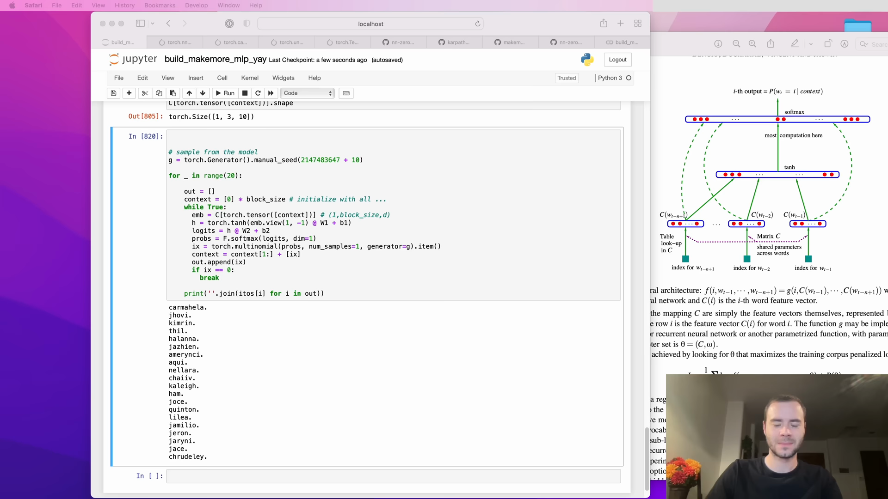

By using Google Colab, you can easily run this code and see the results for yourself. This setup is designed to be user-friendly and requires no local installations, making it accessible to everyone.