# Implementing Makemore: Bigram Language Model

Hi everyone. Today we are continuing our implementation of Makemore. In the last lecture, we implemented the bigram language model using both counts and a super simple neural network with a single linear layer.

## Overview of the Bigram Language Model

This is the Jupyter Notebook that we built out last lecture. We approached this by looking at only the single previous character and predicting the distribution for the character that would go next in the sequence. We did this by taking counts and normalizing them into probabilities so that each row sums to one.


Now, this is all well and good if you only have one character of previous context, and this works and is approachable. The problem with this model, of course, is that the predictions from this model are not very good because you only take one character of context, so the model didn't produce very name-like results.

## Visualizing the Bigram Probabilities

Here is a visualization of the bigram probabilities. Each cell represents the probability of transitioning from one character to another.


## Code Implementation

Below is a snippet of the code we used to generate the bigram probabilities and sample from the model:

```python
P.sum(1, keepdims=True)
torch.Size([27])

g = torch.Generator().manual_seed(2147483647)

for i in range(5):
    out = []
    ix = 0
    while True:
        p = P[ix]
        ix = torch.multinomial(p, num_samples=1, replacement=True, generator=g).item()
        out.append(itos[ix])
        if ix == 0:
            break
    print(''.join(out))
```

This code generates sequences based on the bigram probabilities. However, as mentioned earlier, the sequences generated are not very name-like due to the limited context.


In the next steps, we will look into improving this model by incorporating more context and using more sophisticated neural network architectures. Stay tuned!
## Understanding Context in Sequence Prediction

The problem with using a simple lookup table for predicting the next character in a sequence is that the table size grows exponentially with the length of the context. If we only take a single character at a time, there are 27 possibilities for the context. However, if we take two characters in the past and try to predict the third one, the number of rows in this matrix becomes 27 times 27, resulting in 729 possibilities for what could have come in the context.


If we take three characters as the context, we suddenly have 20,000 possibilities of context. This results in way too many rows in the matrix, leading to very few counts for each possibility. The whole approach becomes impractical and doesn't work very well.

## Moving to a Multilayer Perceptron Model

To address this issue, we will implement a multilayer perceptron (MLP) model to predict the next character in a sequence. This modeling approach allows us to take more context into account without the exponential growth in table size.

Here is a snippet of the code used to implement the MLP model:

```python
P = P / P.sum(1, keepdims=True)
g = torch.Generator().manual_seed(2147483647)

for i in range(5):
    out = []
    ix = 0
    while True:
        p = P[ix]
        ix = torch.multinomial(p, num_samples=1, replacement=True, generator=g).item()
        out.append(itos[ix])
        if ix == 0:
            break
    print(''.join(out))
```

This code snippet demonstrates how we normalize the probabilities and use a random generator to predict the next character in the sequence.

## Visualizing the Context Matrix

To better understand the context matrix, we can visualize it. The following image shows a heatmap of the context matrix, where each cell represents the count of a specific context combination.


In this heatmap, darker cells indicate higher counts, showing which context combinations are more common.

By moving from a simple lookup table to a multilayer perceptron model, we can effectively handle larger contexts without the exponential growth in table size. This approach allows us to predict the next character in a sequence more accurately and efficiently.
# A Neural Probabilistic Language Model

## Introduction

In this blog post, we will delve into the influential paper by Bengio et al. (2003) titled "A Neural Probabilistic Language Model." This paper is often cited for its significant contributions to the field of language modeling using neural networks. Although it is not the first paper to propose the use of multilayer perceptrons or neural networks to predict the next character or token in a sequence, it has been highly influential and is frequently referenced in the literature. The paper spans 19 pages, and while we won't cover every detail, I encourage you to read it for a comprehensive understanding. It is well-written, engaging, and packed with interesting ideas.

## Problem Description

The introduction of the paper describes the problem of statistical language modeling, which involves learning the joint probability function of sequences of words in a language. This task is challenging due to the "curse of dimensionality," where the number of possible word sequences is vast, making it difficult for models to generalize from the training data.

## Proposed Model

To address this problem, the authors propose a model that learns a distributed representation for words. This approach allows each training sentence to inform the model about an exponential number of semantically neighboring sentences. The model learns simultaneously:

1. A distributed representation for each word.
2. The probability function for word sequences, expressed in terms of these representations.

Generalization is achieved because a sequence of words that has never been seen before gets high probability if it is made of words that are similar (in the sense of having a nearby representation) to words forming an already seen sentence.


## Fighting the Curse of Dimensionality with Distributed Representations

The idea of the proposed approach can be summarized as follows:

1. **Associate with each word in the vocabulary a distributed word feature vector** (a real-valued vector in \( \mathbb{R}^m \)).
2. **Express the joint probability function of word sequences** in terms of the feature vectors of these words in the sequence.
3. **Learn simultaneously the word feature vectors and the parameters of that probability function**.


The feature vector represents different aspects of the word, with each word associated with a point in a vector space. The number of features (e.g., \( m = 30, 60, \) or \( 100 \) in the experiments) is much smaller than the size of the vocabulary (e.g., 17,000). The probability function is expressed as a product of conditional probabilities of the next word given the previous ones, using a multilayer neural network to predict the next word given the previous ones.

This function has parameters that can be iteratively tuned to maximize the log-likelihood of the training data or a regularized criterion, such as adding a weight decay penalty. The feature vectors associated with each word are learned, but they could be initialized using prior knowledge of semantic features.


The proposed approach by Bengio et al. (2003) significantly improves on state-of-the-art n-gram models and allows for the utilization of longer contexts. By learning distributed representations for words, the model can generalize better and handle the curse of dimensionality more effectively. This paper has laid the groundwork for many subsequent advancements in neural language modeling.
# Fighting the Curse of Dimensionality with Distributed Representations

## Introduction

In this section, we discuss the approach to fighting the curse of dimensionality using distributed representations. The idea can be summarized as follows:
1. **Associate with each word in the vocabulary a distributed word feature vector** (a real-valued vector in \( \mathbb{R}^m \)).
2. **Express the joint probability function of word sequences** in terms of the feature vectors of these words in the sequence.
3. **Learn simultaneously the word feature vectors and the parameters of that probability function**.

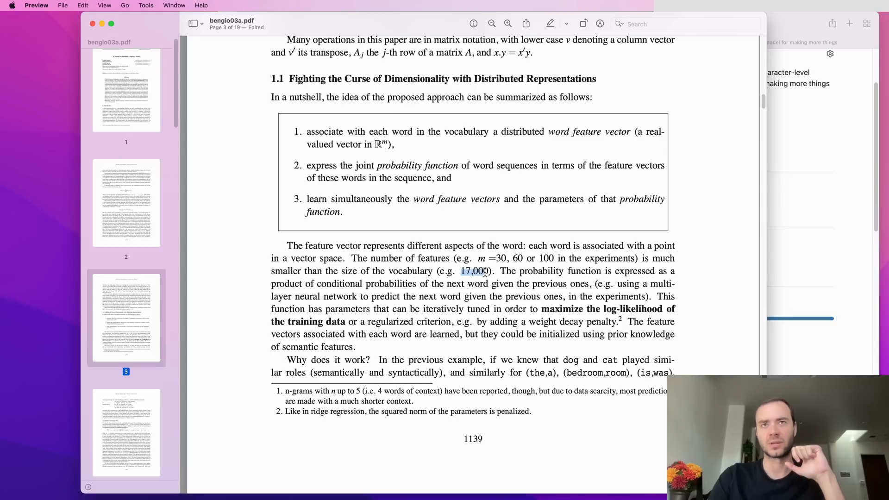

## Feature Vector Representation

The feature vector represents different aspects of the word. Each word is associated with a point in a vector space. The number of features (e.g., \( m = 30, 60 \) or 100 in the experiments) is much smaller than the size of the vocabulary (e.g., 17,000). The probability function is expressed as a product of conditional probabilities of the next word given the previous ones (e.g., using a multi-layer neural network to predict the next word given the previous ones in the experiments). This function has parameters that can be iteratively tuned to maximize the log-likelihood of the training data or a regularized criterion, e.g., by adding a weight decay penalty. The feature vectors associated with each word are learned, but they could be initialized using prior knowledge of semantic features.

## Why Does It Work?

In the previous example, if we knew that dog and cat played similar roles (semantically and syntactically), and similarly for (the, a), (bedroom, room), (is, was), (running, walking), we could naturally generalize (i.e., transfer probability mass) from:
- The cat is walking in the bedroom
- A dog was running in a room
- The cat is running in a room
- A dog is walking in a bedroom
- The dog was walking in the room


## Embedding Space and Generalization

Words are embedded into a 30-dimensional space. We have 17,000 points or vectors in this 30-dimensional space, which is very crowded. Initially, these words are spread out randomly, but during training, the embeddings are tuned using backpropagation. Over time, words with similar meanings or synonyms end up in similar parts of the space, while words with different meanings are positioned elsewhere.

The modeling approach uses a multi-layer neural network to predict the next word given the previous words, maximizing the log-likelihood of the training data. This approach allows for generalization even when the exact phrase has not been encountered in the training data. For example, if the phrase "a dog was running in a" has never occurred in the training data, the model can still predict the next word by leveraging similar phrases it has seen, such as "the dog was running in a."

## Example of Generalization

Suppose you are trying to predict "a dog was running in a blank." If this exact phrase has never occurred in the training data, the model can still make a prediction by recognizing that "a" and "the" are often interchangeable. The embeddings for "a" and "the" are placed near each other in the space, allowing the model to transfer knowledge and generalize. Similarly, the network can recognize that "cats" and "dogs" are animals that co-occur in similar contexts, enabling it to generalize even if it hasn't seen the exact phrase or action.

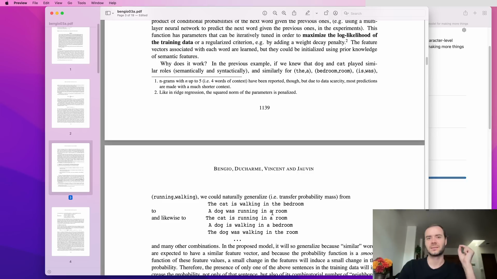

By leveraging the embedding space, the model can transfer knowledge and make accurate predictions even in out-of-distribution scenarios. This approach enhances the model's ability to generalize and handle variations in language effectively.
# Neural Network Architecture for Word Prediction

In this section, we will discuss the architecture of a neural network designed to predict the next word in a sequence based on the previous words. The diagram below illustrates the structure of this neural network.


### Input Layer

In this example, we are using three previous words to predict the fourth word in a sequence. Given a vocabulary of 17,000 possible words, each word is represented by an index ranging from 0 to 16,999. There is a lookup table, denoted as **C**, which is a matrix of size 17,000 by 30. This lookup table acts as an embedding matrix, converting each word index into a 30-dimensional vector. Therefore, the input layer consists of 30 neurons for each of the three words, making a total of 90 neurons.

### Hidden Layer

The hidden layer's size is a hyperparameter, meaning it is a design choice that can vary. For instance, if the hidden layer has 100 neurons, each of these neurons is fully connected to the 90 input neurons. This layer is followed by a tanh non-linearity.

### Output Layer

The output layer consists of 17,000 neurons, corresponding to the 17,000 possible next words. Each neuron in the output layer is fully connected to all neurons in the hidden layer. This layer is computationally expensive due to the large number of parameters.

### Softmax Layer

On top of the output layer, we have a softmax layer. Each logit from the output layer is exponentiated and normalized to sum to one, resulting in a probability distribution for the next word in the sequence.

### Training

During training, the actual next word in the sequence is known. The index of this word is used to extract the corresponding probability from the softmax layer. The goal is to maximize this probability with respect to the neural network's parameters, which include the weights and biases of the output and hidden layers, as well as the embedding lookup table **C**. This optimization is performed using backpropagation.

### Implementation

Now, let's move on to the implementation. We will start by creating a new notebook for this lecture.

This concludes the explanation of the neural network architecture for word prediction. The next steps involve coding and implementing this architecture in a practical setting.
## Building a Character-Level Language Model with PyTorch

In this section, we will walk through the process of building a character-level language model using PyTorch. We will start by reading in a dataset of names, building a vocabulary, and then creating a dataset suitable for training a neural network.

### Reading the Dataset

First, we read all the names into a list of words. Here, we are showing the first eight names, but keep in mind that we have a total of 32,033 names in the dataset.

```python
words = open('names.txt', 'r').read().splitlines()
words[:8]
```

Output:
```
['emma', 'olivia', 'ava', 'isabella', 'sophia', 'charlotte', 'mia', 'amelia']
```


### Building the Vocabulary

Next, we build the vocabulary of characters and create mappings from characters to integers and vice versa.

```python
chars = sorted(list(set(''.join(words))))
stoi = {s: i+1 for i, s in enumerate(chars)}
stoi['.'] = 0
itos = {i: s for s, i in stoi.items()}
print(itos)
```

Output:
```
{1: 'a', 2: 'b', 3: 'c', 4: 'd', 5: 'e', 6: 'f', 7: 'g', 8: 'h', 9: 'i', 10: 'j', 11: 'k', 12: 'l', 13: 'm', 14: 'n', 15: 'o', 16: 'p', 17: 'q', 18: 'r', 19: 's', 20: 't', 21: 'u', 22: 'v', 23: 'w', 24: 'x', 25: 'y', 26: 'z', 0: '.'}
```

### Compiling the Dataset

The first step in preparing the dataset for the neural network is to define the block size, which is the context length of how many characters we take to predict the next one. In this example, we use a block size of three, meaning we take three characters to predict the fourth one.

```python
block_size = 3
x, y = [], []
for word in words[:5]:  # Using the first five words for efficiency
    context = [0] * block_size
    for ch in word + '.':
        ix = stoi[ch]
        x.append(context)
        y.append(ix)
        context = context[1:] + [ix]
```

### Generating Examples

Here, we print the word "emma" and show the examples generated from it. For instance, given the context of `...`, the first character in the sequence is `e`. The label for this context is `m`.

```python
word = 'emma'
context = [0] * block_size
for ch in word + '.':
    ix = stoi[ch]
    print(''.join(itos[i] for i in context), '->', itos[ix])
    context = context[1:] + [ix]
```

Output:
```
... -> e
..e -> m
.em -> m
emm -> a
mma -> .
```

### Rolling Window of Context

We use a rolling window of context to build the dataset. The context is padded with zero tokens initially, and then we iterate over all characters to build the arrays `x` and `y`.

```python
block_size = 3
x, y = [], []
for word in words[:5]:
    context = [0] * block_size
    for ch in word + '.':
        ix = stoi[ch]
        x.append(context)
        y.append(ix)
        context = context[1:] + [ix]
```

### Adjusting Block Size

We can change the block size to predict different lengths of sequences. For example, setting the block size to four means predicting the fifth character given the previous four.

```python
block_size = 4
# Similar code to generate x and y with the new block size
```

### Final Dataset

From the first five words, we have created a dataset of 32 examples. Each input to the neural network is three integers long.

```python
print(f'Dataset size: {len(x)} examples')
print(f'First example: {x[0]} -> {y[0]}')
```

Output:
```
Dataset size: 32 examples
First example: [0, 0, 0] -> 5
```

In this way, we have prepared a dataset suitable for training a character-level language model using PyTorch.
# Building a Neural Network for Character Embeddings

In this section, we will discuss how to build a neural network that takes input characters and predicts corresponding labels. We will start by creating an embedding lookup table and then explore how to use it for embedding individual characters.

## Embedding Lookup Table

First, let's build the embedding lookup table `C`. We have 27 possible characters, and we will embed them in a lower-dimensional space. In the referenced paper, they embed 17,000 words into a 30-dimensional space. For our case, we have only 27 possible characters, so we will start with a 2-dimensional space.

This lookup table will be initialized with random numbers. It will have 27 rows and 2 columns, meaning each of the 27 characters will have a 2-dimensional embedding. This is our matrix `C` of embeddings, initialized randomly.

## Embedding a Single Integer

Before embedding all the integers inside the input `x` using this lookup table `C`, let's embed a single integer, say 5, to understand how this works.

One way to do this is to index into row 5 of `C`, which gives us a vector, the fifth row of `C`. This is one way to do it. Another way, as presented in a previous lecture, involves using one-hot encoding.

### One-Hot Encoding

To one-hot encode the integer 5, we need to specify that the number of classes is 27. This results in a 27-dimensional vector of all zeros, except the fifth bit is turned on.

However, this approach has a caveat. The input must be a tensor, not an integer. This is straightforward to fix. We get a one-hot vector where the fifth dimension is one, and the shape of this vector is 27.

### Matrix Multiplication

If we take this one-hot vector and multiply it by `C`, we encounter an error because the one-hot vector is of type `long` (a 64-bit integer), while `C` is a float tensor. PyTorch doesn't know how to multiply an integer with a float. To fix this, we explicitly cast the one-hot vector to a float.

The output is identical to indexing into `C` directly. This is because the matrix multiplication masks out everything in `C` except for the fifth row, which is plucked out. This tells us that embedding the integer can be interpreted as indexing into the lookup table `C`.

## Neural Network Interpretation

We can also think of this embedding process as the first layer of a larger neural network. This layer has neurons with no nonlinearity (no `tanh`), just linear neurons. The weight matrix of this layer is `C`. We encode integers into one-hot vectors and feed them into the neural network.

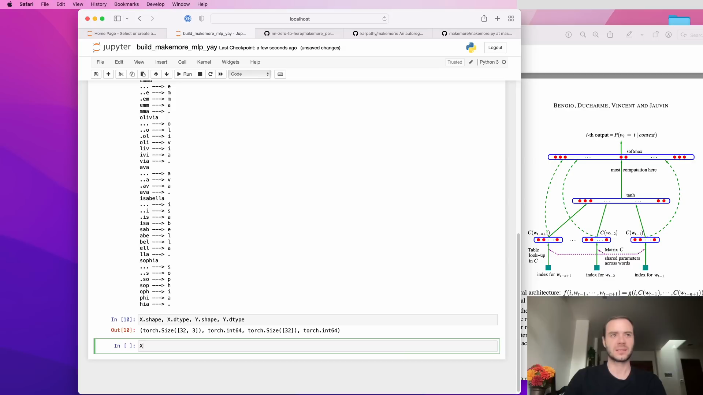

In summary, we have built an embedding lookup table and explored how to embed individual characters using both direct indexing and one-hot encoding. This forms the basis for building a neural network that can predict labels from input characters.
# Embedding and Indexing in PyTorch

In this section, we will explore how to efficiently embed and index integers using PyTorch. This is crucial for tasks such as natural language processing, where words or characters are often represented as integers.

## Embedding Integers

Embedding a single integer, like 5, is straightforward. We can simply ask PyTorch to retrieve the fifth row of a matrix `C`. However, embedding a batch of integers, such as a 32x3 array, requires more advanced indexing techniques.

### Indexing with Lists and Tensors

PyTorch's indexing capabilities are quite flexible. For example, we can index using lists or tensors of integers. This allows us to retrieve multiple rows simultaneously.

```python
C = torch.randn((27, 2))
C[5]  # Retrieve the 5th row
```

To embed all integers in a 32x3 array `X`, we can use tensor indexing:

```python
X = torch.randint(0, 27, (32, 3))
emb = C[X]
```

This retrieves the embedding vectors for all integers in `X`.

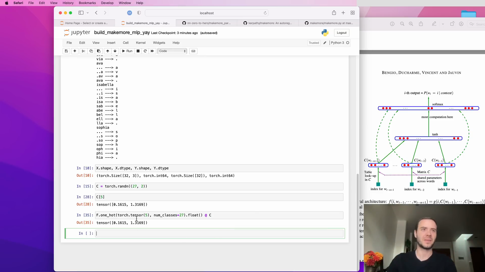

## Constructing the Hidden Layer

Next, we construct a hidden layer. We initialize the weights `W1` and biases `b1` randomly. The number of inputs to this layer is determined by the embedding dimensions and the number of embeddings.

```python
W1 = torch.randn((6, 100))
b1 = torch.randn(100)
```

However, directly multiplying the embeddings with the weights will not work due to shape mismatches. We need to concatenate the embeddings into a suitable shape.

### Concatenating Tensors

To transform a 32x3x2 tensor into a 32x6 tensor, we can use the `torch.cat` function. This concatenates the embeddings along the specified dimension.

```python
emb = C[X]
emb = torch.cat([emb[:, 0], emb[:, 1], emb[:, 2]], dim=1)
```

This approach works but is not generalizable. If the number of embeddings changes, the code needs to be updated.

### Using `torch.unbind`

A more flexible approach is to use `torch.unbind`, which removes a tensor dimension and returns a tuple of slices.

```python
emb = torch.cat(torch.unbind(emb, dim=1), dim=1)
```

This method works regardless of the number of embeddings, making the code more robust.


## Efficient Tensor Reshaping

PyTorch provides efficient ways to reshape tensors using the `view` method. This allows us to quickly represent a tensor in different shapes without changing the underlying data.

```python
a = torch.arange(18)
a.view(2, 9)
a.view(9, 2)
a.view(3, 3, 2)
```

As long as the total number of elements remains the same, we can reshape the tensor as needed.

By leveraging these techniques, we can efficiently embed and manipulate tensors in PyTorch, enabling more complex neural network architectures and operations.
# Understanding PyTorch Tensor Views and Efficient Operations

In this post, we will delve into the internal workings of PyTorch tensors, focusing on how views and efficient operations are handled. This discussion is based on a practical example, and we will explore the concepts of tensor storage, views, and efficient tensor operations.

## Tensor Storage and Views

In PyTorch, each tensor has an underlying storage, which is a one-dimensional vector representing the tensor in computer memory. When we manipulate a tensor's view, we are not changing the actual data in memory but rather how this data is interpreted as an n-dimensional tensor.


When we call the `view` method on a tensor, we are manipulating attributes such as storage offset, strides, and shapes. These attributes dictate how the one-dimensional sequence of bytes is interpreted as different n-dimensional arrays. This operation is extremely efficient because no memory is copied or moved; only the internal attributes of the tensor are changed.

## Practical Example: Reshaping Tensors

Let's consider a tensor `a` with a shape of (18):

```python
a = torch.arange(18)
a.shape  # torch.Size([18])
```

We can reshape this tensor into a 3x3x2 tensor using the `view` method:

```python
a.view(3, 3, 2)
```

This operation does not create new memory but simply changes the view of the existing data.

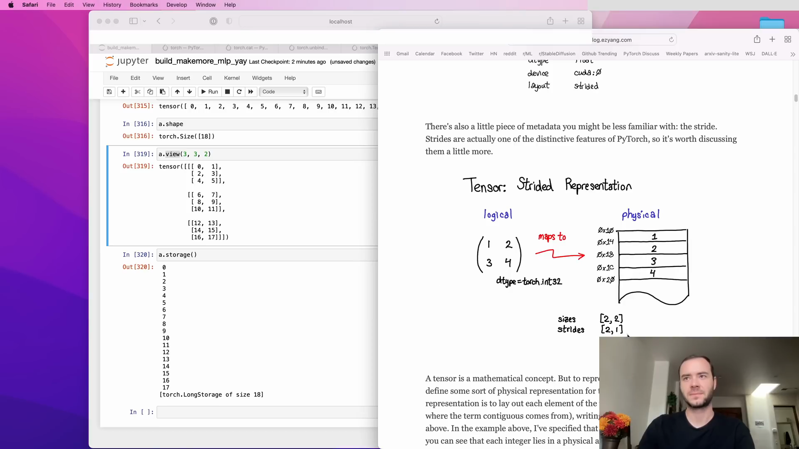

## Efficient Concatenation and Multiplication

In our example, we have a tensor `emb` with a shape of (32, 3, 2). We want to reshape this tensor to (32, 6) to perform a matrix multiplication. This can be done efficiently using the `view` method:

```python
emb.view(32, 6)
```

This reshaping allows us to perform the desired matrix multiplication without creating new memory. The resulting tensor `h` will have the shape (32, 100):

```python
h = torch.tanh(emb.view(-1, 6) @ W1 + b1)
h.shape  # torch.Size([32, 100])
```

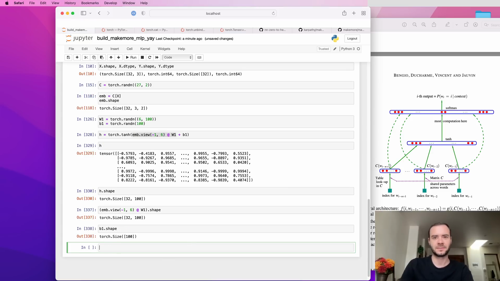

## Broadcasting in PyTorch

When performing operations like addition, PyTorch uses broadcasting to align tensors of different shapes. For example, if we have a tensor `h` of shape (32, 100) and a bias `b1` of shape (100), PyTorch will broadcast `b1` to match the shape of `h`:

```python
h + b1  # Broadcasting b1 to shape (32, 100)
```

This broadcasting ensures that the same bias vector is added to all rows of the matrix `h`.

## Final Layer and Logits Calculation

Finally, we create the output layer with weights `W2` and biases `b2`. The input to this layer is the 100-dimensional activations, and the output is 27-dimensional logits, corresponding to the 27 possible characters:

```python
W2 = torch.randn(100, 27)
b2 = torch.randn(27)
logits = h @ W2 + b2
logits.shape  # torch.Size([32, 27])
```

The logits are then exponentiated and normalized to obtain probabilities.

By understanding and utilizing these efficient operations, we can optimize our neural network computations in PyTorch, ensuring both performance and correctness.
## Understanding Probabilities in Neural Networks

In this section, we will delve into how probabilities are handled in neural networks, particularly focusing on the normalization of probabilities and indexing into probability arrays to predict the next character in a sequence.

### Normalizing Probabilities

First, we ensure that the probabilities are normalized. This means that the sum of probabilities in each row equals one. This is crucial for the probabilities to be valid.

```python
prob = counts / counts.sum(1, keepdims=True)
prob.shape
```

The shape of `prob` is `(32, 27)`, indicating that we have 32 rows and 27 columns, with each row summing to one.


### Creating the Dataset

We have an array `Y` which contains the actual next character in the sequence that we want to predict. This array was created during the dataset creation process.

```python
Y = torch.tensor([5, 13, 15, 12, 9, 22, 9, 1, 0, 15, 12, 1, 0, 19, 1, 2, 5, 12, 1, 0, 19, 15, 16, 8, 9, 1, 0])
```

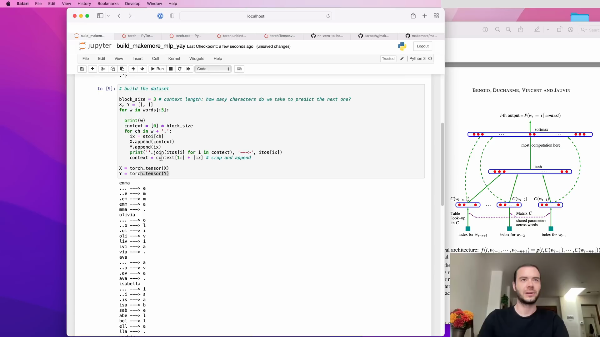

### Indexing into Probabilities

To predict the next character, we need to index into the rows of `prob` and extract the probability assigned to the correct character as given by `Y`.

```python
torch.arange(32)
```

This creates an iterator over numbers from 0 to 31. We can then use this to index into `prob`.

```python
prob[torch.arange(32), Y]
```

This line of code iterates over the rows of `prob` and grabs the column specified by `Y` for each row. This gives us the current probabilities assigned by the neural network to the correct character in the sequence.


### Evaluating the Probabilities

The extracted probabilities show how confident the neural network is about its predictions. Initially, these probabilities might not look very promising, as the network hasn't been trained yet. For example, some probabilities might be as low as 0.0701, indicating that the network thinks these characters are extremely unlikely.

However, as we train the neural network, these probabilities will improve. Ideally, we want the probability for the correct character to be close to one, indicating a high confidence in the prediction.

```python
# Example of probabilities after indexing
tensor([0.2, 0.0701, ...])
```

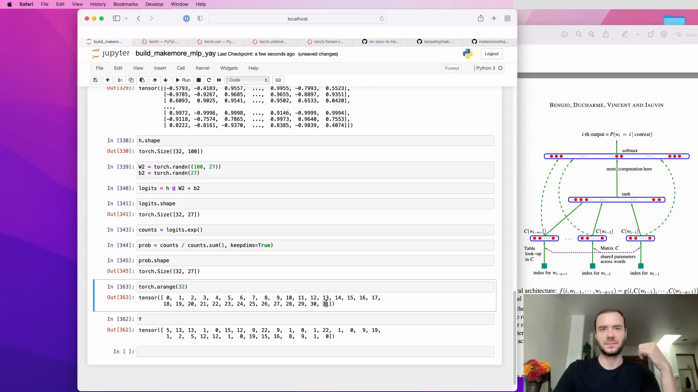

By understanding and manipulating these probabilities, we can train our neural network to make more accurate predictions over time.
# Building a Character-Level Language Model with PyTorch

## Loss Calculation

In this section, we calculate the loss for our neural network. The loss value here is 17, which we aim to minimize to improve the network's prediction accuracy for the correct character in the sequence.

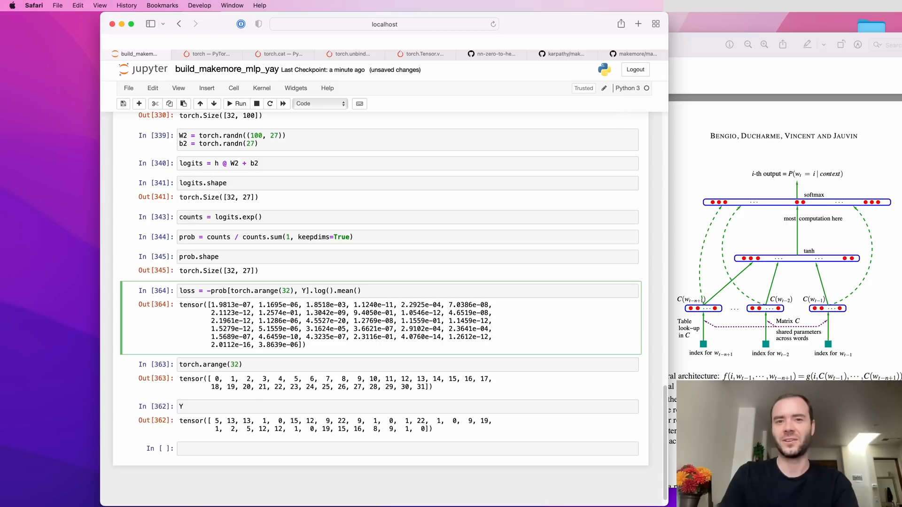

## Rewriting for Clarity and Reproducibility

I have rewritten the code to make it more respectable and organized. Here's a breakdown of the changes:

1. **Dataset and Parameters**: We define our dataset and parameters.
2. **Reproducibility**: We use a generator to ensure reproducibility.
3. **Parameter Clustering**: All parameters are clustered into a single list, making it easier to count them. Currently, we have about 3,400 parameters.

```python
g = torch.Generator().manual_seed(2147483647)  # for reproducibility
C = torch.randn((27, 2), generator=g)
W1 = torch.randn((6, 100), generator=g)
b1 = torch.randn(100, generator=g)
W2 = torch.randn((100, 27), generator=g)
b2 = torch.randn(27, generator=g)
parameters = [C, W1, b1, W2, b2]
```

## Forward Pass and Loss Calculation

This is the forward pass as we developed it, resulting in a single number representing the loss. This loss value indicates how well the neural network performs with the current parameter settings.

```python
emb = C[X]  # (32, 3, 2)
h = torch.tanh(emb.view(-1, 6) @ W1 + b1)  # (32, 100)
logits = h @ W2 + b2  # (32, 27)
counts = logits.exp()
prob = counts / counts.sum(1, keepdims=True)
loss = -prob[torch.arange(32), Y].log().mean()
```

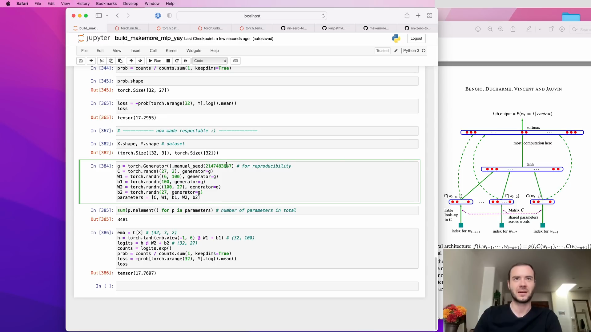

## Improving the Code

To make the code even more respectable, we avoid reinventing the wheel by using existing functions for common operations. This approach not only simplifies the code but also makes it more efficient and easier to understand.

By organizing the code and ensuring reproducibility, we can better track the performance of our neural network and make necessary adjustments to improve its accuracy.
## Efficient Cross-Entropy Calculation in PyTorch

In this section, we will discuss the use of the `torch.nn.functional.cross_entropy` function in PyTorch to calculate cross-entropy loss more efficiently.

### Using `torch.nn.functional.cross_entropy`

To calculate cross-entropy loss, we can simply call `F.cross_entropy` and pass in the logits and the array of targets `y`. This function computes the exact same loss as a manual implementation but in a much more efficient manner.

```python
import torch.nn.functional as F

# Example usage
loss = F.cross_entropy(logits, y)
```

This single line of code replaces the need for manually computing the loss, which involves multiple steps and intermediate tensors.


### Advantages of `F.cross_entropy`

There are several reasons to prefer `F.cross_entropy` over a manual implementation:

1. **Memory Efficiency**: When using `F.cross_entropy`, PyTorch does not create all the intermediate tensors that a manual implementation would. This is because each intermediate tensor occupies memory, making the process inefficient.

2. **Fused Kernels**: PyTorch often clusters operations and uses fused kernels to evaluate these expressions efficiently. This clustering of mathematical operations leads to significant performance improvements.

3. **Efficient Backward Pass**: The backward pass can be made much more efficient with `F.cross_entropy`. This is not only due to the use of fused kernels but also because the backward pass can be simplified analytically and mathematically.

### Example: Simplifying the Backward Pass

Consider the implementation of the `tanh` function in a micrograd library. The forward pass of the `tanh` operation involves a complex mathematical expression. However, the backward pass can be simplified significantly.

```python
def tanh(self):
    x = self.data
    t = (math.exp(2*x) - 1) / (math.exp(2*x) + 1)
    out = Value(t, (self,), 'tanh')
    
    def _backward():
        self.grad += (1 - t**2) * out.grad
    out._backward = _backward
    
    return out
```

In the backward pass, instead of individually backpropagating through each operation (e.g., `x`, `2*x`, `-1`, division), we use the simplified expression `1 - t^2`. This reuse of calculations and mathematical simplification leads to a more efficient implementation.

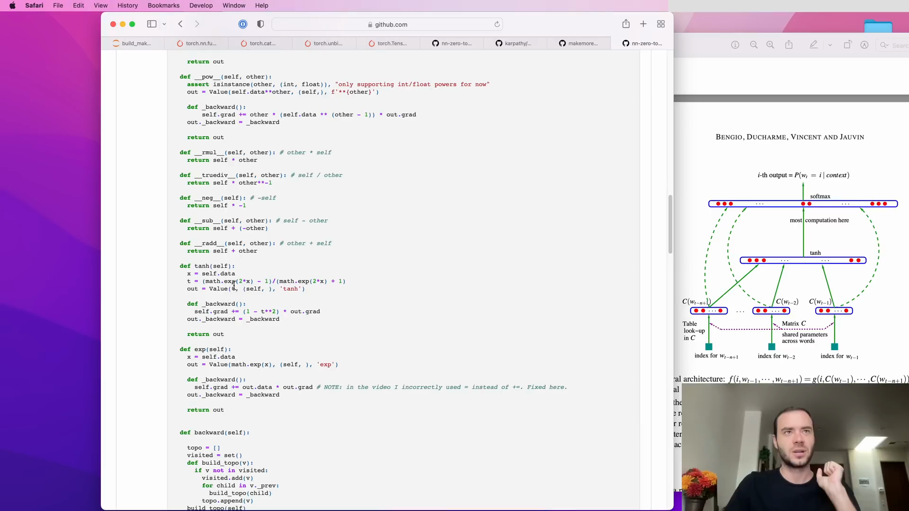

By leveraging these optimizations, PyTorch ensures that both the forward and backward passes are executed efficiently, making `F.cross_entropy` the preferred choice for calculating cross-entropy loss in practice.
## Numerical Stability in Cross Entropy Loss

In this section, we will discuss the numerical stability of the cross-entropy loss function in PyTorch and how it handles extreme values in logits.

### Understanding Logits and Probabilities

Let's start with an example. Suppose we have logits with the following values: -2, 3, -3, 0, and 5. When we take the exponent of these logits and normalize them to sum to one, we get a well-behaved probability distribution.

However, during the optimization of a neural network, logits can take on more extreme values. For instance, if some logits become very negative, like -100, the probabilities remain well-behaved and sum to one. This is because the exponent of a very negative number is a very small number close to zero.

### The Problem with Very Positive Logits

The issue arises when logits become very positive. For example, if a logit is 100, we run into trouble because the exponent of 100 is a very large number, which can exceed the dynamic range of floating-point numbers. This results in a "not a number" (NaN) error.

### PyTorch's Solution

PyTorch addresses this issue by normalizing the logits. It calculates the maximum value in the logits and subtracts it from all logits. This ensures that the largest logit becomes zero and all other logits become negative. This normalization step prevents overflow and ensures that the resulting probabilities are well-behaved.

Here is a code snippet demonstrating this:

```python
import torch

logits = torch.tensor([-2.0, 3.0, -3.0, 0.0, 5.0])
probabilities = torch.softmax(logits, dim=0)
print(probabilities)
```

### Example in Jupyter Notebook

Let's look at an example from a Jupyter Notebook to illustrate this concept further.

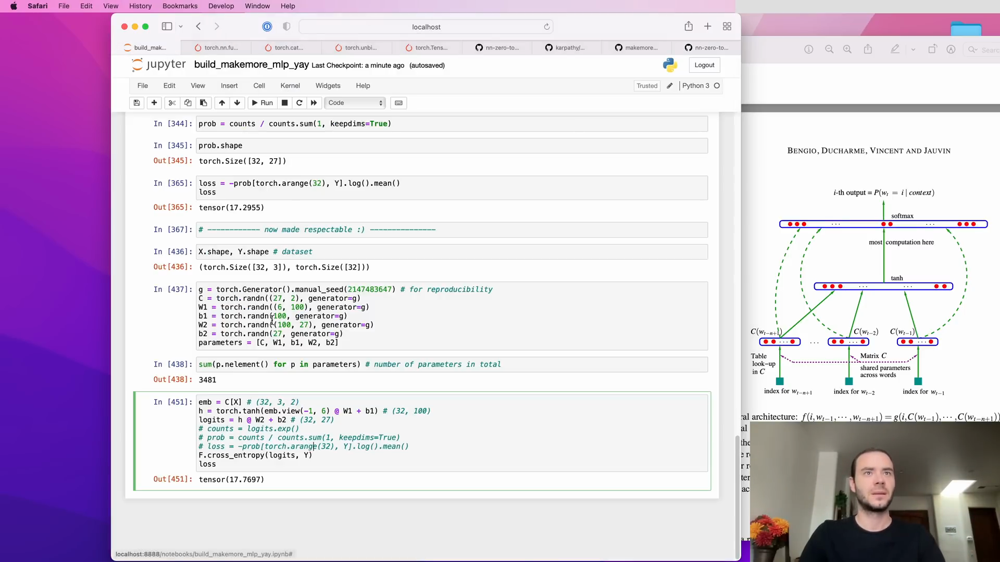

In the above image, we see the setup of logits and the calculation of probabilities using PyTorch's `torch.softmax` function. The code ensures that even with extreme values, the probabilities remain well-behaved.

### Benefits of Using Cross Entropy in PyTorch

1. **Efficiency**: The cross-entropy function in PyTorch is optimized for performance, making the forward and backward passes more efficient.
2. **Numerical Stability**: By normalizing logits, PyTorch ensures that the calculations remain within the dynamic range of floating-point numbers, preventing overflow and NaN errors.

In summary, PyTorch's implementation of cross-entropy loss is both efficient and numerically stable, making it a reliable choice for training neural networks.
# Training a Neural Network with PyTorch

In this post, we will walk through the process of training a neural network using PyTorch. We will cover the forward pass, backward pass, and parameter updates. Additionally, we will discuss overfitting and how it affects our model's performance.

## Forward Pass

The forward pass involves calculating the loss using the cross-entropy function. Here is the code snippet for the forward pass:

```python
loss = F.cross_entropy(logits, Y)
```

## Backward Pass

The backward pass involves setting the gradients to zero, computing the gradients, and updating the parameters. Below is the code for the backward pass:

```python
for p in parameters:
    p.grad = None
loss.backward()
for p in parameters:
    p.data += -0.1 * p.grad
```

We start by setting the gradients to zero using `p.grad = None`, which is equivalent to setting them to zero in PyTorch. Then, we call `loss.backward()` to populate the gradients. Finally, we update the parameters by nudging them with the learning rate times the gradient.


## Training Loop

We run the training loop for a thousand iterations to minimize the loss. Here is the code for the training loop:

```python
for _ in range(1000):
    # forward pass
    emb = C[X]  # (32, 3, 2)
    h = torch.tanh(emb.view(-1, 6) @ W1 + b1)  # (32, 100)
    logits = h @ W2 + b2  # (32, 27)
    loss = F.cross_entropy(logits, Y)
    
    # backward pass
    for p in parameters:
        p.grad = None
    loss.backward()
    
    # update
    for p in parameters:
        p.data += -0.1 * p.grad
    
    print(loss.item())
```

We start with a loss of 17 and observe a significant decrease as we run the loop. This indicates that our model is making good predictions.

## Overfitting

In this example, we are overfitting a single batch of data. We have 32 examples and 3,400 parameters, making it easy to achieve a very low loss. However, this is not ideal for generalization.

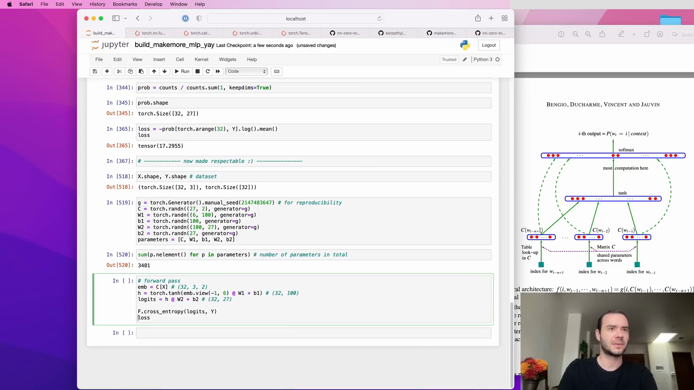

## Analyzing Predictions

We can analyze the logits and their maximum values to understand the model's predictions. Here is the code to inspect the logits:

```python
logits.max(1)
```

The `max` function in PyTorch returns both the maximum values and their indices. We compare these indices with the labels to see how close our predictions are.

```python
Y
```

In some cases, the predicted indices differ from the labels, indicating that we are not able to achieve a loss of zero. This is because multiple outputs are possible for the same input in our training set.

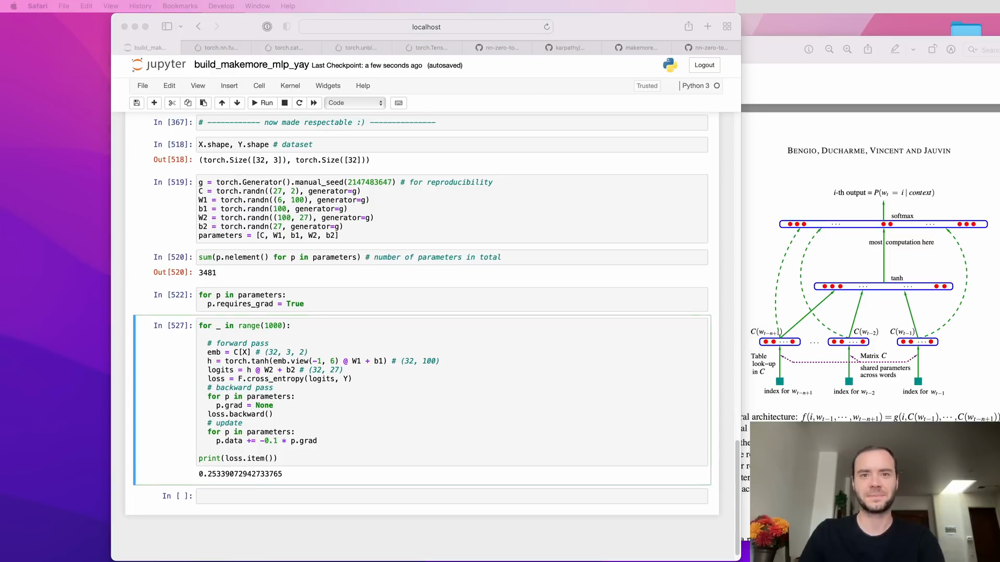

By following these steps, we can train a neural network using PyTorch. While overfitting a small batch of data can lead to very low loss, it is important to train on a larger dataset for better generalization.
# Building a Character-Level Language Model with PyTorch

In this blog post, we will walk through the process of building a character-level language model using PyTorch. We will cover the steps from data preparation to model training and discuss some optimization techniques to improve training efficiency.

## Data Preparation

First, we need to build the vocabulary of characters and map them to/from integers. This is essential for converting our text data into a format that can be processed by the neural network.

```python
chars = sorted(list(set(''.join(words))))
stoi = {s: i+1 for i, s in enumerate(chars)}
stoi['.'] = 0
itos = {i: s for s, i in stoi.items()}
print(itos)
```

Next, we build the dataset. We define a context length (`block_size`) which determines how many characters we use to predict the next one.

```python
block_size = 3
X, Y = [], []
for w in words:
    context = [0] * block_size
    for ch in w + '.':
        ix = stoi[ch]
        X.append(context)
        Y.append(ix)
        context = context[1:] + [ix]
X = torch.tensor(X)
Y = torch.tensor(Y)
```

## Model Initialization

We initialize the model parameters, including the embedding matrix and the weights for the hidden layers.

```python
C = torch.randn((27, 2))
emb = C[X]
emb.shape
```

```python
W1 = torch.randn((6, 100))
b1 = torch.randn(100)
W2 = torch.randn((100, 27))
b2 = torch.randn(27)
parameters = [C, W1, b1, W2, b2]
```

## Training the Model

We set up the training loop, where we perform forward and backward passes and update the model parameters. Initially, we use the entire dataset for each iteration, which is computationally expensive.

```python
for _ in range(10):
    emb = C[X]
    h = torch.tanh(emb.view(-1, 6) @ W1 + b1)
    logits = h @ W2 + b2
    loss = F.cross_entropy(logits, Y)
    print(loss.item())
    
    for p in parameters:
        p.grad = None
    loss.backward()
    for p in parameters:
        p.data += -0.1 * p.grad
```

## Optimization with Mini-Batches

To improve training efficiency, we switch to using mini-batches. This involves randomly selecting a subset of the dataset for each forward and backward pass.

```python
batch_size = 32
for _ in range(10):
    idx = torch.randint(0, X.shape[0], (batch_size,))
    X_batch = X[idx]
    Y_batch = Y[idx]
    
    emb = C[X_batch]
    h = torch.tanh(emb.view(-1, 6) @ W1 + b1)
    logits = h @ W2 + b2
    loss = F.cross_entropy(logits, Y_batch)
    print(loss.item())
    
    for p in parameters:
        p.grad = None
    loss.backward()
    for p in parameters:
        p.data += -0.1 * p.grad
```

By using mini-batches, we significantly reduce the computational load per iteration, allowing for faster training and more frequent updates to the model parameters.

# Optimizing Neural Network Training with Mini-Batches and Learning Rate Tuning

In this post, we will explore the process of optimizing neural network training using mini-batches and tuning the learning rate. We will discuss the implementation details and the rationale behind these techniques.

## Mini-Batch Construction

To speed up the training process, we use mini-batches. Instead of processing the entire dataset at once, we process smaller subsets of the data. This approach not only speeds up the training but also helps in better generalization of the model.

```python
ix = torch.randint(0, X.shape[0], (32,))
```

Here, we create a tensor of random integers that index into our dataset. If our mini-batch size is 32, we can construct the mini-batch as follows:

```python
# Mini-batch construct
emb = C[ix]  # (32, 3, 2)
h = torch.tanh(emb.view(-1, 6)) @ W1 + b1  # (32, 100)
logits = h @ W2 + b2  # (32, 27)
loss = F.cross_entropy(logits, Y[ix])
```

By indexing into `X` and `Y` with `ix`, we only grab 32 rows, making the embeddings `(32, 3, 2)` instead of the entire dataset size. This makes the process much faster.

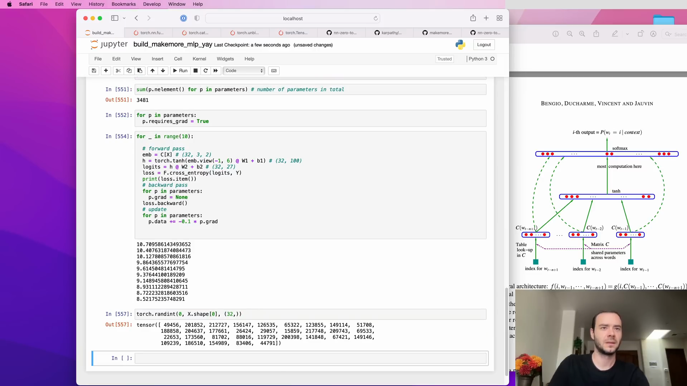
<br>

## Gradient Descent with Mini-Batches

Using mini-batches, we can run many examples nearly instantly and decrease the loss much faster. However, the quality of our gradient is lower because it is an approximation based on a subset of the data. Despite this, the approximate gradient is good enough to be useful.

```python
# Backward pass
for p in parameters:
    p.grad = None
loss.backward()

# Update
for p in parameters:
    p.data += -0.0001 * p.grad
```

Even with the lower quality gradient, it is much better to have an approximate gradient and make more steps than to evaluate the exact gradient and take fewer steps.

## Evaluating the Loss

To get a full sense of how well the model is doing, we evaluate the loss on the entire training set:

```python
# Evaluate loss for all of X and Y
loss = F.cross_entropy(logits, Y)
print(loss.item())
```

After running the optimization for a while, we observe the loss decreasing:

```python
# Example loss values
2.6, 2.57, 2.53
```

## Determining the Learning Rate

One challenge in training neural networks is determining the appropriate learning rate. We need to find a balance where the learning rate is neither too slow nor too fast. Here's a method to determine a reasonable learning rate:

1. **Reset Parameters**: Start with the initial settings.
2. **Print Loss at Each Step**: Observe the loss for a small number of steps.
3. **Adjust Learning Rate**: Find the range where the loss decreases steadily without instability.

```python
# Reset parameters
for p in parameters:
    p.data = torch.randn_like(p)

# Try different learning rates
learning_rates = [0.001, 0.01, 0.1, 1, 10]
for lr in learning_rates:
    for _ in range(100):
        # Forward pass
        loss = F.cross_entropy(logits, Y)
        print(loss.item())
        
        # Backward pass
        for p in parameters:
            p.grad = None
        loss.backward()
        
        # Update
        for p in parameters:
            p.data += -lr * p.grad
```

By experimenting with different learning rates, we can identify the range where the loss decreases effectively.

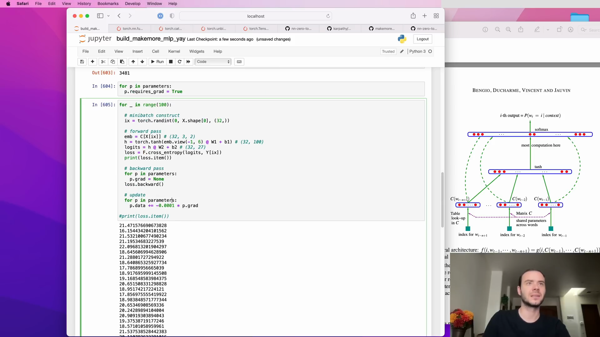
<br>

## Exponential Learning Rate Search

Instead of stepping linearly between learning rates, we can step exponentially. This approach helps in covering a wider range of learning rates more effectively.

```python
# Exponential learning rate search
lre = torch.linspace(-3, 0, 1000)
learning_rates = 10 ** lre
```

By stepping linearly between the exponents of the learning rates, we can search over a range from `0.001` to `1` more efficiently.

In summary, using mini-batches and tuning the learning rate are crucial techniques in optimizing neural network training. These methods help in speeding up the training process and finding the optimal parameters for the model.
# Optimizing Learning Rates in Neural Networks

In this section, we will explore how to optimize learning rates for training a neural network. We will use a dynamic learning rate that changes over the course of training, rather than a fixed learning rate. This approach can help us find a more optimal learning rate and improve the performance of our model.

## Setting Up the Learning Rate Schedule

First, we initialize the learning rates using an exponential scale. This means that we start with a very low learning rate and gradually increase it.

```python
lre = torch.linspace(-3, 0, 1000)
lrs = 10 ** lre
```

Here, `lre` is a tensor of 1,000 values linearly spaced between -3 and 0. We then exponentiate these values to get `lrs`, which will be our learning rates.

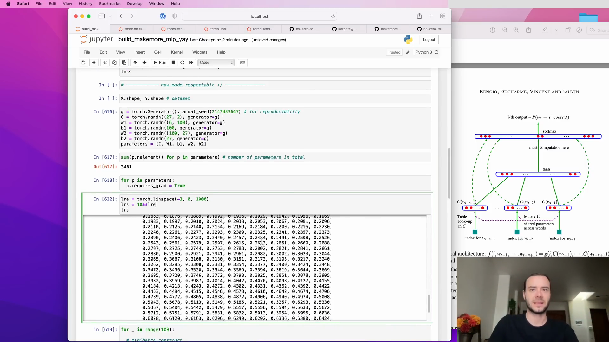

## Running the Optimization

We will run the optimization for 1,000 steps, using the learning rates we just defined. We will also keep track of the learning rates and the corresponding losses.

```python
lri = []
lossi = []

for i in range(1000):
    # Forward pass
    emb = C[X[ix]]
    h = torch.tanh(emb.view(-1, 6) @ W1 + b1)
    logits = h @ W2 + b2
    loss = F.cross_entropy(logits, Y[ix])
    
    # Backward pass
    for p in parameters:
        p.grad = None
    loss.backward()
    
    # Update
    lr = lrs[i]
    for p in parameters:
        p.data += -lr * p.grad
    
    # Track stats
    lri.append(lr)
    lossi.append(loss.item())
```

In this loop, we perform a forward pass to compute the loss, a backward pass to compute the gradients, and then update the parameters using the current learning rate. We also append the learning rate and loss to our tracking lists.


## Plotting Learning Rates vs. Losses

After running the optimization, we can plot the learning rates against the losses to visualize how the learning rate affects the training process.

```python
plt.plot(lri, lossi)
plt.xlabel('Learning Rate')
plt.ylabel('Loss')
plt.show()
```

Typically, the plot will show that very low learning rates result in little progress, while very high learning rates can cause instability. There is usually a "sweet spot" where the learning rate is just right.

## Fine-Tuning the Learning Rate

Based on the plot, we can identify a good learning rate. For example, if the plot shows that a learning rate of 0.1 is optimal, we can set our learning rate to this value and run the optimization for a longer period.

```python
lr = 0.1
for i in range(10000):
    # Forward pass
    emb = C[X[ix]]
    h = torch.tanh(emb.view(-1, 6) @ W1 + b1)
    logits = h @ W2 + b2
    loss = F.cross_entropy(logits, Y[ix])
    
    # Backward pass
    for p in parameters:
        p.grad = None
    loss.backward()
    
    # Update
    for p in parameters:
        p.data += -lr * p.grad
    
    # Track stats
    lri.append(lr)
    lossi.append(loss.item())
```

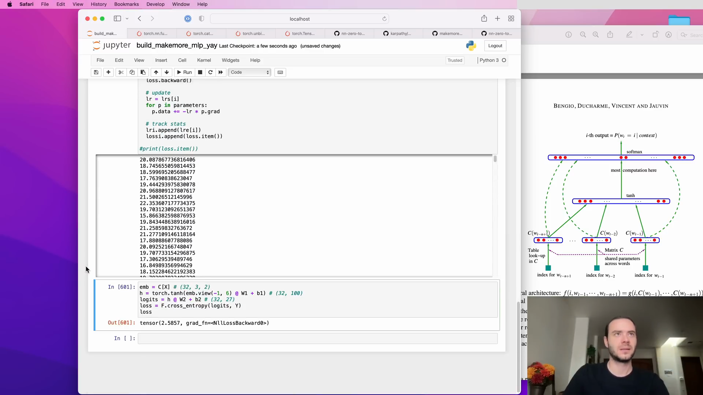

## Applying Learning Rate Decay

As training progresses, it is common to apply learning rate decay. This means reducing the learning rate by a factor (e.g., 10) to allow the model to converge more smoothly.

```python
lr = 0.01  # Decayed learning rate
for i in range(10000):
    # Forward pass
    emb = C[X[ix]]
    h = torch.tanh(emb.view(-1, 6) @ W1 + b1)
    logits = h @ W2 + b2
    loss = F.cross_entropy(logits, Y[ix])
    
    # Backward pass
    for p in parameters:
        p.grad = None
    loss.backward()
    
    # Update
    for p in parameters:
        p.data += -lr * p.grad
    
    # Track stats
    lri.append(lr)
    lossi.append(loss.item())
```


By following these steps, we can effectively optimize the learning rate for our neural network, leading to better performance and faster convergence.
# Understanding Overfitting and Data Splits in Neural Networks

In this section, we discuss the concept of overfitting in neural networks and the importance of splitting your dataset into training, validation, and test sets.

## Overfitting in Neural Networks

As the capacity of a neural network grows, it becomes more capable of overfitting your training set. Overfitting occurs when the model performs exceptionally well on the training data but fails to generalize to new, unseen data. This means that the loss on the training set can become very low, potentially even zero, but the model is merely memorizing the training data rather than learning to generalize from it.

When you evaluate the model on withheld data, such as a validation or test set, the loss can be significantly higher, indicating poor generalization. Therefore, it's crucial to split your dataset into different subsets to properly evaluate and tune your model.

## Data Splits: Training, Validation, and Test Sets

The standard practice in the field is to split your dataset into three parts:

1. **Training Set**: Typically 80% of your data. This subset is used to optimize the parameters of the model using gradient descent.
2. **Validation Set (Dev Set)**: Usually 10% of your data. This subset is used to tune the hyperparameters of the model, such as the size of the hidden layers, the size of the embeddings, and other settings.
3. **Test Set**: The remaining 10% of your data. This subset is used to evaluate the performance of the model at the end. It's crucial to evaluate the test loss sparingly to avoid overfitting to the test set as well.

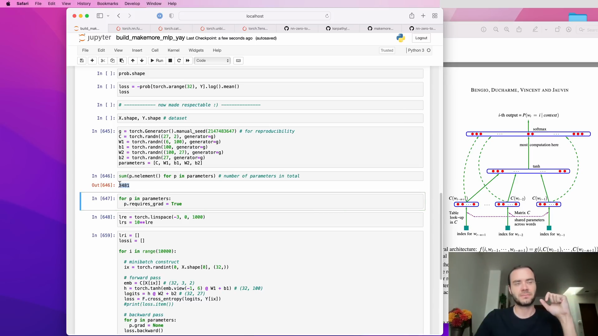

## Implementing Data Splits in Code

Here is an example of how to split your data into training, validation, and test sets in code:

```python
# Shuffle the words
words = [...]  # List of words
random.shuffle(words)

# Define the split points
N1 = int(0.8 * len(words))
N2 = int(0.9 * len(words))

# Create the splits
train_words = words[:N1]
dev_words = words[N1:N2]
test_words = words[N2:]

# Build datasets
X_train, Y_train = build_dataset(train_words)
X_dev, Y_dev = build_dataset(dev_words)
X_test, Y_test = build_dataset(test_words)
```

In this code snippet, we shuffle the list of words and then split them into training, validation, and test sets based on the defined percentages.

## Training and Evaluating the Model

When training the model, we use only the training set. The validation set is used to tune hyperparameters, and the test set is used sparingly to evaluate the final performance of the model.

```python
# Training loop
for epoch in range(num_epochs):
    # Forward pass
    logits = model(X_train)
    loss = criterion(logits, Y_train)
    
    # Backward pass
    optimizer.zero_grad()
    loss.backward()
    optimizer.step()
    
    # Evaluate on validation set
    if epoch % eval_interval == 0:
        val_logits = model(X_dev)
        val_loss = criterion(val_logits, Y_dev)
        print(f'Epoch {epoch}, Validation Loss: {val_loss.item()}')
```

In this training loop, we periodically evaluate the model on the validation set to monitor its performance and adjust hyperparameters as needed.


By following these practices, you can ensure that your model generalizes well to new data and avoids overfitting.
# Optimizing Neural Networks: Addressing Underfitting

In this section, we will discuss how to address underfitting in neural networks by scaling up the size of the network. We will also look at the training and development (dev) loss to ensure that our model is not overfitting.

## Evaluating Training and Dev Loss

First, let's evaluate the loss on the entire training set. We observe that the training and dev loss are approximately equal, indicating that our model is not overfitting. This suggests that the model is not powerful enough to memorize the data, and we are currently underfitting.

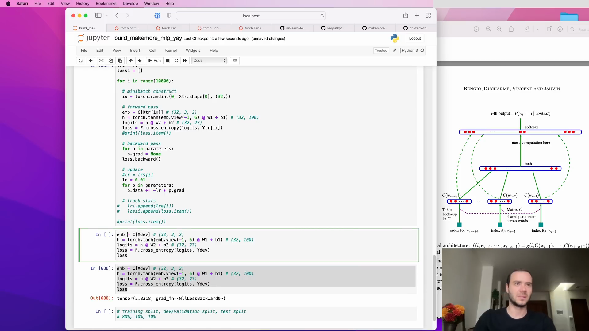

## Increasing the Neural Network Size

To improve performance, we need to scale up the size of our neural network. The simplest way to do this is by increasing the number of neurons in the hidden layer. Currently, our hidden layer has 100 neurons. Let's increase this to 300 neurons.

```python
# Increase the size of the hidden layer
h = torch.tanh(emb.view(-1, 6) @ W1 + b1) # (32, 100) -> (32, 300)
logits = h @ W2 + b2 # (32, 300) -> (32, 27)
```

By doing this, we now have 10,000 parameters instead of the previous 3,000 parameters.

## Tracking Training Progress

To keep track of our training progress, we will monitor the loss and the number of steps. We will train the model on 30,000 steps with a learning rate of 0.1.

```python
# Initialize parameters
lr = 0.1
for i in range(30000):
    # Minibatch training
    ix = torch.randint(0, Xtr.shape[0], (32,))
    emb = C[Xtr[ix]]
    h = torch.tanh(emb.view(-1, 6) @ W1 + b1)
    logits = h @ W2 + b2
    loss = F.cross_entropy(logits, Ytr[ix])
    
    # Backward pass
    for p in parameters:
        p.grad = None
    loss.backward()
    
    # Update parameters
    for p in parameters:
        p.data += -lr * p.grad
    
    # Track stats
    if i % 100 == 0:
        print(f'Step {i}, Loss: {loss.item()}')
```

## Visualizing the Loss Function

We will plot the steps against the loss to visualize how the loss function is being optimized. The plot will show some noise due to the mini-batch training.

```python
import matplotlib.pyplot as plt

# Plotting the loss function
plt.plot(steps, losses)
plt.xlabel('Steps')
plt.ylabel('Loss')
plt.title('Loss Function Optimization')
plt.show()
```

## Current Status

As of now, our dev set loss is at 2.5, indicating that we still haven't optimized the neural network very well. Further tuning and adjustments may be necessary to achieve better performance.

By scaling up the neural network and carefully monitoring the training process, we can address underfitting and improve the model's performance.
# Training a Neural Network: Addressing Convergence and Bottlenecks

In this session, we are continuing the training of our neural network. One of the challenges we are facing is the slow convergence of the model. Let's dive into the details and explore some potential solutions.

## Training Continuation and Batch Size Considerations

It might take longer for this neural net to converge. One possibility is that the batch size is so low that we have way too much noise in the training. Increasing the batch size could help us achieve a more accurate gradient and optimize more effectively.

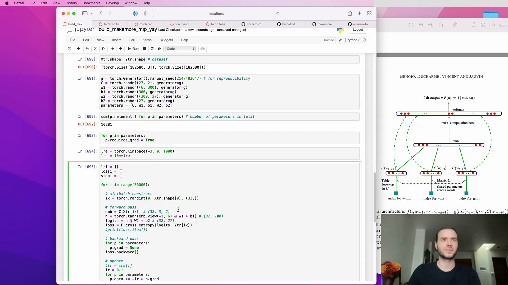

## Learning Rate Adjustments

We have re-initialized the parameters, and the current state of the model is not very pleasing. There might be a tiny improvement, but it's hard to tell. Let's try decreasing the learning rate by a factor of two.

```python
lr = 0.05
for p in parameters:
    p.data += -lr * p.grad
```

After adjusting the learning rate, we observe some progress. The loss has decreased to 2.32, but we need to continue training to see more significant improvements.

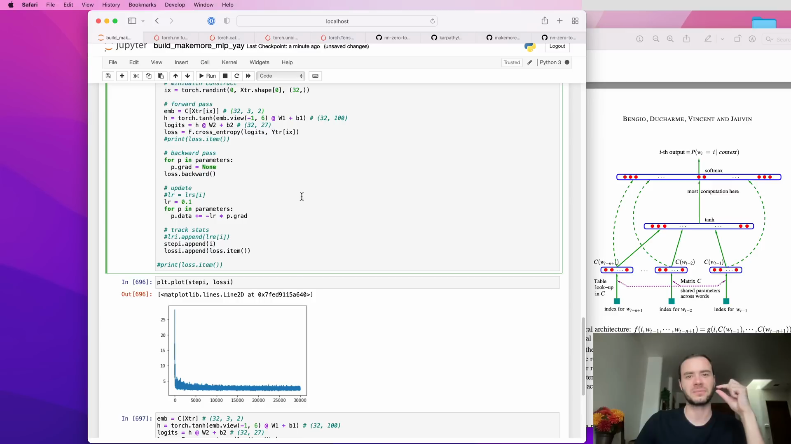

## Model Size and Embedding Bottleneck

We expect to see a lower loss with a bigger model since we were underfitting before. However, even after increasing the hidden layer size, the loss is not decreasing as expected. One concern is that the bottleneck of the network might be the two-dimensional embeddings. We might be cramming too many characters into just two dimensions, limiting the neural net's ability to use that space effectively.

```python
emb = C[Xtr]  # (32, 3, 2)
h = torch.tanh(emb.view(-1, 6) @ W1 + b1)  # (32, 100)
logits = h @ W2 + b2  # (32, 27)
loss = F.cross_entropy(logits, Ytr[ix])
```

By decreasing the learning rate, we made some progress, but the improvement is still limited. The current loss is around 2.23.

## Visualizing Embedding Vectors

Before scaling up the embedding size from two, we want to visualize the embedding vectors for these characters. This visualization will help us understand how the network is using the embedding space.

```python
plt.figure(figsize=(8,8))
plt.scatter(C[:,0].data, C[:,1].data, s=200)
for i in range(C.shape[0]):
    plt.text(C[i,0].item(), C[i,1].item(), itos[i], ha="center", va="center", color="white")
plt.grid('minor')
```

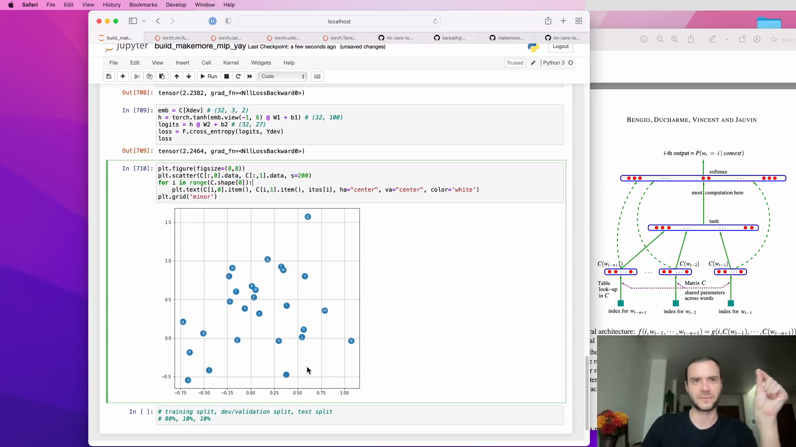

The network has learned to separate and cluster the characters. For example, the vowels A, E, I, O, and U are clustered together, indicating that the network is learning meaningful representations even with the limited embedding size.

In this session, we explored the impact of batch size, learning rate adjustments, and embedding size on the training of our neural network. Visualizing the embeddings provided insights into the network's learning process and highlighted the potential bottleneck caused by the limited embedding dimensions. Moving forward, increasing the embedding size could help alleviate this bottleneck and improve the model's performance.
# Exploring Neural Network Embeddings and Optimization

In this session, we delve into the intricacies of neural network embeddings and optimization techniques. We will explore how embeddings are structured, how to scale them, and the impact of various hyperparameters on the model's performance.

## Understanding Embeddings

The neural network treats certain characters as similar and interchangeable. For instance, the character 'Q' is an exception with a unique embedding vector, while other characters cluster together. This structure is evident after training, indicating that the embeddings are meaningful and not random.


## Scaling Up Embeddings

To improve performance, we scale up the embedding size. Initially, we used two-dimensional embeddings, but now we will use ten-dimensional embeddings for each word. This change means the hidden layer will receive 30 inputs (3 times 10). Additionally, we reduce the hidden layer size from 300 to 200 neurons, resulting in a total of 11,000 elements.

```python
emb = C[Xtr] # (32, 3, 2)
h = torch.tanh(emb.view(-1, 30) @ W1 + b1) # (32, 100)
logits = h @ W2 + b2 # (32, 27)
loss = F.cross_entropy(logits, Ytr)
```

We also adjust the learning rate and iteration count. Instead of hardcoding values, we use more flexible parameters.

## Logging and Plotting Loss

To better visualize the loss, we log the loss values using `log10`. This approach prevents the "hockey stick" appearance in plots and provides a clearer view of the loss progression.

```python
# Logging loss
lossi.append(loss.log10().item())
```

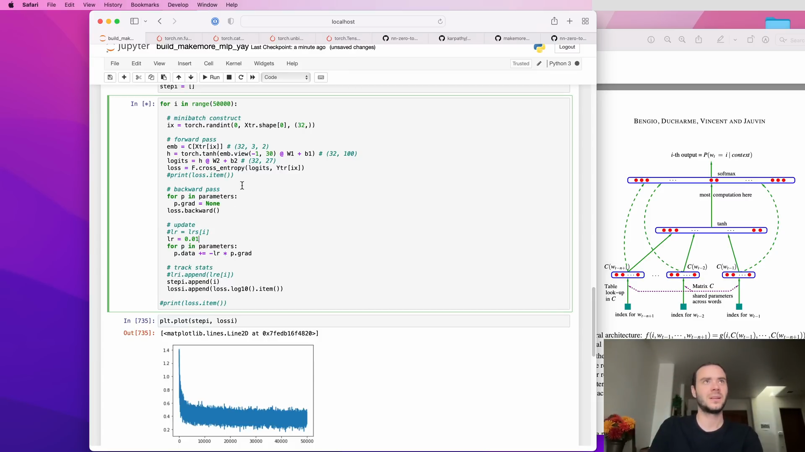

## Training and Validation Performance

After adjusting the learning rate and running for 50,000 iterations, we observe the training and validation performance. The training set loss is 2.3, and the validation set loss is 2.38. We then decrease the learning rate by a factor of 10 and train for another 50,000 iterations.

```python
# Adjusting learning rate
lr = 0.1 if i < 100000 else 0.01
```


## Hyperparameter Tuning

We continue tuning the optimization and experimenting with different hyperparameters. For instance, we can change the number of neurons in the hidden layer, the dimensionality of the embedding lookup table, and the number of input characters.

```python
# Hyperparameter tuning
for i in range(200000):
    lr = 0.1 if i < 100000 else 0.01
    # Training loop
```


Through various experiments and optimizations, we achieve a validation loss of 2.17. There are multiple ways to further improve the model, such as adjusting the neural network size or increasing the number of input characters. I invite you to experiment with these parameters and surpass this performance.
# Training and Sampling from a Neural Network Model

## Training the Model

In this section, we discuss the training process of a neural network model. The code snippet below shows the training loop, where we iterate over a range of 200,000 steps. During each step, we construct a mini-batch, perform a forward pass, compute the loss, and then perform a backward pass to update the parameters.

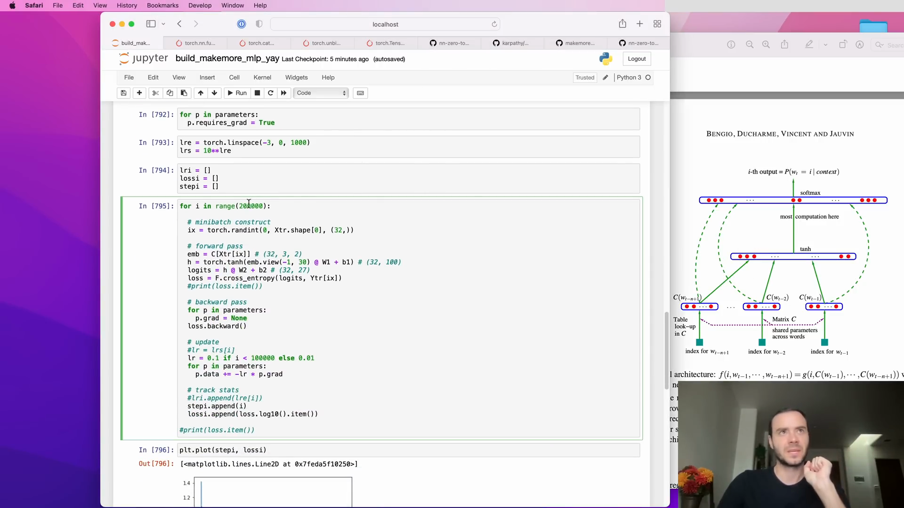

```python
for i in range(200000):
    # minibatch construct
    ix = torch.randint(0, Xtr.shape[0], (32,))
    
    # forward pass
    emb = C[Xtr[ix]]
    h = torch.tanh(emb.view(-1, 30) @ W1 + b1)  # (32, 100)
    logits = h @ W2 + b2  # (32, 27)
    loss = F.cross_entropy(logits, Ytr[ix])
    
    # backward pass
    for p in parameters:
        p.grad = None
    loss.backward()
    
    # update
    lr = 0.1 if i < 100000 else 0.01
    for p in parameters:
        p.data += -lr * p.grad
    
    # track stats
    lr1.append(lr)
    stepi.append(i)
    lossi.append(loss.log10().item())
```

The learning rate is initially set to 0.1 and then decays to 0.01 after 100,000 steps. This helps in achieving better convergence speed and a good loss value.

## Plotting the Loss

After training, we plot the loss to visualize the training progress. The plot shows how the loss decreases over time, indicating that the model is learning.


```python
plt.plot(stepi, lossi)
```

## Evaluating the Model

We evaluate the model on both the training and validation sets to check its performance. The loss values for both sets are printed below.

```python
emb = C[Xtr]
h = torch.tanh(emb.view(-1, 30) @ W1 + b1)  # (32, 100)
logits = h @ W2 + b2  # (32, 27)
loss = F.cross_entropy(logits, Ytr)
print(loss)  # tensor(2.1260, grad_fn=<NLLLossBackward0>)

emb = C[Xdev]
h = torch.tanh(emb.view(-1, 30) @ W1 + b1)  # (32, 100)
logits = h @ W2 + b2  # (32, 27)
loss = F.cross_entropy(logits, Ydev)
print(loss)  # tensor(2.1701, grad_fn=<NLLLossBackward0>)
```

## Sampling from the Model

To sample from the model, we generate 20 samples. We start with a context of all dots and embed the current context using the embedding table `C`. This embedding is then projected into the hidden state to get the logits. We calculate the probabilities using `F.softmax` and sample from them using `torch.multinomial`. The context window is then shifted to append the new index, and we decode the integers to strings to print them out.


```python
g = torch.Generator().manual_seed(2147483647 + 10)

out = []
context = [0] * block_size  # initialize with all dots
while True:
    emb = C[torch.tensor([context])]  # (1, block_size, d)
    h = torch.tanh(emb.view(1, -1) @ W1 + b1)
    logits = h @ W2 + b2
    probs = F.softmax(logits, dim=1)
    ix = torch.multinomial(probs, num_samples=1, generator=g).item()
    context = context[1:] + [ix]
    out.append(ix)
    if ix == 0:
        break

print(''.join(itos[i] for i in out))
```

The generated samples are more word-like or name-like, indicating that the model is improving.

## Making the Notebooks Accessible

To make these notebooks more accessible, a Google Colab link will be shared. This allows you to execute all the code in your browser without needing to install Jupyter notebooks or Torch. The Google Colab notebook will look like the one shown below, and you can train the network, plot, and sample from the model directly in your browser.


```python
import torch
import torch.nn.functional as F
import matplotlib.pyplot as plt

# Download the names.txt file from GitHub
!wget https://raw.githubusercontent.com/karpathy/makemore/master/names.txt

# Read the names from the file
words = open('names.txt', 'r').read().splitlines()
print(words[:8])  # ['emma', 'olivia', 'ava', 'isabella', 'sophia', 'charlotte', 'mia', 'amelia']
print(len(words))  # 32033

# Build the vocabulary of characters and mappings to/from integers
chars = sorted(list(set(''.join(words))))
stoi = {s: i+1 for i, s in enumerate(chars)}
stoi['.'] = 0
itos = {i: s for s, i in stoi.items()}
print(itos)  # {0: '.', 1: 'a', 2: 'b', 3: 'c', 4: 'd', 5: 'e', 6: 'f', 7: 'g', 8: 'h', 9: 'i', 10: 'j', 11: 'k', 12: 'l', 13: 'm', 14: 'n', 15: 'o', 16: 'p', 17: 'q', 18: 'r', 19: 's', 20: 't', 21: 'u', 22: 'v', 23: 'w', 24: 'x', 25: 'y', 26: 'z'}
```

By using Google Colab, you can easily tinker with the numbers and experiment with the model without any installation hassle.