# Implementing Makemore: Bigram Language Model

Hi everyone. Today we are continuing our implementation of Makemore. In the last lecture, we implemented the bigram language model using both counts and a super simple neural network with a single linear layer.

## Bigram Language Model

This is the Jupyter Notebook that we built out last lecture. We approached this by looking at only the single previous character and predicting the distribution for the character that would go next in the sequence. We did this by taking counts and normalizing them into probabilities so that each row sums to one.


This method works if you only have one character of previous context. However, the predictions from this model are not very good because it only takes one character of context, resulting in outputs that do not sound very name-like.

## Limitations of the Bigram Model

The problem with this approach is that if we take more context into account when predicting the next character in a sequence, things quickly become complex. The size of the table grows exponentially with the amount of context considered.


In the image above, you can see the bigram table where each cell represents the probability of transitioning from one character to another. As we increase the context, the number of possible transitions increases, making the table larger and more difficult to manage.

## Generating Names

Despite its limitations, we can still generate some names using this bigram model. Here is a snippet of code that demonstrates how we generate names:

```python
P = (N+1).float()
P = P / P.sum(1, keepdims=True)

g = torch.Generator().manual_seed(2147483647)

for i in range(5):
    out = []
    ix = 0
    while True:
        p = P[ix]
        ix = torch.multinomial(p, num_samples=1, replacement=True, generator=g).item()
        out.append(itos[ix])
        if ix == 0:
            break
    print("".join(out))
```

This code generates names by sampling from the probability distribution defined by the bigram model. Here are some example outputs:

```
mor.
axx.
minanyoryles.
kondlaish.
anchshiarie.
```

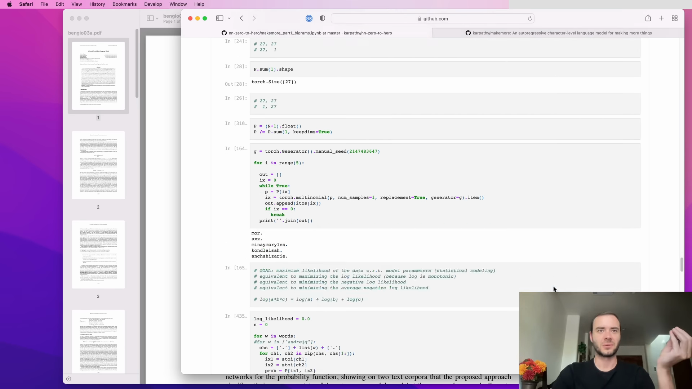

As you can see, the names generated are not very realistic, highlighting the limitations of using only a single character of context.

In the next lecture, we will explore more advanced models that can take more context into account and produce more realistic names. Stay tuned! ## Understanding Context Explosion in Language Models

In fact, the complexity of language models grows exponentially with the length of the context. If we only take a single character at a time, that's 27 possibilities of context. However, if we take two characters in the past and try to predict the third one, the number of rows in this matrix becomes 27 times 27, resulting in 729 possibilities for what could have come in the context.


If we take three characters as the context, suddenly we have 27 * 27 * 27 = 19,683 possibilities of context. This exponential growth leads to way too many rows in the matrix, resulting in very few counts for each possibility. Consequently, the whole system becomes unmanageable and doesn't work very well.

## Moving to Multilayer Perceptron Models

To address this issue, we are going to implement a multilayer perceptron (MLP) model to predict the next character in a sequence. This modeling approach follows the paper by Bengio et al., 2003.


This paper isn't the very first to propose the use of multilayer perceptrons or neural networks to predict the next character or token in a sequence, but it was very influential around that time. It is often cited as a foundational work in this area, and it provides a very nice write-up of the concepts involved.

## Key Insights from Bengio et al., 2003

The goal of statistical language modeling is to learn the joint probability function of sequences of words in a language. This is intrinsically difficult because of the curse of dimensionality: a word sequence on which the model will be tested is likely to be different from all the word sequences seen during training.

Traditional but very successful approaches based on n-grams obtain generalization by concatenating very short overlapping sequences seen in the training set. However, this approach has its limitations, especially as the context length increases.

The paper proposes to fight the curse of dimensionality by learning a distributed representation for words. This allows each training sentence to inform the model about an exponential number of semantically neighboring sentences. The model learns simultaneously:

1. A distributed representation for each word
2. The probability function for word sequences, expressed in terms of these representations.

Generalization is obtained because a sequence of words that has never been seen before gets high probability if it is made of words that are similar (in the sense of having a nearby representation) to words forming an already seen sentence. Training such large models (with millions of parameters) within a reasonable time is still a significant challenge.

Based on experiments using neural networks for the probability function, the proposed approach shows significant improvements over traditional methods.

By implementing a multilayer perceptron model, we can better handle the exponential growth in context possibilities and improve the prediction of the next character in a sequence. The approach outlined in Bengio et al., 2003, provides a solid foundation for this implementation, addressing the curse of dimensionality through distributed representations and probability functions for word sequences. # A Neural Probabilistic Language Model

In this blog post, we will discuss the key ideas from the paper "A Neural Probabilistic Language Model" by Yoshua Bengio, Réjean Ducharme, Pascal Vincent, and Christian Jauvin. This paper introduces a novel approach to language modeling using neural networks. Although the paper is 19 pages long, we will focus on the main concepts and insights.

## Introduction

The paper addresses the problem of statistical language modeling, which involves learning the joint probability function of sequences of words in a language. This is challenging due to the "curse of dimensionality," where the number of possible word sequences is vast, making it difficult to generalize from training data to unseen sequences.

## Proposed Model

The authors propose a model that associates each word in the vocabulary with a distributed word feature vector. In their experiments, they use a vocabulary of 17,000 words, each represented by a 30-dimensional feature vector. Initially, these vectors are randomly initialized, but they are fine-tuned during training using backpropagation.

### Fighting the Curse of Dimensionality

The idea of the proposed approach can be summarized as follows:

1. **Associate each word with a distributed word feature vector**: Each word is represented as a point in a vector space.
2. **Express the joint probability function of word sequences**: This is done in terms of the feature vectors of the words in the sequence.
3. **Learn the word feature vectors and the parameters of the probability function simultaneously**: This is achieved through training the neural network.


The feature vector represents different aspects of the word, and the number of features (e.g., 30, 60, or 100) is much smaller than the size of the vocabulary (e.g., 17,000). The probability function is expressed as a product of conditional probabilities of the next word given the previous ones, using a multi-layer neural network.

### Why Does It Work?

The model can generalize to unseen sequences by leveraging the learned embeddings. For example, if the phrase "a dog was running in a" has never occurred in the training data, the model can still predict the next word by recognizing similar phrases like "the dog was running in a." The embeddings for "a" and "the" are placed near each other in the vector space, allowing the model to transfer knowledge and generalize.

Similarly, the model can understand that "cats" and "dogs" are animals that often appear in similar contexts. Even if the exact phrase "a dog was running in a" is not in the training data, the model can use the embeddings to predict the next word based on similar phrases involving "cats" and "dogs."


## Neural Network Architecture

The neural network architecture used in the paper involves taking three previous words and predicting the fourth word in a sequence. Each word is represented by its feature vector, and the network learns to predict the next word based on these vectors.

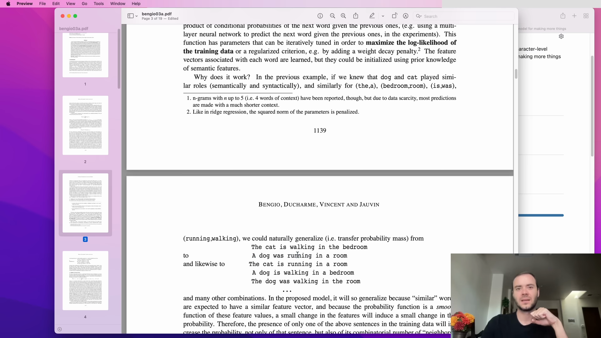

The architecture includes a table lookup for the word feature vectors, a multi-layer neural network with tanh activation functions, and a softmax layer to output the probability distribution of the next word.

The neural probabilistic language model proposed by Bengio et al. offers a powerful approach to language modeling by addressing the curse of dimensionality through distributed representations. By learning word embeddings and using a multi-layer neural network, the model can generalize to unseen sequences and improve the prediction of the next word in a sequence. This approach has paved the way for many advancements in natural language processing and neural network-based language models. # Understanding Neural Network Architecture for Word Embeddings

In this post, we will delve into the architecture of a neural network designed for word embeddings. The architecture involves several key components, including an input layer, a hidden layer, and an output layer. Let's break down each part of this architecture.

## Input Layer

The input layer consists of a lookup table, referred to as matrix **C**. This lookup table is a matrix of size 17,000 by 30. Each index in this table corresponds to a word, and the table converts each word into a 30-dimensional embedding vector.

For example, if we have three words, each word is represented by a 30-dimensional vector, making up a total of 90 neurons in the input layer.


In the diagram above, you can see how each word is indexed into the same matrix **C**. This matrix is shared across all words, meaning that for each word, we are always indexing into the same matrix **C** repeatedly.

## Hidden Layer

Next, we have the hidden layer of the neural network. The size of this hidden layer is a hyperparameter, which means it is a design choice left to the designer of the neural network. The size can vary depending on the specific requirements and can be as large or as small as needed.

For instance, if the hidden layer has 100 neurons, all of these neurons would be fully connected to the 90 neurons from the input layer. This fully connected layer is followed by a tanh non-linearity.


## Output Layer

The output layer is designed to predict the next word in a sequence. Given that there are 17,000 possible words that could come next, this layer consists of 17,000 neurons. Each of these neurons is fully connected to all the neurons in the hidden layer.

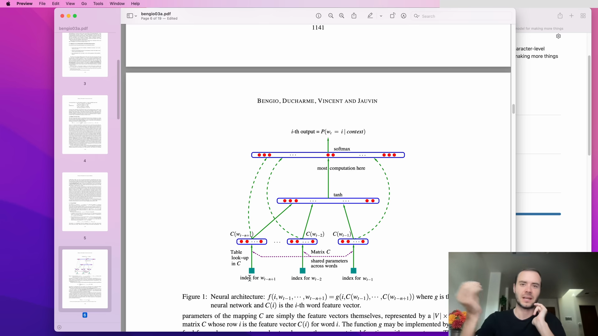

Due to the large number of possible words, the output layer has a significant number of parameters. This complexity is necessary to handle the vast vocabulary and provide accurate predictions.

To summarize, the neural network architecture for word embeddings involves:
- An input layer with a lookup table (matrix **C**) that converts words into 30-dimensional vectors.
- A hidden layer whose size is a hyperparameter and can vary.
- An output layer with 17,000 neurons, each fully connected to the hidden layer, to predict the next word in a sequence.

This architecture allows the neural network to effectively learn and predict word embeddings, making it a powerful tool for natural language processing tasks. # Understanding the Neural Network Architecture

In this section, we will delve into the neural network architecture as illustrated in the diagram below. This architecture is designed to predict the next word in a sequence, a common task in natural language processing.

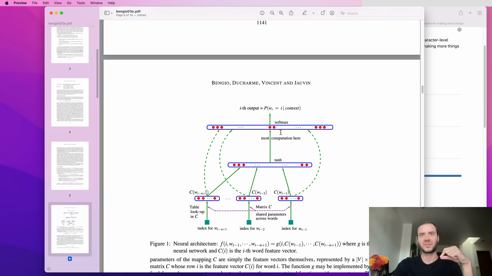

## Softmax Layer

At the top of the architecture, we have the **softmax layer**. This layer is crucial for converting the logits into a probability distribution. Each logit is exponentiated, and then all the exponentiated values are normalized to sum to one. This normalization ensures that we have a valid probability distribution for predicting the next word in the sequence.

During training, we have the label, which is the identity of the next word in the sequence. The index of this word is used to extract the probability of that word from the softmax output. The goal is to maximize the probability of the correct word with respect to the parameters of the neural network.

## Parameters and Optimization

The parameters of this neural network include:

- **Weights and biases of the output layer**
- **Weights and biases of the hidden layer**
- **Embedding lookup table (C)**

All these parameters are optimized using backpropagation. The dashed arrows in the diagram represent a variation of the neural network that we are not exploring in this discussion.

## Embedding Lookup Table

The embedding lookup table, denoted as **C**, plays a significant role in this architecture. Each word in the vocabulary is represented by a feature vector, which is stored in this table. During the forward pass, the indices of the words in the context are used to retrieve their corresponding feature vectors from the table.

## Hidden Layer

The hidden layer, which uses the **tanh** activation function, processes the concatenated feature vectors of the context words. The output of this hidden layer is then passed to the softmax layer to generate the logits for the next word prediction.

This neural network architecture effectively combines the embedding lookup table, hidden layer, and softmax layer to predict the next word in a sequence. The parameters are optimized using backpropagation to maximize the probability of the correct word during training.

By understanding each component and its role, we can appreciate the complexity and efficiency of this neural network in handling natural language processing tasks. # Building a Character-Level Language Model with PyTorch

In this lecture, we will build a character-level language model using PyTorch. We'll start by importing the necessary libraries and reading in our dataset. Then, we'll create a vocabulary of characters and map them to integers. Finally, we'll build a dataset for training our neural network and implement an embedding lookup table.

## Importing Libraries and Reading Data

First, we import PyTorch and Matplotlib for creating figures. We then read all the names into a list of words and display the first eight names. Our dataset contains a total of 32,033 names.

```python
import torch
import torch.nn.functional as F
import matplotlib.pyplot as plt  # for making figures
%matplotlib inline

# Read in all the words
words = open('names.txt', 'r').read().splitlines()
words[:8]
```

Output:
```
['emma', 'olivia', 'ava', 'isabella', 'sophia', 'charlotte', 'mia', 'amelia']
```

```python
len(words)
```

Output:
```
32033
```

Next, we build the vocabulary of characters and map them to integers and vice versa.

```python
# Build the vocabulary of characters and mappings to/from integers
chars = sorted(list(set(''.join(words))))
stoi = {s: i for i, s in enumerate(chars)}
stoi['.'] = 0
itos = {i: s for s, i in stoi.items()}
print(itos)
```

Output:
```
{1: 'a', 2: 'b', 3: 'c', 4: 'd', 5: 'e', 6: 'f', 7: 'g', 8: 'h', 9: 'i', 10: 'j', 11: 'k', 12: 'l', 13: 'm', 14: 'n', 15: 'o', 16: 'p', 17: 'q', 18: 'r', 19: 's', 20: 't', 21: 'u', 22: 'v', 23: 'w', 24: 'x', 25: 'y', 26: 'z', 0: '.'}
```

## Building the Dataset

We define a `block_size` which represents the context length, i.e., how many characters we take to predict the next one. Here, we start with a block size of 3.

```python
# Build the dataset
block_size = 3  # context length: how many characters do we take to predict the next one?
X, Y = [], []
for w in words[:5]:
    print(w)
    context = [0] * block_size
    for ch in w + '.':
        ix = stoi[ch]
        X.append(context)
        Y.append(ix)
        print(''.join(itos[i] for i in context), '--->', itos[ix])
        context = context[1:] + [ix]  # crop and append

X = torch.tensor(X)
Y = torch.tensor(Y)
```

Output:
```
emma
... ---> e
..e ---> m
.em ---> m
emm ---> a
mma ---> .
olivia
... ---> o
..o ---> l
.ol ---> i
oli ---> v
liv ---> i
ivi ---> a
via ---> .
ava
... ---> a
..a ---> v
.av ---> a
ava ---> .
isabella
... ---> i
..i ---> s
.is ---> a
isa ---> b
sab ---> e
abe ---> l
bel ---> l
ell ---> a
lla ---> .
sophia
... ---> s
..s ---> o
.so ---> p
sop ---> h
oph ---> i
phi ---> a
hia ---> .
```


## Embedding Lookup Table

We create an embedding lookup table `C` with 27 possible characters embedded in a lower-dimensional space. Here, we start with a 2-dimensional space.

```python
C = torch.randn((27, 2))
C
```

Output:
```
tensor([[-0.4984, -0.2921],
        [ 1.0815, -1.3502],
        [-0.0639, -0.9878],
        ...
        [ 0.2487,  0.1350]])
```

To understand how embedding works, we embed a single integer, say 5, using the lookup table `C`.

```python
C[5]
```

Output:
```
tensor([0.1615, 1.3169])
```

Alternatively, we can use one-hot encoding to achieve the same result.

```python
F.one_hot(torch.tensor(5), num_classes=27) @ C
```

Output:
```
tensor([0.1615, 1.3169])
```


In this example, we see that both methods yield the same result, demonstrating the equivalence of direct indexing and one-hot encoding followed by matrix multiplication. This concludes our setup for building a character-level language model. Next, we will implement the neural network to predict the next character in the sequence. # Understanding Embedding in Neural Networks with PyTorch

In this post, we will explore how embedding works in neural networks using PyTorch. We will discuss the concept of embedding integers, indexing into lookup tables, and how PyTorch's flexible indexing can be leveraged to handle multi-dimensional tensors.

## Embedding Integers

When we embed an integer, we can think of it as indexing into a lookup table `C`. For example, embedding the integer `5` retrieves the fifth row of `C`. This can be done easily in PyTorch:

```python
C = torch.randn((27, 2))
C[5]
```


The output tensor `[0.1615, 1.3169]` is the embedding for the integer `5`.

## Indexing with Lists and Tensors

PyTorch allows for flexible and powerful indexing. Instead of just retrieving a single element, we can index using lists or tensors of integers. For example, to get the rows `5`, `6`, and `7`:

```python
C[torch.tensor([5, 6, 7])]
```

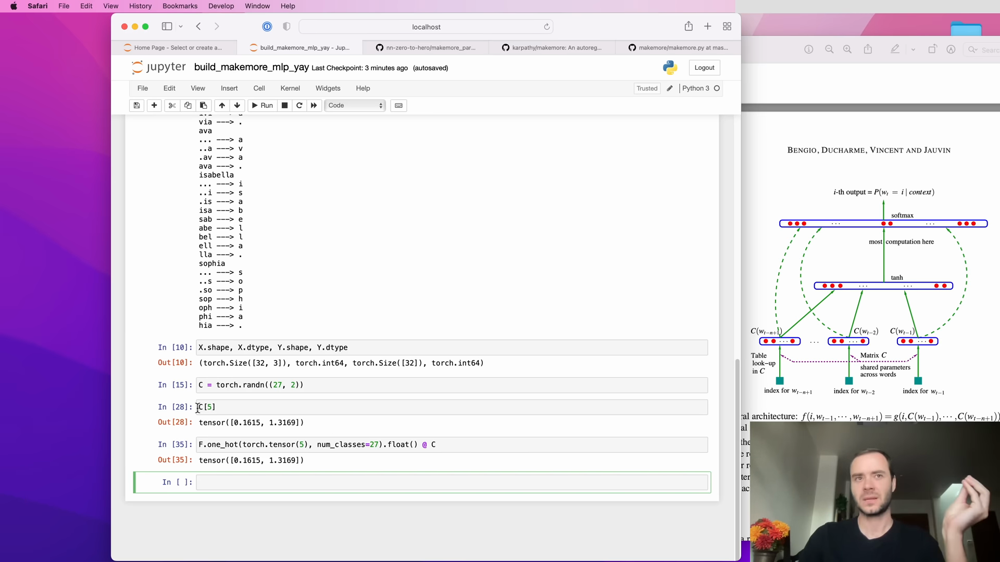

The output will be a tensor containing the embeddings for the integers `5`, `6`, and `7`.

## Multi-dimensional Tensor Indexing

We can also index with multi-dimensional tensors. For instance, if we have a 2D tensor of integers, we can retrieve the corresponding embeddings for each integer in the tensor:

```python
X = torch.randint(0, 27, (32, 3))
C[X].shape
```


The shape of the resulting tensor is `32 x 3 x 2`, where `32 x 3` is the original shape of `X`, and `2` is the dimension of the embedding vectors.

## Example: Retrieving Specific Embeddings

To illustrate, let's consider an example where we want to retrieve the embedding for a specific integer in a multi-dimensional tensor. Suppose we want the embedding for the integer at position `[13, 2]` in `X`:

```python
C[X][13, 2]
```

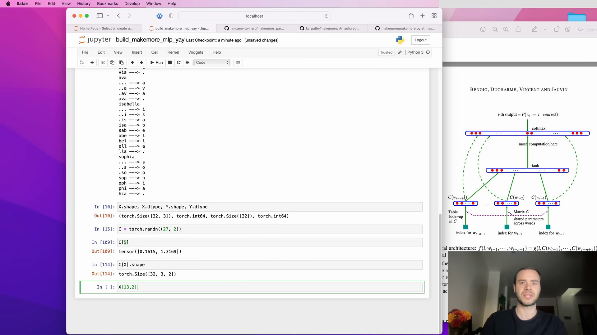

This retrieves the embedding for the integer at that specific position. We can verify that this embedding matches the corresponding row in `C`:

```python
C[X[13, 2]]
```

By understanding these concepts, we can efficiently use embeddings in neural networks, leveraging PyTorch's powerful indexing capabilities to handle complex data structures. # Building a Hidden Layer in PyTorch

In this section, we will discuss how to construct a hidden layer in PyTorch, focusing on embedding integers and performing matrix operations.

## Embedding Integers

To embed all the integers in `X` simultaneously, we can simply use `C(X)`, where `C` is our embedding matrix. This operation will give us the embeddings for all integers in `X`.

```python
C = torch.randn((27, 2))
emb = C[X]
emb.shape
```

The shape of the resulting embedding tensor is `(32, 3, 2)`.


## Constructing the Hidden Layer

Next, we will construct the hidden layer. We start by initializing the weights `W1` randomly. The number of inputs to this layer is `3 * 2` because we have two-dimensional embeddings and three of them, resulting in 6 inputs. The number of neurons in this layer is a variable we can choose; for this example, we will use 100 neurons. The biases will also be initialized randomly.

```python
W1 = torch.randn((6, 100))
b1 = torch.randn(100)
```

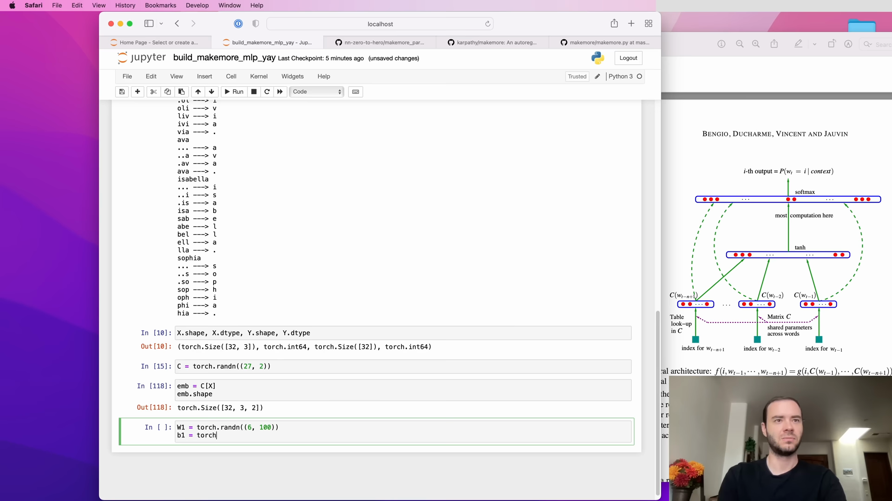

## Matrix Multiplication Issue

Normally, we would take the input (in this case, the embedding) and multiply it with these weights, then add the bias. However, the embeddings are stacked up in the dimensions of this input tensor, making the matrix multiplication invalid. The shape of the embedding tensor is `(32, 3, 2)`, and we cannot multiply it by a tensor of shape `(6, 100)`.

```python
emb @ W1 + b1
```

This operation will result in a shape mismatch error.


## Transforming the Tensor Shape

To resolve this, we need to transform the tensor from shape `(32, 3, 2)` to `(32, 6)` so that we can perform the matrix multiplication. One way to achieve this is by concatenating the inputs together.

PyTorch provides a large number of functions to manipulate tensors. By exploring the documentation, we can find the `torch.cat` function, which concatenates a given sequence of tensors along a specified dimension.

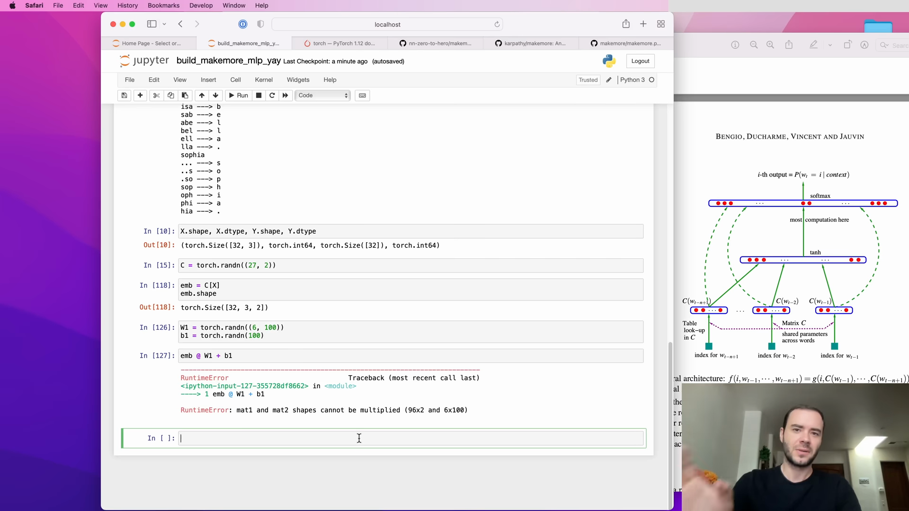

## Using `torch.cat`

The `torch.cat` function can be used to concatenate tensors along a given dimension. This will allow us to reshape our tensor appropriately for matrix multiplication.

```python
torch.cat(tensors, dim=0)
```

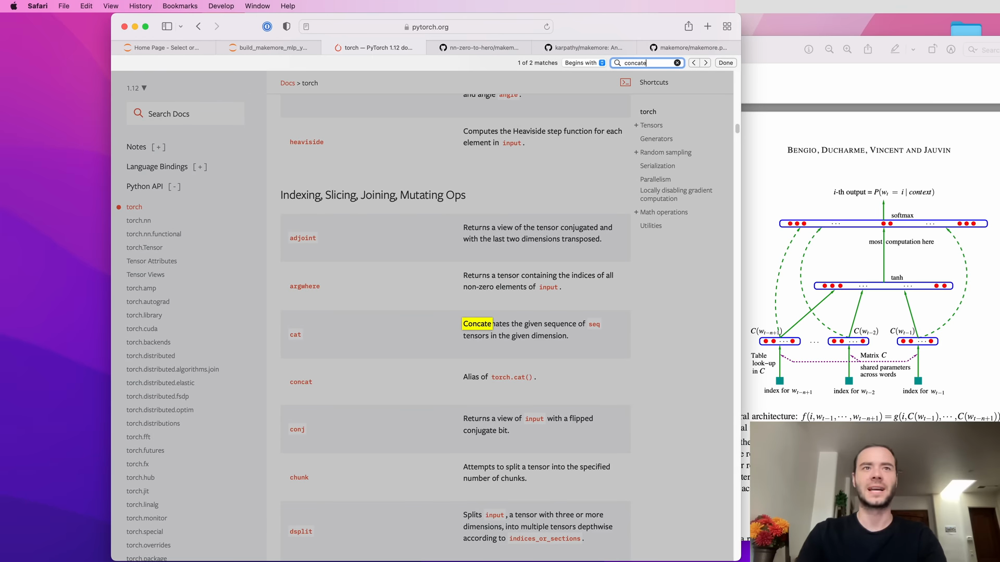

By using `torch.cat`, we can transform our tensor and perform the necessary matrix operations to construct our hidden layer. # Efficient Tensor Operations in PyTorch

In this post, we will explore efficient tensor operations in PyTorch, focusing on concatenation and reshaping techniques. We'll also delve into some internal workings of PyTorch tensors to understand why certain operations are more efficient than others.

## Concatenating Tensors

We start with a tensor `emb` of shape `[32, 3, 2]`. Our goal is to concatenate its slices along a specific dimension. Here's how we can achieve this:

```python
emb[:, 0, :], emb[:, 1, :], emb[:, 2, :]
```

This code extracts three parts of the tensor, each of shape `[32, 2]`. We then concatenate these parts along dimension 1:

```python
torch.cat([emb[:, 0, :], emb[:, 1, :], emb[:, 2, :]], dim=1)
```

This results in a tensor of shape `[32, 6]`.

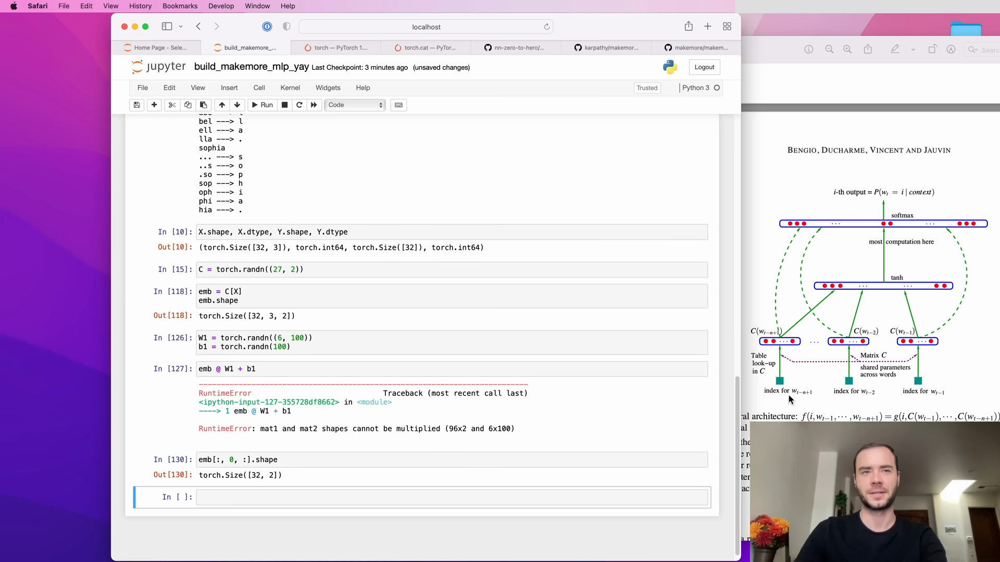

However, this approach is not flexible if the number of slices changes. For instance, if we have five slices instead of three, we would need to modify the code. To address this, we can use `torch.unbind`:

```python
torch.cat(torch.unbind(emb, dim=1), dim=1)
```

This method dynamically handles any number of slices, making the code more robust.

## Efficient Reshaping with `view`

Next, we explore an efficient way to reshape tensors using the `view` method. Let's create a tensor `a` with elements from 0 to 17:

```python
a = torch.arange(18)
```

The shape of `a` is `[18]`. We can reshape it into different dimensions using `view`:

```python
a.view(3, 3, 2)
```

This reshapes `a` into a tensor of shape `[3, 3, 2]`.


The `view` method is efficient because it does not change the underlying storage of the tensor. Instead, it manipulates attributes like `storage_offset`, `strides`, and `shapes` to interpret the one-dimensional storage as an n-dimensional tensor.

## Applying `view` to Our Tensor

Returning to our tensor `emb`, we can use `view` to achieve the same result as concatenation:

```python
emb.view(32, 6)
```

This flattens the tensor into a shape of `[32, 6]`, effectively concatenating the slices.


This method is more efficient than concatenation because it avoids creating new memory. Instead, it reinterprets the existing storage.

## Generalizing the Code

To make our code more general, we can avoid hardcoding dimensions. For example, instead of using `32`, we can use `emb.shape[0]` or `-1`:

```python
emb.view(emb.shape[0], -1)
```

This ensures that the code works for any size of `emb`.

By using `torch.unbind` and `view`, we can efficiently manipulate tensors in PyTorch. These methods provide flexibility and performance benefits, making them valuable tools for tensor operations.

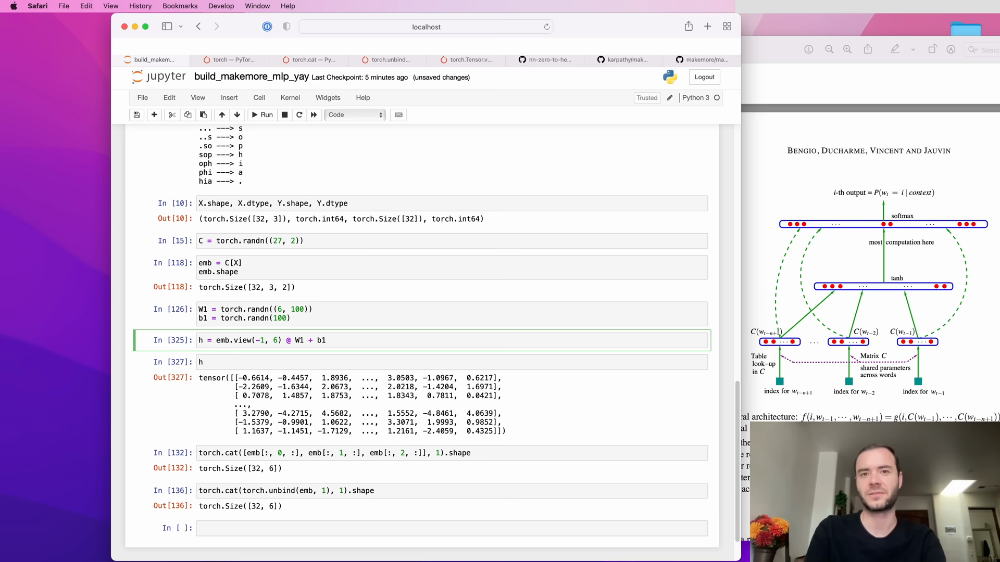 ## Understanding the Hidden Layer and Broadcasting in Neural Networks

In this section, we will delve into the hidden layer activations and the concept of broadcasting in neural networks. We will also create the final layer of our neural network.

### Hidden Layer Activations

We start by obtaining our hidden layer activations, denoted as `h`. These activations are numbers between -1 and 1 due to the `tanh` activation function. The shape of `h` is `(32, 100)`, representing 32 examples with 100 features each.

```python
h = torch.tanh(emb.view(-1, 6) @ W1 + b1)
h.shape
```

The output confirms the shape:

```python
torch.Size([32, 100])
```

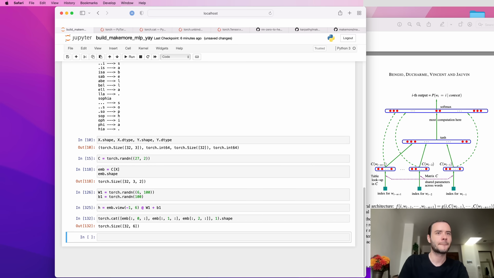

### Broadcasting in Addition

One crucial aspect to be careful about is the addition operation involving broadcasting. The shape of `h` is `(32, 100)`, and the shape of `b1` is `(100)`. When adding these, broadcasting ensures that the addition is performed correctly.

Broadcasting aligns on the right, creating a fake dimension for `b1`, making it a `(1, 100)` row vector. This row vector is then copied vertically for each of the 32 rows, allowing element-wise addition.

```python
b1.shape
```

The output confirms the shape:

```python
torch.Size([100])
```

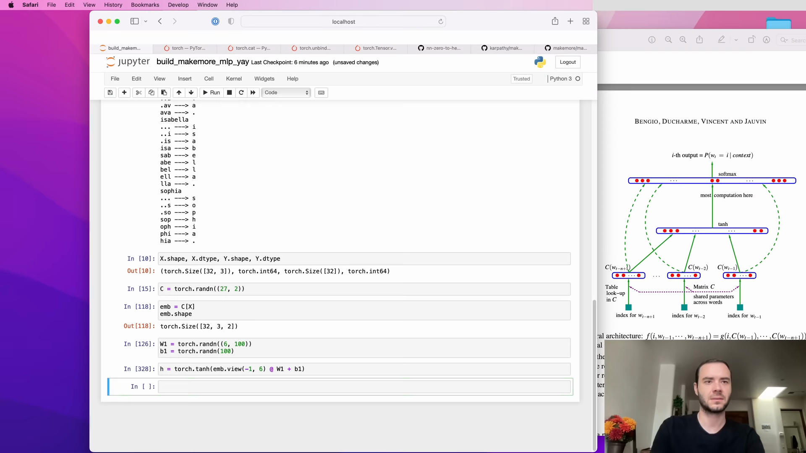

### Creating the Final Layer

Next, we create the final layer of our neural network. The input to this layer is 100, and the output is 27, corresponding to the 27 possible characters that can come next. Therefore, the biases will also have 27 elements.

```python
W2 = torch.randn(100, 27)
b2 = torch.randn(27)
```

The logits, which are the outputs of this neural network, are computed as follows:

```python
logits = h @ W2 + b2
logits.shape
```

The output confirms the shape:

```python
torch.Size([32, 27])
```

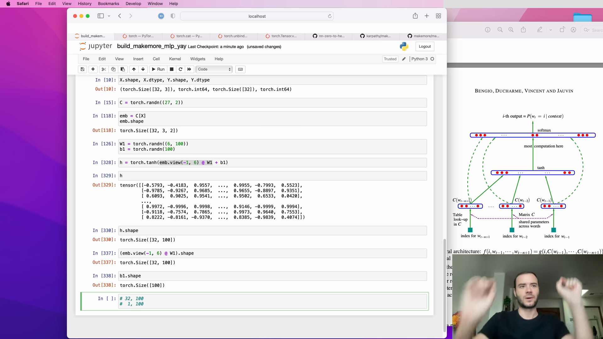

### Converting Logits to Probabilities

Finally, we convert the logits to probabilities. This involves exponentiating the logits to get fake counts and then normalizing them.

```python
counts = torch.exp(logits)
probs = counts / counts.sum(dim=1, keepdim=True)
```

This process ensures that the outputs are valid probabilities, summing to 1 across the 27 possible characters.

By understanding these steps, we can ensure that our neural network is correctly implemented and that the operations involving broadcasting are handled properly. ## Normalizing Probabilities

First, we normalize the probabilities. The shape of `prob` is now 32 by 27, and every row of `prob` sums to one, ensuring that it is normalized. This normalization gives us the probabilities.


## Actual Next Character

We have the actual next character from the array `Y`, which we created during the dataset creation. `Y` contains the identity of the next character in the sequence that we want to predict.

```python
Y = torch.tensor([5, 13, 13, 1, 0, 15, 12, 9, 22, 9, 1, 0, 1, 22, 1, 0, 9, 19, 1, 2, 5, 12, 12, 1, 0, 19, 15, 16, 8, 9, 1, 0])
```

## Indexing into Probabilities

We want to index into the rows of `prob` and, in each row, pluck out the probability assigned to the correct character as given by `Y`.

First, we create an iterator over numbers from 0 to 31 using `torch.arange(32)`.

```python
torch.arange(32)
```

Then, we index into `prob` in the following way:

```python
prob[torch.arange(32), Y]
```

This iterates over the rows and grabs the column as given by `Y`. This gives the current probabilities assigned by the neural network to the correct character in the sequence.

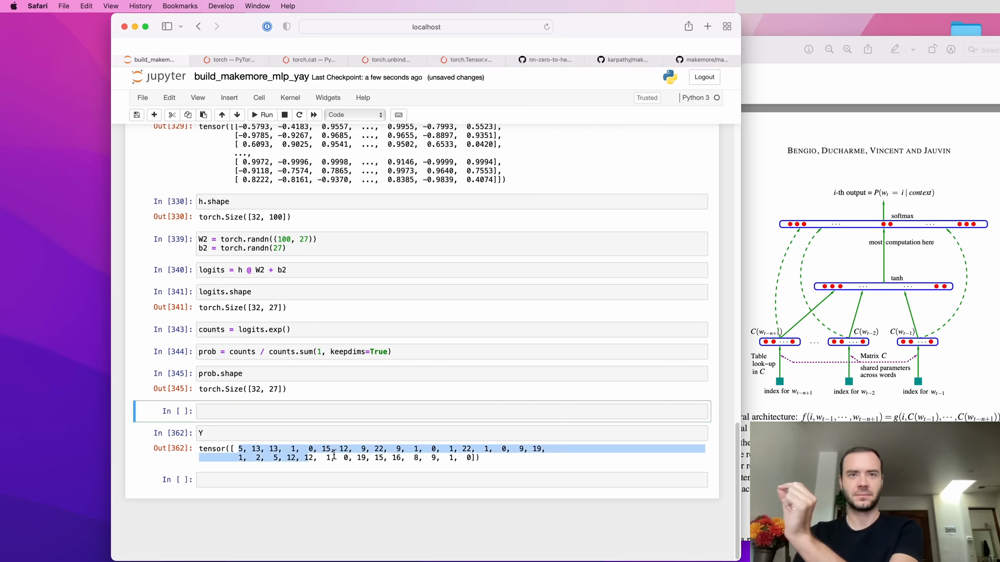

## Evaluating Probabilities

You can see that some probabilities look okay, like 0.2, but others are very low, like 0.0701. The network thinks some characters are extremely unlikely, but we haven't trained the neural network yet, so this will improve. Ideally, all these numbers should be one, indicating correct predictions.

## Calculating Negative Log Likelihood

Just as in the previous video, we want to take these probabilities, look at the log probability, and then look at the average log probability. The negative of this value will give us the negative log likelihood.

```python
log_prob = torch.log(prob[torch.arange(32), Y])
average_log_prob = log_prob.mean()
negative_log_likelihood = -average_log_prob
```

This process will help us evaluate the performance of our neural network and guide the training process to improve its predictions. # Building a Character-Level Language Model with PyTorch

In this section, we will walk through the process of building a character-level language model using PyTorch. We'll start by defining our dataset and parameters, and then proceed to the forward pass of our neural network. Finally, we'll calculate the loss to evaluate the performance of our model.

## Defining the Dataset and Parameters

First, let's define our dataset and initialize the parameters. We use a generator to ensure reproducibility. All parameters are clustered into a single list for easy management.

```python
X.shape, Y.shape # dataset
# Output: (torch.Size([32, 3]), torch.Size([32]))

g = torch.Generator().manual_seed(2147483647) # for reproducibility
C = torch.randn(27, 2, generator=g)
W1 = torch.randn(6, 100, generator=g)
b1 = torch.randn(100, generator=g)
W2 = torch.randn(100, 27, generator=g)
b2 = torch.randn(27, generator=g)
parameters = [C, W1, b1, W2, b2]

sum(p.nelement() for p in parameters) # number of parameters in total
# Output: 3481
```

## Forward Pass

Next, we perform the forward pass through the network. This involves embedding the input, applying the tanh activation function, and calculating the logits.

```python
emb = C[X] # (32, 3, 2)
h = torch.tanh(emb.view(-1, 6) @ W1 + b1) # (32, 100)
logits = h @ W2 + b2 # (32, 27)
counts = logits.exp()
prob = counts / counts.sum(1, keepdims=True)
loss = -prob[torch.arange(32), Y].log().mean()
loss
# Output: tensor(17.7697)
```

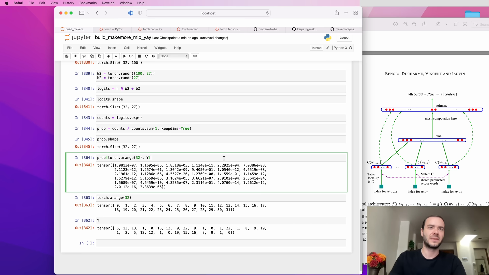

## Calculating the Loss

The loss function is crucial as it tells us how well our model is performing. Here, the loss is calculated using the negative log likelihood of the correct class probabilities.

```python
loss = -prob[torch.arange(32), Y].log().mean()
loss
# Output: tensor(17.2955)
```


## Making the Model More Respectable

To make our model more respectable, we ensure that we are not reinventing the wheel. The process of calculating the logits and the loss is a standard classification task, and many people use classification in their models.

```python
# Rewriting the forward pass for clarity and respectability
emb = C[X] # (32, 3, 2)
h = torch.tanh(emb.view(-1, 6) @ W1 + b1) # (32, 100)
logits = h @ W2 + b2 # (32, 27)
counts = logits.exp()
prob = counts / counts.sum(1, keepdims=True)
loss = -prob[torch.arange(32), Y].log().mean()
loss
# Output: tensor(17.7697)
```


By organizing our code and ensuring reproducibility, we can better understand and improve our model's performance. The current loss value indicates how well the neural network is working with the current set of parameters. ## Efficient Cross-Entropy Loss Calculation in PyTorch

When working with neural networks in PyTorch, calculating the cross-entropy loss is a common task. While it's possible to manually implement this calculation, using PyTorch's built-in `F.cross_entropy` function is generally preferred for several reasons.

### Using `F.cross_entropy`

To calculate the cross-entropy loss, you can simply call `F.cross_entropy` and pass in the logits and the array of target labels `Y`. This function computes the same loss as a manual implementation but is much more efficient.

```python
import torch.nn.functional as F

# Assuming logits and Y are already defined
loss = F.cross_entropy(logits, Y)
```

This single line of code can replace multiple lines of a manual implementation, yielding the same result.


### Why Prefer `F.cross_entropy`?

There are several reasons to prefer `F.cross_entropy` over a manual implementation:

1. **Memory Efficiency**: When you use `F.cross_entropy`, PyTorch does not create all the intermediate tensors that a manual implementation would. Each intermediate tensor consumes memory, and creating many of them can be inefficient.

2. **Optimized Computation**: PyTorch clusters operations and often uses fused kernels to evaluate expressions efficiently. These fused kernels are optimized for performance, making the computation faster.

3. **Simplified Backward Pass**: The backward pass can be made much more efficient, not just because of fused kernels but also due to mathematical simplifications. For example, in the implementation of the `tanh` function in MicroGrad, the forward pass involves a complex mathematical expression. However, the backward pass simplifies to `1 - t^2`, which is much easier to compute.


In the code snippet above, the `tanh` function's backward pass is simplified to a single expression, reducing the computational complexity.

### Example of Manual Implementation

For educational purposes, here's a manual implementation of the cross-entropy loss:

```python
import torch

# Assuming logits and Y are already defined
counts = logits.exp()
prob = counts / counts.sum(1, keepdims=True)
loss = -prob[torch.arange(32), Y].log().mean()
```

This code calculates the cross-entropy loss manually, but it is less efficient than using `F.cross_entropy`.

While manually implementing the cross-entropy loss can be educational, using PyTorch's `F.cross_entropy` is recommended for practical applications. It is more memory-efficient, computationally optimized, and simplifies the backward pass, making your code more efficient and easier to maintain. # Understanding Cross Entropy in Neural Networks

In this section, we'll delve into the mathematical and practical aspects of cross-entropy loss in neural networks, particularly focusing on its numerical stability and efficiency.

## Numerical Stability of Cross Entropy

Cross-entropy loss is a crucial component in training neural networks, especially for classification tasks. One of the key advantages of using `F.cross_entropy` in PyTorch is its numerical stability. Let's explore this with an example.

Suppose we have a set of logits: `[-2, -3, 0, 5]`. When we take the exponent of these logits and normalize them to sum to one, we get a well-behaved probability distribution. However, during the optimization of a neural network, logits can take on more extreme values.

### Handling Extreme Logits

Consider what happens when some logits become very negative, such as `-100`. The resulting probabilities are still well-behaved and sum to one. However, if logits become very positive, like `100`, we encounter numerical issues. This is because the exponentiation of large positive numbers can exceed the dynamic range of floating-point numbers, leading to `NaN` (Not a Number) values.

```python
logits = torch.tensor([-2, -3, 0, 5])
counts = logits.exp()
probs = counts / counts.sum()
print(probs)  # Well-behaved probabilities

logits = torch.tensor([-100, -3, 0, 100])
counts = logits.exp()
probs = counts / counts.sum()
print(probs)  # NaN due to large positive logits
```

### PyTorch's Solution

PyTorch addresses this issue by normalizing the logits internally. It subtracts the maximum logit value from all logits, ensuring that the largest logit becomes zero and the others become negative. This normalization prevents overflow during exponentiation.

```python
logits = torch.tensor([-5, -3, 0, 5]) + 2
counts = logits.exp()
probs = counts / counts.sum()
print(probs)  # Well-behaved probabilities
```

## Training the Neural Network

Now, let's set up the training process for our neural network. We'll start with the forward pass, followed by the backward pass, and finally update the parameters.

### Forward Pass

In the forward pass, we compute the loss using `F.cross_entropy`.

```python
# Forward pass
emb = C[X]  # (32, 3, 2)
h = torch.tanh(emb.view(-1, 6) @ W1 + b1)  # (32, 100)
logits = h @ W2 + b2  # (32, 27)
loss = F.cross_entropy(logits, Y)
```

### Backward Pass and Parameter Update

In the backward pass, we set the gradients to zero, compute the gradients, and update the parameters.

```python
# Backward pass
for p in parameters:
    p.grad = None
loss.backward()

# Update
for p in parameters:
    p.data += -0.1 * p.grad
```

### Training Loop

We repeat the forward and backward passes multiple times to train the network. Here, we print the loss at each step to monitor the training progress.

```python
for _ in range(1000):
    # Forward pass
    emb = C[X]  # (32, 3, 2)
    h = torch.tanh(emb.view(-1, 6) @ W1 + b1)  # (32, 100)
    logits = h @ W2 + b2  # (32, 27)
    loss = F.cross_entropy(logits, Y)
    
    # Backward pass
    for p in parameters:
        p.grad = None
    loss.backward()
    
    # Update
    for p in parameters:
        p.data += -0.1 * p.grad
    
    print(loss.item())
```

### Overfitting and Loss Analysis

Initially, we observe a high loss value, but it decreases significantly as we train the network. This is because we are overfitting a small batch of data (32 examples) with a large number of parameters (3400). Consequently, the network can easily fit the data, resulting in a low loss.

```python
logits.max(1)
Y
```

However, we cannot achieve a loss of zero due to the inherent variability in the training set. For example, the same input might have multiple possible outcomes, making it impossible to perfectly overfit the data.

By understanding these concepts, we can appreciate the importance of numerical stability in training neural networks and the practical benefits of using `F.cross_entropy` in PyTorch. # Optimizing Neural Networks with PyTorch

In this post, we will discuss how to optimize a neural network using PyTorch. We will cover the process of handling large datasets, implementing mini-batch gradient descent, and determining an appropriate learning rate. Additionally, we will explore the importance of splitting the dataset into training, validation, and test sets to prevent overfitting.

## Handling Large Datasets

When working with large datasets, it is crucial to ensure that the neural network can handle the data efficiently. Initially, we created a dataset with only the first five words, but now we will process the full dataset, which contains 228,000 examples.

```python
# Reinitialize the weights
for p in parameters:
    p.requires_grad = True

# Forward pass
emb = C[X]  # (32, 3, 2)
h = torch.tanh(emb.view(-1, 6) @ W1 + b1)  # (32, 100)
logits = h @ W2 + b2  # (32, 27)
loss = F.cross_entropy(logits, Y)

# Backward pass
for p in parameters:
    p.grad = None
loss.backward()

# Update
for p in parameters:
    p.data += -0.1 * p.grad

print(loss.item())
```

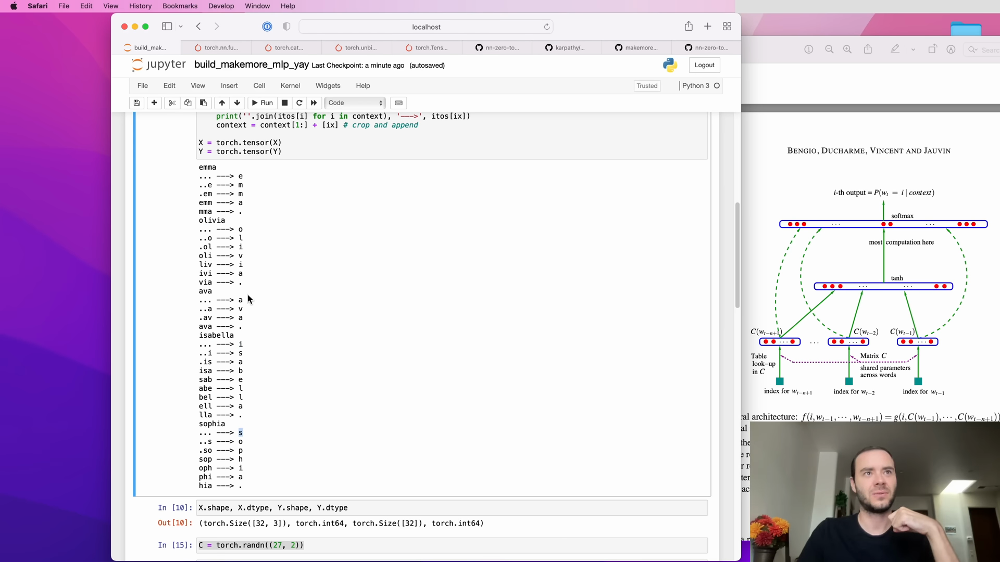

## Implementing Mini-Batch Gradient Descent

Processing the entire dataset in one go can be computationally expensive. Instead, we can use mini-batch gradient descent, where we perform forward and backward passes on smaller batches of data.

```python
# Mini-batch construct
ix = torch.randint(0, X.shape[0], (32,))
emb = C[X[ix]]  # (32, 3, 2)
h = torch.tanh(emb.view(-1, 6) @ W1 + b1)  # (32, 100)
logits = h @ W2 + b2  # (32, 27)
loss = F.cross_entropy(logits, Y[ix])

# Backward pass
for p in parameters:
    p.grad = None
loss.backward()

# Update
for p in parameters:
    p.data += -0.1 * p.grad

print(loss.item())
```

Using mini-batches allows us to run many examples nearly instantly and decrease the loss much faster. However, the quality of the gradient is lower, but it is still useful for optimization.

## Determining the Learning Rate

Choosing the right learning rate is crucial for efficient training. We can determine a reasonable learning rate by experimenting with different values and observing the loss.

```python
# Reset parameters
for p in parameters:
    p.requires_grad = True

# Learning rate search
lre = torch.linspace(-3, 0, 1000)
lrs = 10**lre

# Track stats
lri = []
lossi = []

for i in range(1000):
    lr = lrs[i]
    for p in parameters:
        p.data += -lr * p.grad
    lri.append(lr)
    lossi.append(loss.item())

# Plot learning rate vs. loss
plt.plot(lri, lossi)
```

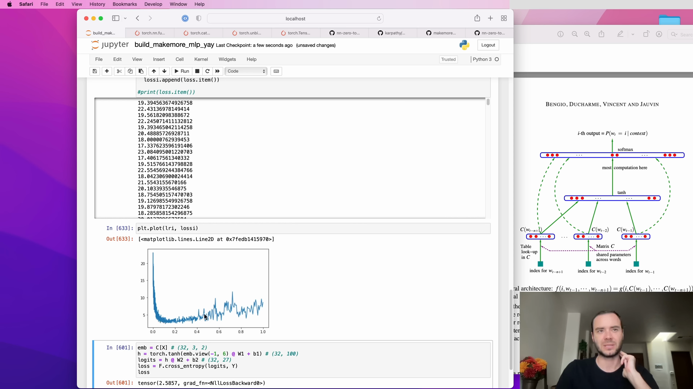

By plotting the learning rates against the losses, we can identify a good learning rate that minimizes the loss effectively.

## Splitting the Dataset

To prevent overfitting, it is essential to split the dataset into training, validation, and test sets. Typically, the dataset is split as follows:
- Training set: 80%
- Validation set: 10%
- Test set: 10%

```python
# Split the dataset
def build_dataset(words):
    X, Y = [], []
    for w in words:
        context = [0] * block_size
        for ix in w + '.':
            X.append(context)
            Y.append(ix)
            context = context[1:] + [ix]
    return torch.tensor(X), torch.tensor(Y)

random.shuffle(words)
n1 = int(0.8 * len(words))
n2 = int(0.9 * len(words))

Xtr, Ytr = build_dataset(words[:n1])
Xdev, Ydev = build_dataset(words[n1:n2])
Xte, Yte = build_dataset(words[n2:])
```

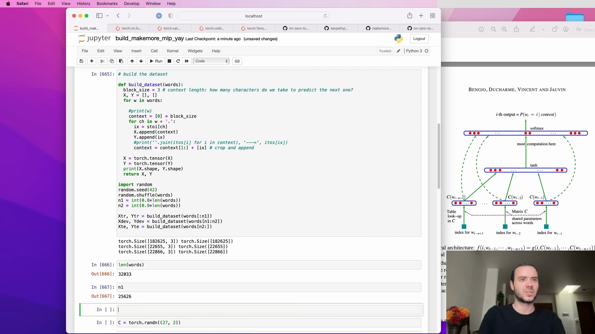

## Training the Neural Network

With the dataset split, we can now train the neural network using the training set and evaluate its performance on the validation set.

```python
# Training loop
for i in range(30000):
    ix = torch.randint(0, Xtr.shape[0], (32,))
    emb = C[Xtr[ix]]
    h = torch.tanh(emb.view(-1, 6) @ W1 + b1)
    logits = h @ W2 + b2
    loss = F.cross_entropy(logits, Ytr[ix])

    for p in parameters:
        p.grad = None
    loss.backward()

    for p in parameters:
        p.data += -0.1 * p.grad

    if i % 1000 == 0:
        print(loss.item())

# Evaluate on validation set
emb = C[Xdev]
h = torch.tanh(emb.view(-1, 6) @ W1 + b1)
logits = h @ W2 + b2
loss = F.cross_entropy(logits, Ydev)
print(loss.item())
```

By following these steps, we can optimize the neural network efficiently and achieve better performance while preventing overfitting. # Scaling Up a Neural Network for Improved Performance

In this post, we will explore the process of scaling up a neural network to improve its performance. We will start by examining the current state of the model, then increase its size, and finally visualize the character embeddings.

## Current Model Performance

We begin by evaluating the current performance of our neural network. The training and development (dev) losses are roughly equal, indicating that the model is underfitting. This means our network is too small to capture the complexity of the data.

```python
emb = C[Xtr[ix]] # (32, 3, 2)
h = torch.tanh(emb.view(-1, 6) @ W1 + b1) # (32, 100)
logits = h @ W2 + b2 # (32, 27)
loss = F.cross_entropy(logits, Ytr[ix])
loss
```


## Increasing the Network Size

To address the underfitting issue, we will increase the size of the hidden layer from 100 neurons to 300 neurons. This change will also increase the number of parameters in the network from 3,000 to 10,000.

```python
W1 = torch.randn((6, 300), generator=g)
b1 = torch.randn(300, generator=g)
W2 = torch.randn((300, 27), generator=g)
b2 = torch.randn(27, generator=g)
parameters = [C, W1, b1, W2, b2]
```

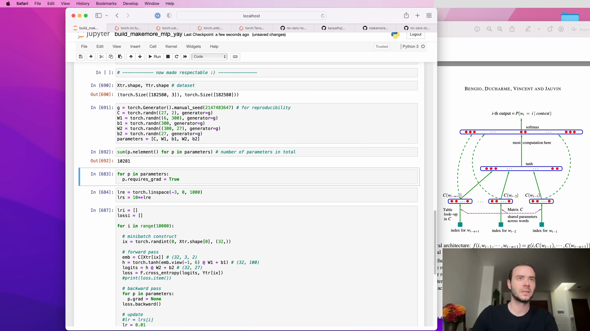

## Training the Larger Network

We will now train the larger network for 30,000 iterations and keep track of the loss at each step.

```python
lri = []
lossi = []
stepi = []

for i in range(30000):
    ix = torch.randint(0, Xtr.shape[0], (32,))
    emb = C[Xtr[ix]] # (32, 3, 2)
    h = torch.tanh(emb.view(-1, 6) @ W1 + b1) # (32, 300)
    logits = h @ W2 + b2 # (32, 27)
    loss = F.cross_entropy(logits, Ytr[ix])
    
    for p in parameters:
        p.grad = None
    loss.backward()
    
    lr = lrs[i]
    for p in parameters:
        p.data += -lr * p.grad
    
    lri.append(lr)
    stepi.append(i)
    lossi.append(loss.item())
```


## Visualizing the Training Progress

We plot the training loss over the iterations to observe the optimization process. The plot shows some noise due to the mini-batch training, but overall, we expect the loss to decrease.

```python
plt.plot(stepi, lossi)
```


## Evaluating the Bottleneck

Despite increasing the network size, the loss does not improve significantly. This suggests that the bottleneck might be the two-dimensional character embeddings. To confirm this, we visualize the embeddings.

```python
plt.figure(figsize=(8,8))
plt.scatter(C[:,0].data, C[:,1].data, s=200)
for i in range(C.shape[0]):
    plt.text(C[i,0].item(), C[i,1].item(), itos[i], ha='center', va='center', color='white')
plt.grid('minor')
```

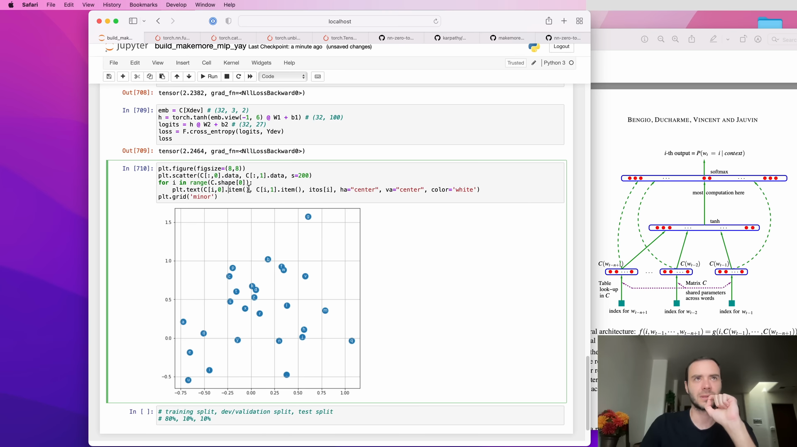

## Observations from the Embedding Visualization

The visualization reveals that the network has learned to cluster similar characters together. For example, vowels (A, E, I, O, U) are grouped closely, indicating that the network treats them as similar. Special characters like 'Q' and '.' are positioned further away, showing their unique embeddings.

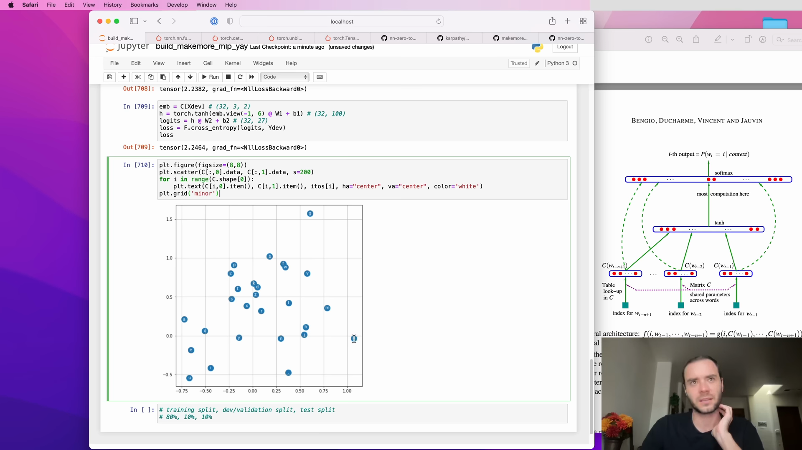

By scaling up the hidden layer of our neural network, we aimed to improve its performance. However, the two-dimensional character embeddings appear to be a bottleneck. Visualizing these embeddings provided insights into how the network perceives different characters. In future steps, we will consider increasing the embedding size to further enhance the model's performance. # Optimizing Neural Network Training with PyTorch

In this session, we will make some adjustments to our neural network model to improve its performance. We'll start by increasing the dimensionality of our embeddings and making some changes to the hidden layer size. Additionally, we'll adjust the learning rate and the number of iterations to see how these changes affect our model's performance.

## Increasing Embedding Dimensions

First, let's increase the dimensionality of our embeddings. Instead of using 2-dimensional embeddings, we'll use 10-dimensional embeddings for each word. This means that the input to our hidden layer will now be 30 (3 times 10).

```python
C = torch.randn((27, 10), generator=g)
W1 = torch.randn((30, 200), generator=g)
b1 = torch.randn(200, generator=g)
W2 = torch.randn((200, 27), generator=g)
b2 = torch.randn(27, generator=g)
parameters = [C, W1, b1, W2, b2]
```

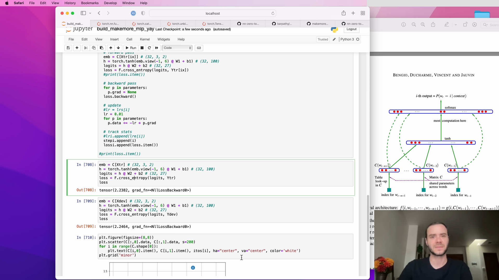

## Adjusting the Hidden Layer Size

Next, we'll reduce the size of the hidden layer from 300 neurons to 200 neurons. This change will slightly increase the total number of parameters to around 11,000.

```python
sum(p.nelement() for p in parameters)  # number of parameters in total
```

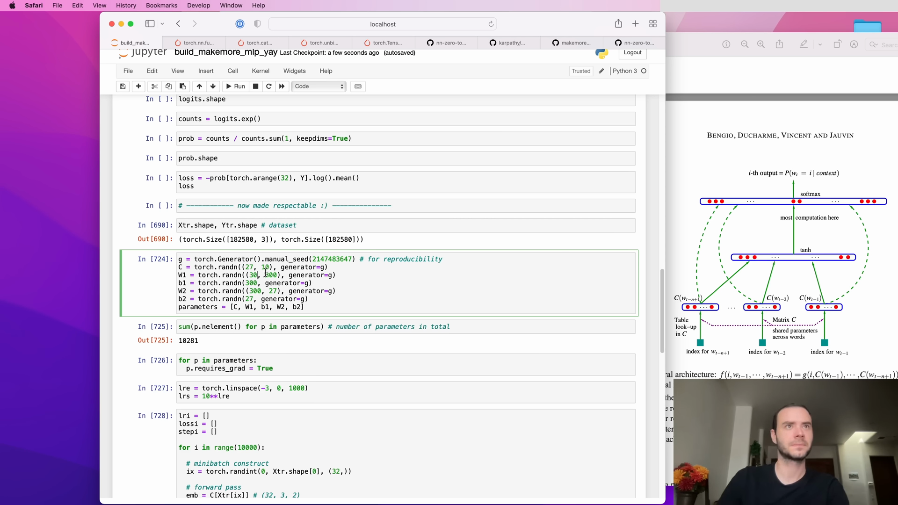

## Setting the Learning Rate and Iterations

We'll set the learning rate to 0.1 and run the training for 50,000 iterations. Additionally, we'll modify the code to avoid hardcoding magic numbers. For instance, instead of hardcoding the value 6, we'll use 30, which corresponds to our new embedding size.

```python
lr = 0.1
for i in range 50000:
    # minibatch construct
    ix = torch.randint(0, Xtr.shape[0], (32,))
    
    # forward pass
    emb = C[Xtr[ix]]
    h = torch.tanh(emb.view(-1, 30) @ W1 + b1)
    logits = h @ W2 + b2
    loss = F.cross_entropy(logits, Ytr[ix])
    
    # backward pass
    for p in parameters:
        p.grad = None
    loss.backward()
    
    # update
    for p in parameters:
        p.data += -lr * p.grad
```

## Logging and Plotting the Loss

Instead of logging the loss directly, we'll log the base-10 logarithm of the loss. This helps in visualizing the loss more effectively, as it squashes the values and avoids the "hockey stick" appearance.

```python
lossi.append(loss.log10().item())
plt.plot(stepi, lossi)
```


## Observing the Training and Validation Performance

After running the training for 50,000 iterations, we observe the training and validation losses. The training loss is around 2.17, and the validation loss is around 2.2. This indicates that our model is starting to overfit slightly, as the training and validation performances are slowly departing.

```python
emb = C[Xtr]
h = torch.tanh(emb.view(-1, 30) @ W1 + b1)
logits = h @ W2 + b2
loss = F.cross_entropy(logits, Ytr)
loss

emb = C[Xdev]
h = torch.tanh(emb.view(-1, 30) @ W1 + b1)
logits = h @ W2 + b2
loss = F.cross_entropy(logits, Ydev)
loss
```

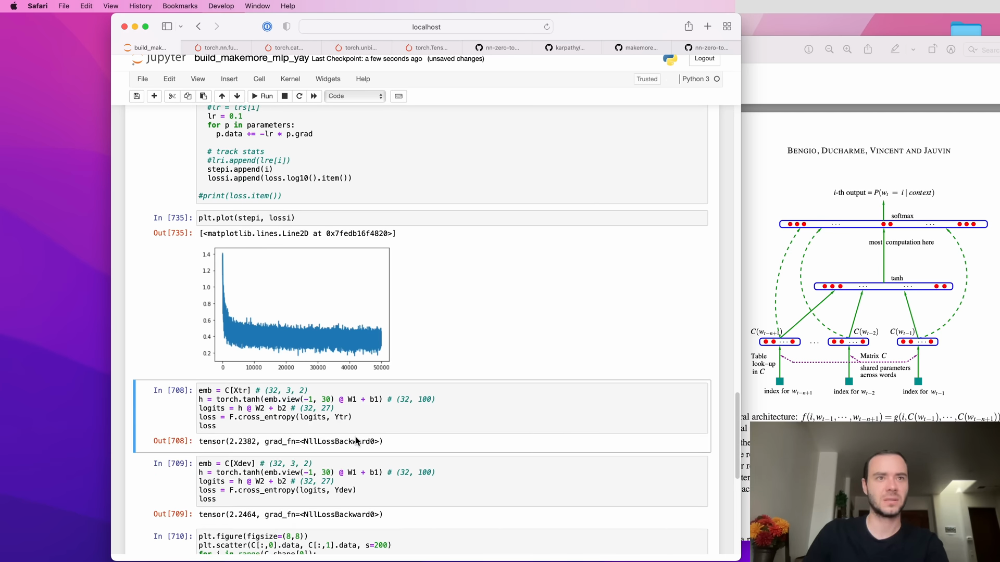

## Further Optimization

To further optimize the model, we can decrease the learning rate by a factor of 10 and train for another 50,000 iterations. This iterative process helps in fine-tuning the model parameters and improving the performance.

```python
lr = 0.01
for i in range 50000:
    # same training loop as above
```

By running multiple experiments and adjusting hyperparameters, we can identify the best settings that yield the optimal performance for our model. This process is crucial in a production environment to ensure that the model generalizes well to unseen data.

 # Optimizing Neural Network Models: Techniques and Tips

In this post, we will discuss various techniques to optimize neural network models, focusing on tuning hyperparameters and improving model performance. We will also explore some practical examples and code snippets to illustrate these concepts.

## Training and Validation Loss

One of the key metrics to monitor during model training is the loss. The loss function measures how well the model's predictions match the actual data. Lower loss values indicate better model performance.

Here, we rerun the plot and evaluate the training and validation loss. The results show that the embedding size was likely holding us back, as we are now achieving lower loss values.


The training and validation loss values are approximately 2.16 and 2.19, respectively. These values suggest that there is room for further optimization.

## Hyperparameter Tuning

There are several ways to improve the model from this point. Some of the key hyperparameters to tune include:

1. **Optimization Techniques**: Experiment with different optimization algorithms and learning rates.
2. **Neural Network Size**: Adjust the number of neurons in the hidden layers.
3. **Input Size**: Increase the number of input characters or words.
4. **Embedding Dimensionality**: Change the size of the embedding lookup table.

### Example: Adjusting Learning Rates

In the following code snippet, we modify the learning rate during the optimization process. For the first 100,000 steps, we use a learning rate of 0.1, and for the next 100,000 steps, we use a learning rate of 0.01.

```python
for i in range(200000):
    # Minibatch construct
    ix = torch.randint(0, Xtr.shape[0], (32,))

    # Forward pass
    emb = C[Xtr[ix]]  # (32, 3, 2)
    h = torch.tanh(emb.view(-1, 30) @ W1 + b1)  # (32, 100)
    logits = h @ W2 + b2  # (32, 27)
    loss = F.cross_entropy(logits, Ytr[ix])

    # Backward pass
    for p in parameters:
        p.grad = None
    loss.backward()

    # Update
    lr = 0.1 if i < 100000 else 0.01
    for p in parameters:
        p.data += -lr * p.grad

    # Track stats
    lri.append(lr)
    stepi.append(i)
    lossi.append(loss.log10().item())
```

The resulting loss plot is shown below:

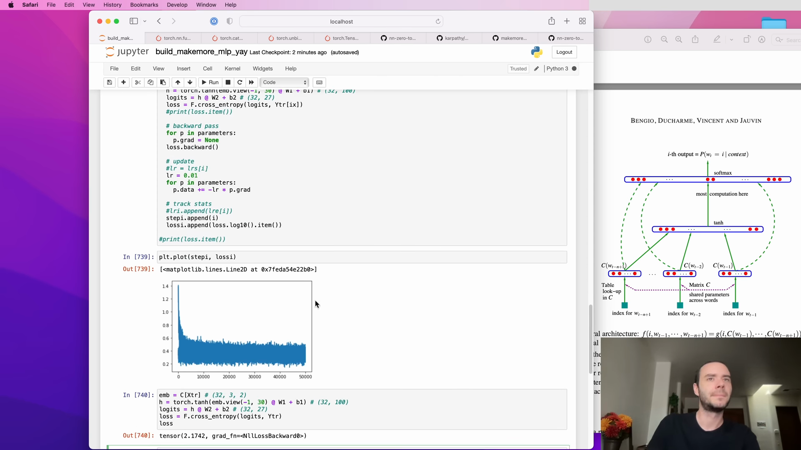

The best validation loss achieved in the last 30 minutes is 2.17. This indicates that the learning rate adjustment has a significant impact on model performance.

## Further Improvements

To surpass the current performance, consider the following adjustments:

1. **Number of Neurons**: Increase or decrease the number of neurons in the hidden layers.
2. **Embedding Dimensionality**: Experiment with different sizes for the embedding lookup table.
3. **Input Size**: Increase the number of characters or words fed into the model as context.
4. **Optimization Details**: Adjust the learning rate schedule, batch size, and training duration.

### Example: Increasing Input Size

By increasing the number of input characters, we can provide more context to the model, potentially improving its performance. The following code snippet demonstrates this:

```python
# Example code to increase input size
emb = C[Xtr]  # (32, 3, 2)
h = torch.tanh(emb.view(-1, 30) @ W1 + b1)  # (32, 100)
logits = h @ W2 + b2  # (32, 27)
loss = F.cross_entropy(logits, Ytr)
```

## Reading and Understanding Research Papers

To gain deeper insights and discover more optimization techniques, it is beneficial to read relevant research papers. The paper by Bengio, Ducharme, Vincent, and Jauvin provides several ideas for improvements that you can experiment with.

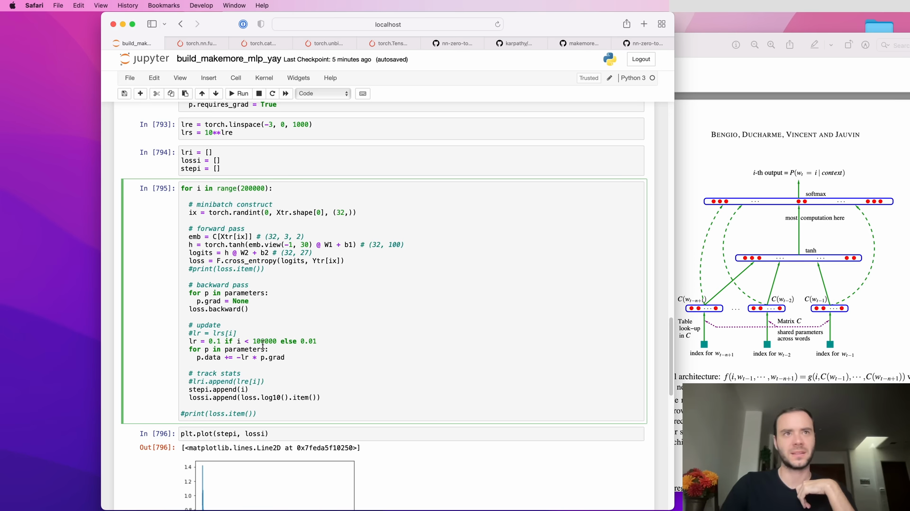

By understanding the concepts and techniques discussed in such papers, you can apply them to your models and achieve better performance.

In this post, we explored various techniques to optimize neural network models, including hyperparameter tuning and increasing input size. By experimenting with these techniques, you can improve your model's performance and achieve lower loss values. Additionally, reading research papers can provide valuable insights and ideas for further improvements. ## Sampling from the Model

Before we wrap up, I wanted to show how you would sample from the model. We're going to generate 20 samples.

### Initializing the Context

At first, we begin with all dots, so that's the context. Until we generate the zero character again, we're going to embed the current context using the embedding table `C`.


### Embedding and Hidden State

Usually, the first dimension is the size of the training set, but here we're only working with a single example that we're generating. So this is just dimension one, for simplicity. This embedding then gets projected into the hidden state, and you get the logits.

### Calculating Probabilities

Now we calculate the probabilities. For that, you can use the `F.softmax` of logits, which basically exponentiates the logits and makes them sum to one. Similar to cross-entropy, it ensures that there are no overflows.


Here is the code snippet for sampling from the model:

```python
g = torch.Generator().manual_seed(2147483647 + 10)

for _ in range(20):
    out = []
    context = [0] * block_size  # initialize with all dots
    while True:
        emb = C[torch.tensor([context])]  # (1, block_size, d)
        h = torch.tanh(emb.view(1, -1) @ W1 + b1)
        logits = h @ W2 + b2
        probs = F.softmax(logits, dim=1)
        ix = torch.multinomial(probs, num_samples=1, generator=g).item()
        context = context[1:] + [ix]
        out.append(ix)
        if ix == 0:
            break

    print(''.join(itos[i] for i in out))
```

This code initializes the context with all dots and iteratively generates new characters until the zero character is produced, indicating the end of the sequence. The embedding of the current context is projected into the hidden state, logits are calculated, and probabilities are derived using `F.softmax`. The next character is sampled from these probabilities, and the context is updated accordingly. ## Sampling from Probabilities and Generating Names

Once we have the probabilities, we sample from them using `torch.multinomial` to get our next index. We then shift the context window to append the index and record it. Finally, we decode all the integers to strings and print them out.

Here is the relevant code snippet:

```python
# sample from the model
g = torch.Generator().manual_seed(2147483647 + 10)

for _ in range(20):
    out = []
    context = [0] * block_size  # initialize with all ...
    while True:
        emb = C[torch.tensor([context])]  # (1,block_size,d)
        h = torch.tanh(emb.view(1, -1) @ W1 + b1)
        logits = h @ W2 + b2
        probs = F.softmax(logits, dim=1)
        ix = torch.multinomial(probs, num_samples=1, generator=g).item()
        context = context[1:] + [ix]
        out.append(ix)
        if ix == 0:
            break

    print(''.join(itos[i] for i in out))
```


### Example Outputs

These are some example samples generated by the model. You can see that the model now works much better. The words here are much more word-like or name-like. For instance, we have:

- carmahela
- jhovi
- kimrin
- thil
- halanna
- jzheir
- amerynci
- aqui
- nelara
- chaliiv
- kaleigh
- ham
- joce
- quinton
- tilea
- jamilio
- jeron
- jaryni
- jace
- chrudeley

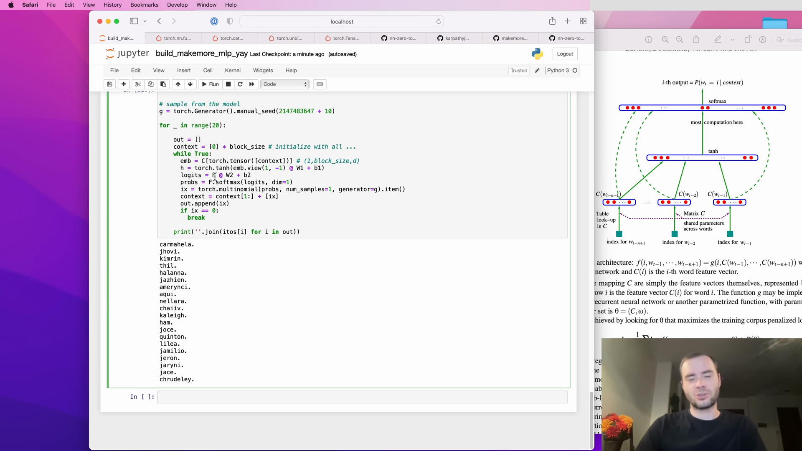

The names are starting to sound a little bit more name-like, so we're definitely making progress. However, there is still room for improvement in this model.

### Making Notebooks More Accessible

I wanted to mention that I aim to make these notebooks more accessible. I don't want you to have to install Jupyter notebooks, Torch, and everything else.

