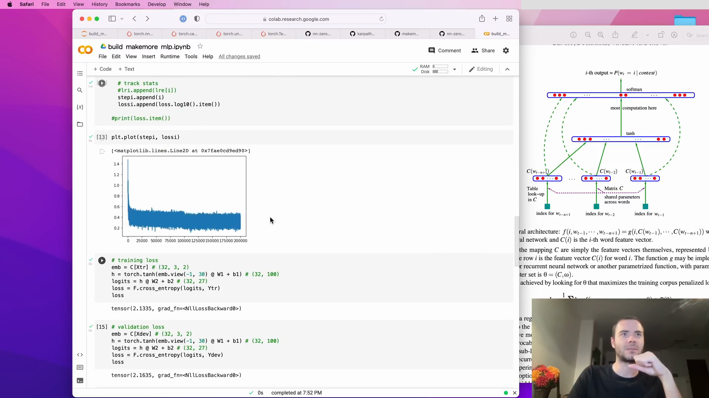

# Implementing Makemore: Bigram Language Model

Hi everyone. Today we are continuing our implementation of Makemore. In the last lecture, we implemented the bigram language model using both counts and a super simple neural network with a single linear layer.

## Bigram Language Model Recap

This is the Jupyter Notebook that we built in the last lecture. We approached this by looking at only the single previous character and predicting the distribution for the character that would go next in the sequence. We did this by taking counts and normalizing them into probabilities so that each row sums to one.


This method works and is approachable if you only have one character of previous context. However, the problem with this model is that the predictions are not very good because it only takes one character of context, so the model didn't produce very name-like results.


## Code Implementation

Here is a snippet of the code we used to generate the predictions:

```python
P.sum(1, keepdims=True)
```

We also set a manual seed for reproducibility:

```python
g = torch.Generator().manual_seed(2147483647)
for _ in range(5):
    out = []
    ix = 0
    while True:
        p = P[ix]
        ix = torch.multinomial(p, num_samples=1, replacement=True, generator=g).item()
        out.append(itos[ix])
        if ix == 0:
            break
    print(''.join(out))
```

This code generates sequences based on the bigram model, but as mentioned, the results are not very name-like due to the limited context.


In the next steps, we will look into improving this model by incorporating more context and using more sophisticated neural network architectures. Stay tuned!
# Implementing a Multilayer Perceptron Model for Character Prediction

In this section, we will discuss the limitations of using simple context-based models for character prediction and introduce a more sophisticated approach using a multilayer perceptron (MLP) model.

## Limitations of Context-Based Models

When predicting the next character in a sequence, considering more context can lead to exponential growth in the size of the context table. For instance:

- **Single Character Context**: 27 possibilities (including the alphabet and a space).
- **Two Characters Context**: 27 × 27 = 729 possibilities.
- **Three Characters Context**: 27³ = 19,683 possibilities.

As the context length increases, the number of possible contexts grows exponentially, making it impractical to manage and leading to sparse data issues.


## Moving to Multilayer Perceptron (MLP)

To address the limitations of context-based models, we will implement a multilayer perceptron (MLP) model. This approach allows us to predict the next character in a sequence more efficiently by leveraging neural network architectures.

### Code Implementation

Below is a snippet of the code used to implement the MLP model for character prediction:

```python
P = P(+1).float()
P = P.sum(1, keepdims=True)

g = torch.Generator().manual_seed(2147483647)

for i in range(5):
    out = []
    ix = 0
    while True:
        p = P[ix]
        ix = torch.multinomial(p, num_samples=1, replacement=True, generator=g).item()
        out.append(itos[ix])
        if ix == 0:
            break
    print(''.join(out))
```

This code sets up a generator with a fixed seed for reproducibility and generates sequences of characters based on the learned probabilities.


### Visualizing the Context Matrix

The context matrix visualization helps us understand the frequency and probability of different character sequences. The matrix below shows the counts of character pairs, which is essential for training our MLP model.


By moving from simple context-based models to a multilayer perceptron, we can handle larger contexts more efficiently and improve the accuracy of our character predictions. This approach leverages the power of neural networks to manage the complexity and sparsity issues inherent in context-based models.

For more details on the implementation and usage of the MLP model, refer to the [makemore repository](https://github.com/karpathy/makemore).


# A Neural Probabilistic Language Model

## Introduction

In this blog post, we will delve into the influential paper by Bengio et al. (2003) titled "A Neural Probabilistic Language Model." This paper is often cited for its significant contributions to the field of language modeling using neural networks. Although it is not the first paper to propose the use of multilayer perceptrons or neural networks to predict the next character or token in a sequence, it has been highly influential and is frequently referenced.


## Problem Description

The primary goal of statistical language modeling is to learn the joint probability function of sequences of words in a language. This task is intrinsically difficult due to the curse of dimensionality: a word sequence on which the model will be tested is likely to be different from all the word sequences seen during training. Traditional approaches, such as n-grams, obtain generalization by concatenating very short overlapping sequences seen in the training set.

## Proposed Model

To address the curse of dimensionality, Bengio et al. propose learning a distributed representation for words. This approach allows each training sentence to inform the model about an exponential number of semantically neighboring sentences. The model learns simultaneously:

1. A distributed representation for each word.
2. The probability function for word sequences, expressed in terms of these representations.

Generalization is achieved because a sequence of words that has never been seen before gets high probability if it is made of words that are similar (in the sense of having a nearby representation) to words forming an already seen sentence.

## Implementation Details

In this paper, the authors work with a vocabulary of 17,000 possible words and build a word-level language model. For our purposes, we will stick with a character-level language model but adopt the same modeling approach.

### Embedding Words into a Vector Space

The authors propose to take each of the 17,000 words and associate a 30-dimensional feature vector to each word. This means that every word is now embedded into a 30-dimensional space. Initially, these words are spread out randomly in this space. During the training of the neural network, these embeddings are tuned using backpropagation. Over time, words with similar meanings or synonyms will cluster together in the space, while words with different meanings will be positioned further apart.


### Fighting the Curse of Dimensionality

The idea of the proposed approach can be summarized as follows:

1. **Associate with each word in the vocabulary a distributed word feature vector** (a real-valued vector in \( \mathbb{R}^m \)).
2. **Express the joint probability function of word sequences** in terms of the feature vectors of these words in the sequence.
3. **Learn simultaneously the word feature vectors and the parameters of that probability function**.


The feature vector represents different aspects of the word, with each word associated with a point in a vector space. The number of features (e.g., \( m = 30 \), 60, or 100 in the experiments) is much smaller than the size of the vocabulary (e.g., 17,000). The probability function is expressed as a product of conditional probabilities of the next word given the previous ones, using a multi-layer neural network to predict the next word given the previous ones. This function has parameters that can be iteratively tuned to maximize the log-likelihood of the training data or a regularized criterion, such as adding a weight decay penalty.

## Conclusion

This paper by Bengio et al. (2003) provides a foundational approach to language modeling using neural networks. By embedding words into a high-dimensional vector space and learning distributed representations, the model can generalize better to unseen word sequences. This approach has influenced many subsequent developments in the field of natural language processing.

For a deeper understanding, I encourage you to read the full paper, as it contains many more interesting ideas and details.
# Fighting the Curse of Dimensionality with Distributed Representations

In this section, we discuss the approach to fighting the curse of dimensionality using distributed representations. The idea can be summarized as follows:

1. **Associate with each word in the vocabulary a distributed word feature vector** (a real-valued vector in \( \mathbb{R}^m \)).
2. **Express the joint probability function of word sequences** in terms of the feature vectors of these words in the sequence.
3. **Learn simultaneously the word feature vectors and the parameters of that probability function**.

The feature vector represents different aspects of the word: each word is associated with a point in a vector space. The number of features (e.g., \( m = 30, 60 \), or 100 in the experiments) is much smaller than the size of the vocabulary (e.g., 17,000). The probability function is expressed as a product of conditional probabilities of the next word given the previous ones, using a multi-layer neural network to predict the next word given the previous ones. This function has parameters that can be iteratively tuned to maximize the log-likelihood of the training data or a regularized criterion, e.g., by adding a weight decay penalty. The feature vectors associated with each word are learned, but they could be initialized using prior knowledge of semantic features.


Why does it work? In the previous example, if we knew that dog and cat played similar roles (semantically and syntactically), and similarly for (the, a), (bedroom, room), (is, was), (running, walking), we could naturally generalize (i.e., transfer probability mass) from:

- The cat is walking in the bedroom
- A dog was running in a room

to:

- The cat is running in a room
- The dog was walking in the room

and many other combinations. In the proposed model, it will generalize because "similar" words are expected to have a similar feature vector, and because the probability function is a smooth function of these feature values, a small change in the features will induce a small change in the probability. Therefore, the presence of only one of the above sentences in the training data will increase the probability not only of that sentence but also of its combinatorial number of "neighbors."

## Neural Network Architecture

Let's now scroll down to the diagram of the neural network. In this example, we are taking three previous words and trying to predict the fourth word in a sequence. We have a vocabulary of 17,000 possible words, so each of these words is represented by an index between 0 and 16,999.


There is a lookup table called \( C \). This lookup table is a matrix of size 17,000 by 30. Each index plucks out a row of this embedding matrix, converting each index to a 30-dimensional vector corresponding to the embedding vector for that word. The input layer consists of 30 neurons for each of the three words, making up 90 neurons in total. This matrix \( C \) is shared across all words, so we always index into the same matrix \( C \) for each word.

Next is the hidden layer of the neural network. The size of this hidden layer is a hyperparameter, which is a design choice up to the designer of the neural network. This size can be as large or as small as desired. For example, the size could be 100, and we will go over multiple choices for the size of this hidden layer.
# Understanding Neural Network Architectures for Word Prediction

In this blog post, we will delve into the architecture of a neural network designed for word prediction. We will explore the components of the network, the training process, and the implementation details using PyTorch.

## Neural Network Architecture

The neural network architecture for word prediction involves several layers and components. Let's break down the architecture step by step.

### Fully Connected Layer

The first layer in our network is a fully connected layer. This layer connects all the neurons to the 90 numbers that represent three words. The output of this layer is then passed through a tanh non-linearity.

### Output Layer

The output layer consists of 17,000 neurons, corresponding to the 17,000 possible words that could come next in the sequence. Each neuron in this layer is fully connected to all the neurons in the hidden layer. This layer is computationally expensive due to the large number of parameters.

### Softmax Layer

On top of the output layer, we have a softmax layer. The softmax function exponentiates each logit and normalizes them to sum to one, resulting in a probability distribution for the next word in the sequence.


### Training Process

During training, we have the label, which is the identity of the next word in the sequence. The index of this word is used to extract the probability of that word, and we maximize this probability with respect to the parameters of the neural network. The parameters include the weights and biases of the output layer, the hidden layer, and the embedding lookup table \( C \). All these parameters are optimized using backpropagation.

## Implementation in PyTorch

Let's implement this neural network in PyTorch. We will start by importing the necessary libraries and preparing the dataset.

### Importing Libraries

```python
import torch
import torch.nn as nn
import matplotlib.pyplot as plt
```

### Preparing the Dataset

We begin by reading all the names into a list of words and building the vocabulary of characters. We then create mappings from characters to integers and vice versa.

```python
# Reading names into a list of words
words = ["Emma", "Olivia", "Ava", "Isabella", "Sophia", "Mia", "Charlotte", "Amelia"]
# Building vocabulary of characters
chars = sorted(list(set(''.join(words))))
stoi = { ch:i for i,ch in enumerate(chars) }
itos = { i:ch for i,ch in enumerate(chars) }
```

### Creating the Dataset

We define a block size, which is the context length of how many characters we take to predict the next one. In this example, we use a block size of three.

```python
block_size = 3
X, Y = [], []

for word in words:
    context = [0] * block_size
    for ch in word + '.':
        ix = stoi[ch]
        X.append(context)
        Y.append(ix)
        context = context[1:] + [ix]
```

### Building the Embedding Lookup Table

We create an embedding lookup table \( C \) with 27 possible characters embedded in a lower-dimensional space. For simplicity, we start with a two-dimensional space.

```python
C = torch.randn((27, 2))
```

### Embedding a Single Integer

To understand how the embedding works, we can embed a single integer, say 5.

```python
ix = 5
embedding = C[ix]
print(embedding)
```

### Neural Network Model

Finally, we define the neural network model that takes the input \( X \) and predicts the output \( Y \).

```python
class WordPredictor(nn.Module):
    def __init__(self, vocab_size, embed_dim):
        super(WordPredictor, self).__init__()
        self.embedding = nn.Embedding(vocab_size, embed_dim)
        self.fc1 = nn.Linear(embed_dim * block_size, 128)
        self.tanh = nn.Tanh()
        self.fc2 = nn.Linear(128, vocab_size)
    
    def forward(self, x):
        x = self.embedding(x)
        x = x.view(x.size(0), -1)
        x = self.fc1(x)
        x = self.tanh(x)
        x = self.fc2(x)
        return x

model = WordPredictor(vocab_size=27, embed_dim=2)
```

This model includes an embedding layer, a fully connected layer with a tanh activation, and an output layer. The forward method defines the forward pass of the network.

By following these steps, we have implemented a neural network for word prediction using PyTorch. This network can be trained on a dataset of words to predict the next word in a sequence.
# Understanding PyTorch Indexing and Embeddings

In this post, we will delve into the intricacies of PyTorch indexing and embeddings, exploring how to efficiently handle tensors and perform operations on them. This discussion is based on a lecture that demonstrates various techniques and their underlying principles.

## One-Hot Encoding and Tensor Operations

In a previous lecture, we discussed one-hot encoding, where we encode integers into a vector of zeros with a single one at the position corresponding to the integer. For example, encoding the integer 5 in a 27-class system results in a 27-dimensional vector with the fifth bit set to one.

However, this approach has limitations. The input must be a tensor, not an integer. Here's how we can fix this:

```python
import torch

# One-hot encoding for integer 5 in a 27-class system
one_hot = torch.zeros(27, dtype=torch.int64)
one_hot[5] = 1
```

This one-hot vector can then be multiplied by a matrix `C` to retrieve the corresponding row:

```python
C = torch.randn(27, 2)
result = torch.matmul(one_hot.float(), C)
```

However, this approach requires casting the one-hot vector to a float, as PyTorch does not support multiplication between integers and floats directly.

## Indexing with PyTorch

Instead of using one-hot encoding, we can directly index into the matrix `C` to retrieve the desired row. This is more efficient and avoids the need for casting:

```python
index = 5
result = C[index]
```

PyTorch's indexing capabilities are quite flexible. We can index using lists or tensors of integers:

```python
indices = torch.tensor([5, 6, 7])
result = C[indices]
```

This also works with multi-dimensional tensors:

```python
X = torch.randint(0, 27, (32, 3))
result = C[X]
```

## Constructing the Hidden Layer

To construct a hidden layer, we need to initialize weights and biases. The number of inputs to this layer is determined by the embedding dimensions and the number of words:

```python
input_dim = 3 * 2  # 3 words, 2-dimensional embeddings
output_dim = 100  # Number of neurons
W1 = torch.randn(input_dim, output_dim)
b1 = torch.randn(output_dim)
```

We need to transform the input tensor to match the dimensions required for matrix multiplication. This can be done using the `view` method:

```python
M = torch.randn(32, 3, 2)
M_viewed = M.view(32, -1)  # Reshape to (32, 6)
```

This transformation is efficient as it only changes the view of the tensor without altering the underlying data.

## Efficient Tensor Operations

PyTorch provides various functions to manipulate tensors efficiently. For example, the `unbind` function can be used to split a tensor along a specified dimension:

```python
M_unbind = torch.unbind(M, dim=1)
M_cat = torch.cat(M_unbind, dim=1)
```

Alternatively, we can use the `view` method to achieve the same result more efficiently:

```python
M_viewed = M.view(32, -1)
```

This approach avoids creating new memory and is more efficient.

Understanding and leveraging PyTorch's indexing and tensor manipulation capabilities can significantly improve the efficiency of your code. By using direct indexing and efficient tensor operations, you can avoid unnecessary computations and memory allocations.


In the image above, we see an example of indexing and embedding operations in PyTorch. The code demonstrates how to retrieve specific rows from a matrix using integer indices.


The second image illustrates the use of the `view` method to reshape tensors efficiently. This method is crucial for preparing tensors for matrix multiplication in neural networks.

By mastering these techniques, you can write more efficient and effective PyTorch code, enabling you to build and train neural networks more effectively.

# Building a Character-Level Language Model with PyTorch

In this post, we will walk through the process of building a character-level language model using PyTorch. We will cover the creation of the model, the forward pass, and the calculation of the loss using cross-entropy. Additionally, we will discuss the benefits of using PyTorch's built-in functions for efficiency and numerical stability.

## Broadcasting in PyTorch

When performing operations in PyTorch, it's crucial to understand how broadcasting works to avoid errors. For instance, consider the following code snippet:

```python
h = torch.tanh(emb.view(-1, 6) @ W1 + b1)
```

Here, `h` has a shape of `[32, 100]`, and `b1` has a shape of `[100]`. Broadcasting will align these shapes correctly by creating a fake dimension for `b1`, making it `[1, 100]`, and then copying it vertically for each of the 32 rows. This ensures that the same bias vector is added to all rows of the matrix.


## Creating the Final Layer

Next, we create the final layer of our neural network:

```python
W2 = torch.randn((100, 27))
b2 = torch.randn(27)
logits = h @ W2 + b2
```

Here, the input to the final layer is 100, and the output is 27, corresponding to the 27 possible characters. The logits have a shape of `[32, 27]`.

## Calculating Probabilities

To convert the logits to probabilities, we exponentiate them and normalize:

```python
counts = torch.exp(logits)
prob = counts / counts.sum(dim=1, keepdim=True)
```

This ensures that each row of `prob` sums to one, giving us a valid probability distribution.

## Indexing Probabilities

We use the array `Y` to get the actual next character in the sequence. We then index into the rows of `prob` to get the probability assigned to the correct character:

```python
correct_probs = prob[torch.arange(32), Y]
```

This gives us the probabilities assigned by the neural network to the correct characters in the sequence.

## Calculating the Loss

We calculate the negative log-likelihood loss:

```python
loss = -correct_probs.log().mean()
```

However, instead of manually implementing this, we can use PyTorch's built-in `cross_entropy` function for efficiency and numerical stability:

```python
import torch.nn.functional as F
loss = F.cross_entropy(logits, Y)
```


## Training the Neural Network

We set up the training loop as follows:

```python
for epoch in range(1000):
    # Forward pass
    logits = h @ W2 + b2
    loss = F.cross_entropy(logits, Y)
    
    # Backward pass
    for p in parameters:
        p.grad = None
    loss.backward()
    
    # Update parameters
    for p in parameters:
        p.data -= learning_rate * p.grad
    
    if epoch % 100 == 0:
        print(f'Epoch {epoch}, Loss: {loss.item()}')
```

Initially, the loss decreases rapidly, indicating that the model is learning. However, since we are overfitting a small batch of 32 examples, the loss can become very low quickly.

## Overfitting and Generalization

Overfitting occurs when the model performs well on the training data but poorly on unseen data. In our case, we have 3400 parameters and only 32 examples, making it easy to overfit. To mitigate this, we need to train on a larger dataset and use techniques like regularization.

In this post, we built a character-level language model using PyTorch, discussed the importance of broadcasting, and leveraged PyTorch's built-in functions for efficiency and numerical stability. By understanding these concepts, we can create more robust and efficient neural networks.
# Optimizing Neural Networks with Mini-Batches and Learning Rate Tuning

In this post, we will explore how to optimize a neural network using mini-batches and how to determine a suitable learning rate. We will also discuss the importance of splitting the dataset into training, validation, and test sets to avoid overfitting.

## Processing the Full Dataset

Initially, we created a dataset using only the first five words. To optimize the neural network, we need to process the full dataset. This increases the number of examples from 32 to 228,000.

```python
# Reinitialize the weights
parameters = [C, W1, b1, W2, b2]
for p in parameters:
    p.requires_grad = True

# Print loss
print(loss.item())
```


## Using Mini-Batches for Optimization

Processing the entire dataset in one go is computationally expensive. Instead, we use mini-batches to perform forward and backward passes and update the model parameters. This approach is more efficient and allows us to iterate faster.

```python
# Mini-batch construction
ix = torch.randint(0, X.shape[0], (32,))
emb = C[X[ix]]  # (32, 3, 2)
h = torch.tanh(emb.view(-1, 6) @ W1 + b1)  # (32, 100)
logits = h @ W2 + b2  # (32, 27)
loss = F.cross_entropy(logits, Y[ix])
```


## Determining the Learning Rate

Choosing the right learning rate is crucial for efficient training. We can determine a reasonable learning rate by experimenting with different values and observing the loss.

```python
# Learning rate search
lrs = torch.linspace(-3, 0, 1000)
lrs = 10 ** lrs

# Track stats
lri = []
lossi = []

for lr in lrs:
    # Reset parameters
    for p in parameters:
        p.data = torch.randn_like(p)
    
    # Optimization step
    optimizer = torch.optim.SGD(parameters, lr=lr)
    optimizer.zero_grad()
    loss.backward()
    optimizer.step()
    
    # Track learning rate and loss
    lri.append(lr)
    lossi.append(loss.item())
```


## Evaluating the Model

After determining a suitable learning rate, we can run the optimization for a longer period and evaluate the model's performance on the entire training set.

```python
# Evaluate on the entire training set
emb = C[X]  # (32, 3, 2)
h = torch.tanh(emb.view(-1, 6) @ W1 + b1)  # (32, 100)
logits = h @ W2 + b2  # (32, 27)
loss = F.cross_entropy(logits, Y)
print(loss.item())
```

## Avoiding Overfitting

To ensure that our model generalizes well, we split the dataset into training, validation, and test sets. This helps us tune hyperparameters and evaluate the model's performance on unseen data.

- **Training Set (80%)**: Used to optimize the model parameters.
- **Validation Set (10%)**: Used to tune hyperparameters.
- **Test Set (10%)**: Used to evaluate the final model performance.

By following these steps, we can effectively train a neural network while avoiding overfitting and ensuring good generalization to new data.
# Training and Evaluating Neural Networks

In this session, we will discuss the process of training a neural network, splitting the dataset, and evaluating the model's performance. We will also explore how to scale up the neural network to improve its performance.

## Splitting the Dataset

To avoid overfitting, it is crucial to split the dataset into training, validation (dev), and test sets. We will train the model on the training set and evaluate it sparingly on the test set.

```python
# Splitting the dataset
N1 = int(0.8 * len(words))
N2 = int(0.9 * len(words))

X_train, Y_train = build_dataset(words[:N1])
X_dev, Y_dev = build_dataset(words[N1:N2])
X_test, Y_test = build_dataset(words[N2:])
```

## Training the Neural Network

We will train the neural network using the training set and evaluate its performance on the dev set. The initial training involves a small neural network, which we will later scale up.

```python
# Training the neural network
for i in range(10000):
    # Minibatch construct
    ix = torch.randint(0, X_train.shape[0], (32,))
    
    # Forward pass
    emb = C[X_train[ix]]
    h = torch.tanh(emb.view(-1, 6) @ W1 + b1)
    logits = h @ W2 + b2
    loss = F.cross_entropy(logits, Y_train[ix])
    
    # Backward pass
    for p in parameters:
        p.grad = None
    loss.backward()
    
    # Update
    lr = lrs[i]
    for p in parameters:
        p.data += -lr * p.grad
```


## Evaluating the Model

After training, we evaluate the model on the dev set to check for overfitting. The loss on the dev set should be similar to the training loss if the model is not overfitting.

```python
# Evaluating the model
emb = C[X_dev]
h = torch.tanh(emb.view(-1, 6) @ W1 + b1)
logits = h @ W2 + b2
loss = F.cross_entropy(logits, Y_dev)
print(loss)
```

## Scaling Up the Neural Network

To improve the model's performance, we increase the size of the hidden layer from 100 to 300 neurons. This increases the number of parameters and allows the model to learn more complex patterns.

```python
# Scaling up the neural network
W1 = torch.randn(6, 300)
b1 = torch.randn(300)
W2 = torch.randn(300, 27)
b2 = torch.randn(27)
```


## Visualizing Embeddings

Before increasing the embedding size, we visualize the current embeddings to understand how the model clusters different characters.

```python
# Visualizing embeddings
plt.figure(figsize=(10, 10))
for i in range(C.shape[0]):
    plt.scatter(C[i, 0].item(), C[i, 1].item())
    plt.text(C[i, 0].item(), C[i, 1].item(), itos[i], fontsize=12)
plt.show()
```

The visualization shows that the model clusters similar characters together, indicating that it has learned meaningful embeddings.

By splitting the dataset, training the neural network, evaluating its performance, and scaling up the model, we can improve the neural network's performance. Visualizing embeddings helps us understand how the model perceives different characters and guides us in making further improvements.
# Optimizing Neural Network Training with PyTorch

In this post, we will walk through the process of optimizing a neural network using PyTorch. We will cover the adjustments made to the network architecture, the training process, and the evaluation of the model's performance.

## Adjusting the Network Architecture

We start by modifying the hidden layer of our neural network. Initially, the hidden layer had 300 neurons, but we decided to reduce it to 200 neurons. This change aims to make the model more efficient while maintaining its performance.

```python
# Adjusting the hidden layer size
h = torch.tanh(emb.view(-1, 30) @ W1 + b1)  # (32, 100)
```

## Setting the Learning Rate and Iterations

We set the learning rate to 0.1 and plan to run the training for 50,000 iterations. Additionally, we replace hard-coded values with more flexible parameters to avoid magic numbers in the code.

```python
# Setting learning rate and iterations
lr = 0.1
iterations = 50000
```

## Logging and Plotting the Loss

To better visualize the training process, we log the loss using a logarithmic scale. This approach helps in squashing the loss values, making the plot more readable.

```python
# Logging the loss
lossi.append(loss.log10().item())
```


## Training the Model

We train the model for 50,000 iterations and observe the loss on both the training and validation sets. The initial results show a training loss of 2.3 and a validation loss of 2.38.

```python
# Training the model
for i in range(50000):
    # Forward pass
    emb = C[Xtr[ix]]  # (32, 3, 2)
    h = torch.tanh(emb.view(-1, 30) @ W1 + b1)  # (32, 100)
    logits = h @ W2 + b2  # (32, 27)
    loss = F.cross_entropy(logits, Ytr[ix])
    
    # Backward pass
    for p in parameters:
        p.grad = None
    loss.backward()
    
    # Update parameters
    for p in parameters:
        p.data += -lr * p.grad
    
    # Log stats
    stepi.append(i)
    lossi.append(loss.log10().item())
```

## Reducing the Learning Rate

Next, we reduce the learning rate by a factor of 10 and continue training for another 50,000 iterations. This step aims to fine-tune the model and achieve better performance.

```python
# Reducing the learning rate
lr = 0.01
for i in range 50000:
    # Training loop as above
```


## Evaluating the Model

After training, we evaluate the model's performance. The training loss is now 2.17, and the validation loss is 2.2. We notice that the training and validation performance are starting to diverge, indicating potential overfitting.

```python
# Evaluating the model
emb = C[Xtr]  # (32, 3, 2)
h = torch.tanh(emb.view(-1, 30) @ W1 + b1)  # (32, 100)
logits = h @ W2 + b2  # (32, 27)
loss = F.cross_entropy(logits, Ytr)
print(loss)
```


## Further Optimization

To further optimize the model, we can experiment with different hyperparameters, such as the size of the neural network or the number of input characters. For instance, increasing the number of input characters could potentially improve the loss.

```python
# Experimenting with different hyperparameters
# Increase the number of input characters
emb = C[Xtr[ix]]  # (32, 5, 2) for example
```

## Final Training and Results

We run the training for 200,000 steps, with the first 100,000 steps using a learning rate of 0.1 and the next 100,000 steps using a learning rate of 0.01. The final loss achieved is shown below.

```python
# Final training
for i in range 200000:
    if i == 100000:
        lr = 0.01
    # Training loop as above
```


By carefully adjusting the network architecture, learning rate, and training iterations, we can optimize the performance of our neural network. This process involves continuous experimentation and evaluation to find the best hyperparameters for our specific task.
# Improving Model Performance

So now I invite you to beat this number, and you have quite a few knobs available to you to surpass this number.

## Model Parameters

### Number of Neurons
You can change the number of neurons in the hidden layer of this model.

### Dimensionality of Embedding
You can change the dimensionality of the embedding lookup table.

### Input Context
You can change the number of characters that are feeding in as an input, as the context, into this model.


## Optimization Details

### Training Duration
You can adjust how long the model is running.

### Learning Rate
You can modify the learning rate and how it changes over time, including its decay.

### Batch Size
You can change the batch size, which may help you achieve a much better convergence speed in terms of how many seconds or minutes it takes to train the model and get your result in terms of really good loss.


## Further Reading

I actually invite you to read this paper. It is 19 pages, but at this point, you should be able to read a good chunk of it and understand pretty good chunks of it. This paper also has quite a few ideas for improvements that you can play with.


By tweaking these parameters and diving into the paper, you can explore various ways to enhance the model's performance.
# Sampling from the Model

Before we wrap up, I wanted to show how you would sample from the model. We're going to generate 20 samples. At first, we begin with all dots, so that's the context. Until we generate the zero character again, we're going to embed the current context using the embedding table `C`.


Usually, the first dimension was the size of the training set, but here we're only working with a single example that we're generating. So this is just dimension one, for simplicity. This embedding then gets projected into the hidden state, and we get the logits.

Next, we calculate the probabilities using `F.softmax(logits)`. This function exponentiates the logits and makes them sum to one, similar to cross-entropy, ensuring there are no overflows. Once we have the probabilities, we sample from them using `torch.multinomial` to get our next index. We then shift the context window to append the index and record it. Finally, we decode all the integers to strings and print them out.

Here are some example samples:

```
carmamela.
jhovi.
kimrni.
thil.
halanna.
jzehien.
amerynci.
aqui.
nelara.
chaliiv.
kaleigh.
ham.
joce.
quinton.
tilea.
jamilo.
jeron.
jaryni.
jace.
chrudeley.
```

You can see that the model now works much better. The words here are much more word-like or name-like. We have things like "hem", "jose", and "lila". It's starting to sound a little bit more name-like, so we're definitely making progress, but we can still improve on this model quite a lot.


Sorry, there's some bonus content. I wanted to mention that I want to make these notebooks more accessible, so I don't want you to have to install Jupyter notebooks, Torch, and everything else.
# Building a Multilayer Perceptron (MLP) with PyTorch

In this section, we will walk through the process of building a Multilayer Perceptron (MLP) using PyTorch. The code snippets and explanations provided will help you understand the steps involved in creating and training a neural network model.

## Setting Up the Environment

First, we need to import the necessary libraries and set up our environment. We will use PyTorch for building the neural network and Matplotlib for plotting figures.


```python
import torch
import torch.nn.functional as F
import matplotlib.pyplot as plt

%matplotlib inline
```

## Downloading the Dataset

We will download a dataset of names from a GitHub repository. This dataset will be used to train our MLP model.

```python
!wget https://raw.githubusercontent.com/karpathy/makemore/master/names.txt
words = open('names.txt', 'r').read().splitlines()
print(words[:8])
print(len(words))
```

## Building the Vocabulary

Next, we will build the vocabulary of characters and create mappings to and from integers.

```python
chars = sorted(list(set(''.join(words))))
stoi = {s:i+1 for i,s in enumerate(chars)}
stoi['.'] = 0
itos = {i:s for s,i in stoi.items()}
print(itos)
```

## Creating the Dataset

We will create the dataset by defining the context length, which determines how many characters we take to predict the next one.

```python
block_size = 3
```

## Model Architecture

We will define the architecture of our MLP model. The model consists of an embedding layer, a hidden layer with a tanh activation function, and an output layer.


```python
C = torch.randn((27, 2))
emb = C[X]
emb.shape

W1 = torch.randn((6, 100))
b1 = torch.randn(100)
h = torch.tanh(emb.view(-1, 6) @ W1 + b1)
h.shape

W2 = torch.randn((100, 27))
b2 = torch.randn(27)
logits = h @ W2 + b2
logits.shape
```

## Training the Model

We will train the model by defining the loss function and optimizing the parameters.

```python
counts = logits.exp()
prob = counts / counts.sum(1, keepdims=True)
prob.shape

loss = -prob[torch.arange(32), Y].log().mean()
print(loss)
```

## Plotting the Training Loss

We will plot the training loss to visualize the model's performance over time.



```python
plt.plot(stepi, loss1)
```

## Evaluating the Model

Finally, we will evaluate the model on the training and validation datasets.

```python
emb = C[Xtr]
h = torch.tanh(emb.view(-1, 30) @ W1 + b1)
logits = h @ W2 + b2
loss = F.cross_entropy(logits, Ytr)
print(loss)

emb = C[Xdev]
h = torch.tanh(emb.view(-1, 30) @ W1 + b1)
logits = h @ W2 + b2
loss = F.cross_entropy(logits, Ydev)
print(loss)
```

By following these steps, you can build and train a Multilayer Perceptron using PyTorch. The provided code snippets and explanations should help you understand the process and experiment with different configurations.